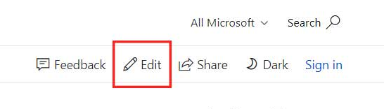

# Windows AI documentation

Welcome to the Windows AI documentation repository, the source of [https://docs.microsoft.com/windows/ai](https://docs.microsoft.com/windows/ai).

## Contribute to documentation

We welcome contributions from all members of the community!

To contribute to our documentation, you can visit the article on [https://docs.microsoft.com/windows/ai](https://docs.microsoft.com/windows/ai) and click the **Edit** link in the top right corner of the article, which goes to the GitHub source. Then, just use the GitHub UI to make your updates. Or, you are welcome to fork the repository and submit updates from your fork. See our general [contributor guide](https://docs.microsoft.com/contribute/) for more information.

## Microsoft Open Source Code of Conduct
This project has adopted the [Microsoft Open Source Code of Conduct](https://opensource.microsoft.com/codeofconduct/).
For more information see the [Code of Conduct FAQ](https://opensource.microsoft.com/codeofconduct/faq/) or contact [opencode@microsoft.com](mailto:opencode@microsoft.com) with any additional questions or comments.
