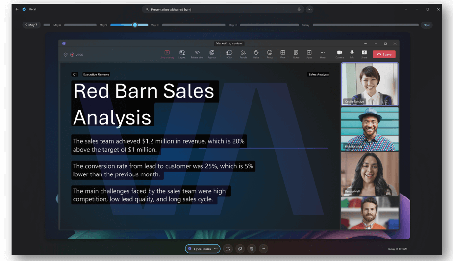

# Recall Overview

Recall utilizes [Windows AI Runtime](../overview.md) to help you find anything you’ve seen on your PC. Search using any clues you remember or use the timeline to scroll through your past activity, including apps, documents, and websites. Once you’ve found what you're looking for, you can quickly jump back to the content seen in the snapshot by selecting the relaunch button below the screenshot. The **UserActivity API** is what allows apps to provide deep links, so you can pick up where you left off.

[Learn more about Recall](https://support.microsoft.com/windows/retrace-your-steps-with-recall-aa03f8a0-a78b-4b3e-b0a1-2eb8ac48701c), including:

- System Requirements
- How to use Recall
- How to search with Recall
- How content interaction (with "Screenray") works
- How to pause or resume snapshots
- How to filter certain websites or apps from being saved by Recall
- How to manage Recall snapshots and disk space
- Keyboard shortcuts

Learn more about [Privacy and control over your Recall experience](https://support.microsoft.com/windows/privacy-and-control-over-your-recall-experience-d404f672-7647-41e5-886c-a3c59680af15), including:

- Controls on how to manage your Recall and snapshots preferences
- How to filter apps and websites from your snapshots
- How snapshot storage works (content stays local)
- Built-in security included with the secured-core PC, Microsoft Plutcon security processor, and Windows Hello Enhanced Sign-in Security (ESS)

For IT Administrators, learn how to [Manage Recall](/windows/client-management/manage-recall) using Windows Client Management, including:

- System requirements
- Supported browsers
- How to configure policies for Recall
- Limitations
- User controlled settings for Recall
- Storage allocation
- Policy setting for control over whether Windows saves snapshots of the screen and analyzes user activity on the device: [DisableAIDataAnalysis](/windows/client-management/mdm/policy-csp-windowsai#disableaidataanalysis)

## Use Recall in your Windows app

The Recall system component regularly saves snapshots of the customer’s screen and stores them locally. Using screen segmentation and image recognition, Windows provides the power to gain insight into what is visible on the screen. As a Windows application developer, you will now be able to offer your app users the ability to semantically search these saved snapshots and find content related to your app. Each snapshot has a [`UserActivity`](/uwp/api/windows.applicationmodel.useractivities) associated that enables the user to relaunch the content.

## Prerequisites

To utilize Recall in a Windows app, the following requirements must be met:

- Currently available only on the new Copilot+ PC.
- User Activity is supported in Windows SDK version 10.0.17134.0 (Windows 10, version 1803, Build 17134) or later.

### User Activities

A **UserActivity** refers to something specific the user was working on within your app. For example, when a user is writing a document, a `UserActivity` could refer to the specific place in the document where the user left off writing. When listening to a music app, the `UserActivity` could be the playlist that the user last listened to. When drawing on a canvas, the `UserActivity` could be where the user last made a mark. In summary, a `UserActivity` represents a destination within your Windows app that a user can return to so that they can resume what they were doing.

To engage with a `UserActivity` your Windows app would call: [UserActivity.CreateSession](/uwp/api/windows.applicationmodel.useractivities.useractivity.createsession). The Windows operating system responds by creating a history record indicating the start and end time for that `UserActivity`. Re-engaging with that same `UserActivity` over time will result in multiple history records being stored for it.

More information about how to engage with User Activities using Recall is coming soon.
