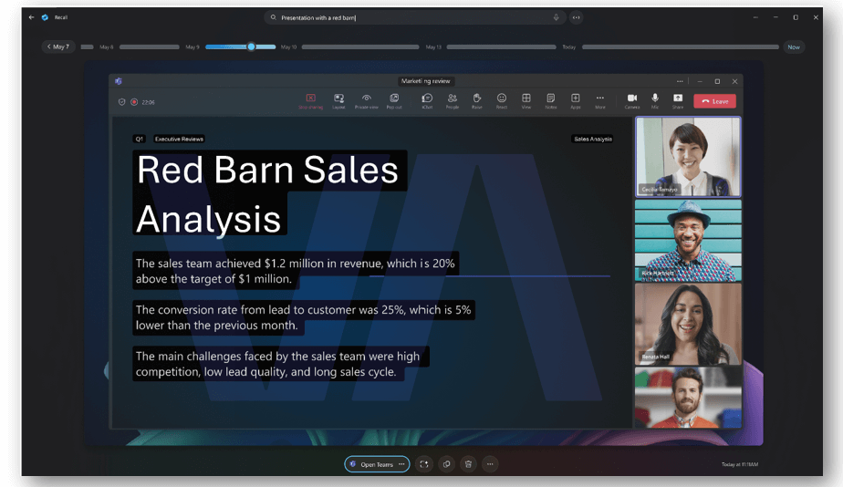

# Recall overview

**Recall** utilizes [Windows Copilot Runtime](../overview.md) to help you find anything you've seen on your PC. Search using any clues you remember or use the timeline to scroll through your past activity, including apps, documents, and websites. Once you've found what you're looking for, you can quickly jump back to the content seen in the snapshot by selecting the relaunch button below the screenshot. The **UserActivity API** is what allows apps to provide deep links, so you can pick up where you left off.

**Click to Do** is an AI-supported feature that utilizes the local Phi Silica model in Copilot+ PCs to connect actions to the content (text or images) found by Recall. For example, a video that you watched featured a person wearing a shirt that you like. You can find that video and where the shirt shows up using Recall. Click to Do will then offer the option to search using Bing for where you might buy that shirt online. Developers will be able to launch Click to Do from their app using a URI scheme.

Learn more about [Click to Do](https://support.microsoft.com/windows/click-to-do-in-recall-do-more-with-what-s-on-your-screen-967304a8-32d1-4812-a904-fad59b5e6abf) or find how to [Launch Click to Do](#launch-click-to-do) from your app using a URI.

[Learn more about Recall](https://support.microsoft.com/windows/retrace-your-steps-with-recall-aa03f8a0-a78b-4b3e-b0a1-2eb8ac48701c), including:

- System Requirements
- How to use Recall
- How to search with Recall
- How content interaction (with ["Screenray"](https://support.microsoft.com/windows/retrace-your-steps-with-recall-aa03f8a0-a78b-4b3e-b0a1-2eb8ac48701c#:~:text=Recall%20opens%20the%20snapshot%20and,cursor%20is%20blue%20and%20white.)) works
- How to pause or resume snapshots
- How to filter certain websites or apps from being saved by Recall
- How to manage Recall snapshots and disk space
- Keyboard shortcuts

Learn more about [Privacy and control over your Recall experience](https://support.microsoft.com/windows/privacy-and-control-over-your-recall-experience-d404f672-7647-41e5-886c-a3c59680af15), including:

- Controls on how to manage your Recall and snapshots preferences
- How to filter apps and websites from your snapshots
- How snapshot storage works (content stays local)
- Built-in security included with the secured-core PC, Microsoft Pluton security processor, and Windows Hello Enhanced Sign-in Security (ESS)

For IT Administrators, learn how to [Manage Recall](/windows/client-management/manage-recall) using Windows Client Management, including:

- System requirements
- Supported browsers
- How to configure policies for Recall
- Limitations
- User controlled settings for Recall
- Storage allocation
- Policy setting for control over whether Windows saves snapshots of the screen and analyzes user activity on the device: [DisableAIDataAnalysis](/windows/client-management/mdm/policy-csp-windowsai#disableaidataanalysis)

Recall updates:

- [Previewing Recall with Click to Do on Copilot+ PCs with Windows Insiders in the Dev Channel (November 22, 2024)](https://blogs.windows.com/windows-insider/2024/11/22/previewing-recall-with-click-to-do-on-copilot-pcs-with-windows-insiders-in-the-dev-channel/)
- [Update on Recall security and privacy architecture (September 27, 2024)](https://blogs.windows.com/windowsexperience/2024/09/27/update-on-recall-security-and-privacy-architecture/)
- [Update on the Recall preview feature for Copilot+ PCs (June 7, 2024)](https://blogs.windows.com/windowsexperience/2024/06/07/update-on-the-recall-preview-feature-for-copilot-pcs/).

## Prerequisites

- A [CoPilot+ PC](/windows/ai/npu-devices/) from Qualcomm, Intel, or AMD.
  - Arm64EC (Emulation Compatible) is not currently supported.
- [Windows 11 Insider Preview Build 26120.3073 (Dev and Beta Channels)](https://blogs.windows.com/windows-insider/2025/01/31/announcing-windows-11-insider-preview-build-26120-3073-dev-and-beta-channels/) or later must be installed on your device.

To utilize Recall and Click to Do in you Windows app:

- **This is not yet available.** This support will ship in an upcoming [experimental channel](/windows/apps/windows-app-sdk/experimental-channel) release of the Windows App SDK.
- User Activity is supported in Windows SDK version 10.0.17134.0 (Windows 10, version 1803, Build 17134) or later.

## Launch Click to Do

To launch the Click to Do feature on a Copilot+ PC from your app, you can utilize the following URI scheme: `ms-recall://default/?screenray`.

Currently, for Click to Do to function, the Recall feature must be enabled on the Copilot+ PC. See the "User choice from the start" section of [Privacy and control over your Recall experience](https://support.microsoft.com/windows/privacy-and-control-over-your-recall-experience-d404f672-7647-41e5-886c-a3c59680af15) for guidance on enabling or disabling Recall in the Privacy & security section of Windows Settings.

The `ms-recall://default/?screenray` URI enables your app to programmatically launch Click to Do, placing an interactive overlay on top of the PC screen. This overlay suggests quick actions to appear for images or text. The analysis of the screen is always performed locally on the device. Content is only shared if the user chooses to complete an action. Content is not saved, nor is it automatically passed back to the app used to open the overlay. This URI does not accept any additional parameters.

The following code samples open Click to Do from the user's app:

```cppwinrt
winrt::Windows::Foundation::Uri clickToDoUri(L"ms-recall://default/?screenray"); 

winrt::Windows::System::Launcher::LaunchUriAsync(clickToDoUri); 
```

```csharp
var clickToDoUri = new Windows.Foundation.Uri(L"ms-recall://default/?screenray"); 

Windows.System.Launcher.LaunchUriAsync(clickToDoUri) 
```

## Use Recall in your Windows app

For those who opt-in by [enabling "Recall & snapshots" in Settings > Privacy & security](https://support.microsoft.com/windows/privacy-and-control-over-your-recall-experience-d404f672-7647-41e5-886c-a3c59680af15#:~:text=You%20can%20turn%20on%20or,and%20selecting%20the%20pause%20option), Windows will regularly save snapshots of the customer's screen and stores them locally. Using screen segmentation and image recognition, Windows provides the power to gain insight into what is visible on the screen. As a Windows application developer, you will now be able to offer your app users the ability to semantically search these saved snapshots and find content related to your app. Each snapshot has a [`UserActivity`](/uwp/api/windows.applicationmodel.useractivities) associated that enables the user to relaunch the content.



### User Activities

A **UserActivity** refers to something specific the user was working on within your app. For example, when a user is writing a document, a `UserActivity` could refer to the specific place in the document where the user left off writing. When listening to a music app, the `UserActivity` could be the playlist that the user last listened to. When drawing on a canvas, the `UserActivity` could be where the user last made a mark. In summary, a `UserActivity` represents a destination within your Windows app that a user can return to so that they can resume what they were doing.

To engage with a `UserActivity` your Windows app would call: [UserActivity.CreateSession](/uwp/api/windows.applicationmodel.useractivities.useractivity.createsession). The Windows operating system responds by creating a history record indicating the start and end time for that `UserActivity`. Re-engaging with that same `UserActivity` over time will result in multiple history records being stored for it.

More information about how to engage with User Activities using Recall is coming soon.

## Related content

- [Developing Responsible Generative AI Applications and Features on Windows](../rai.md)