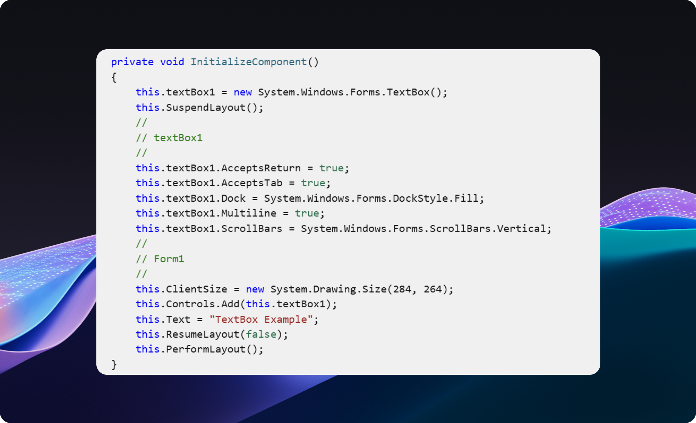
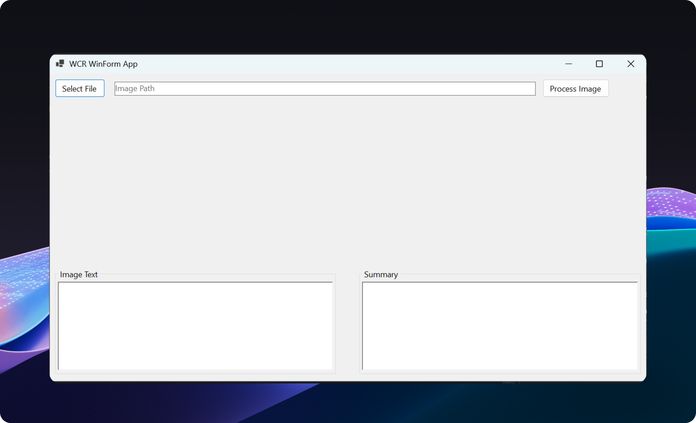
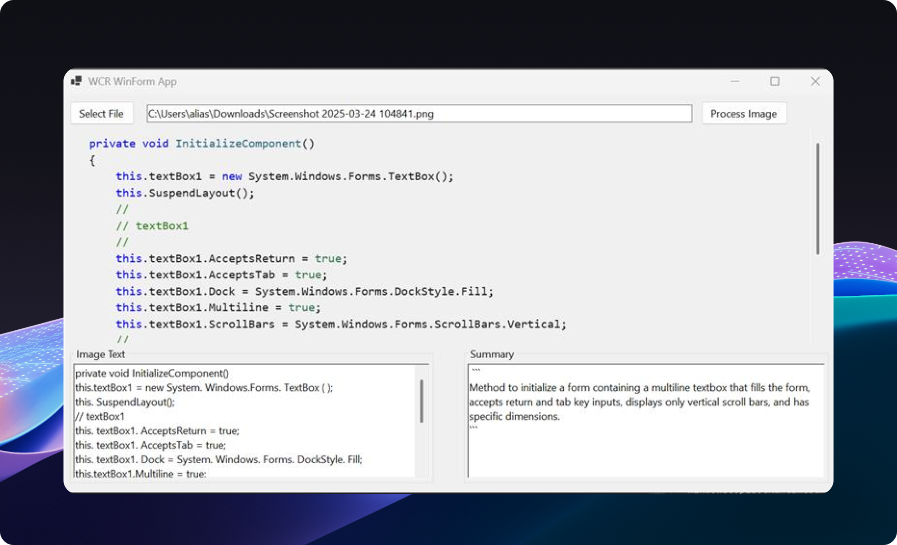

# Text Recognizer Walkthrough

This short tutorial will walk you through a sample that uses Text Recognizer in a WinForms app. To start, ensure you've completed the steps in the [Getting Started page.](get-started.md) for WinForms.

## Introduction

The MainForm class in MainForm.cs is the main user interface for the Windows Copilot Runtime Sample application. It demonstrates how to use the Windows Copilot Runtime API to perform text recognition and summarization on an image. The key functionalities include:

- Select File: Allows the user to select an image file from their file system and displays the selected image in a PictureBox.
- Process Image: Processes the selected image to extract text using Optical Character Recognition (OCR) and then summarizes the extracted text.

### Key Methods and Event Handlers

- SelectFile_Click: Opens a file dialog for the user to select an image file and displays the selected image.
- ProcessButton_Click: Handles the processing of the selected image, including loading AI models, performing text recognition, and summarizing the text.
- LoadAIModels: Loads the necessary AI models (TextRecognizer and LanguageModel) for text recognition and summarization.
- PerformTextRecognition: Uses the TextRecognizer to perform OCR on the selected image and extracts the text.
- SummarizeImageText: Uses the LanguageModel to generate a summary of the extracted text given a prompt.





```
private async Task<string> PerformTextRecognition()
        {
            // The OCR model requires the LanguageModel to be used first or
            // else it returns an interface not registered error.
            // This issue is currently under investigation.
            string prompt = "What is Windows App SDK?";
            var output = await languageModel!.GenerateResponseAsync(prompt);

            ImageBuffer? imageBuffer = await LoadImageBufferFromFileAsync(pathToImage);

            if (imageBuffer == null)
            {
                throw new Exception("Failed to load image buffer.");
            }

            TextRecognizerOptions options = new TextRecognizerOptions { };
            RecognizedText recognizedText = textRecognizer!.RecognizeTextFromImage(imageBuffer, options);

            var recognizedTextLines = recognizedText.Lines.Select(line => line.Text);
            string text = string.Join(Environment.NewLine, recognizedTextLines);

            richTextBoxForImageText.Text = text;
            return text;
        }
```


# Build and run the sample

1. Clone the [repository](https://github.com/microsoft/WindowsAppSDK-Samples/tree/release/experimental/Samples/WindowsCopilotRuntime/cs-winforms) onto your Copilot+PC.
2. Open the solution file WindowsCopilotRuntimeSample.sln in Visual Studio 2022.
3. Change the Solution Platform to match the architecture of your Copilot+ PC.
4. Right-click on the solution in Solution Explorer and select "Build" to build solution.
5. Once the build is successful, right-click on the project in Solution Explorer and select "Set as Startup Project".
6. Press F5 or select "Start Debugging" from the Debug menu to run the sample. Note: The sample can also be run without debugging by selecting "Start Without Debugging" from the Debug menu or Ctrl+F5.
