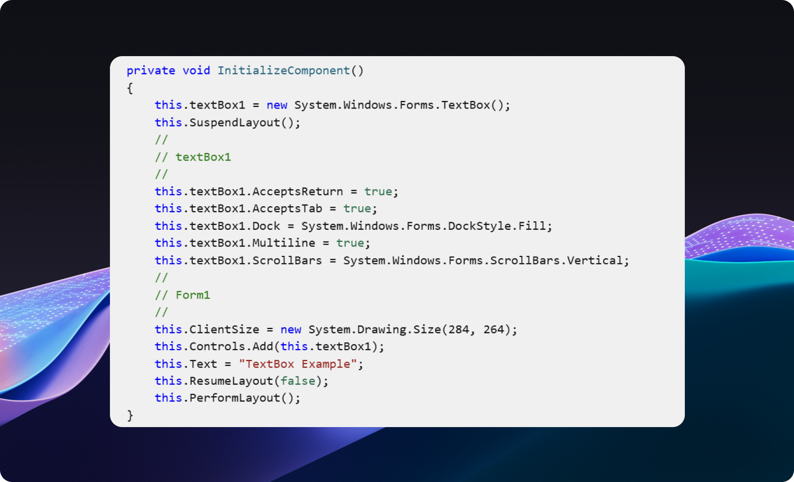
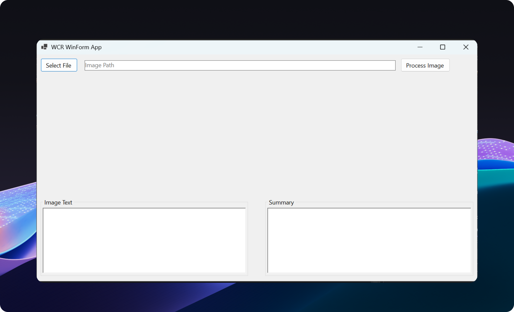
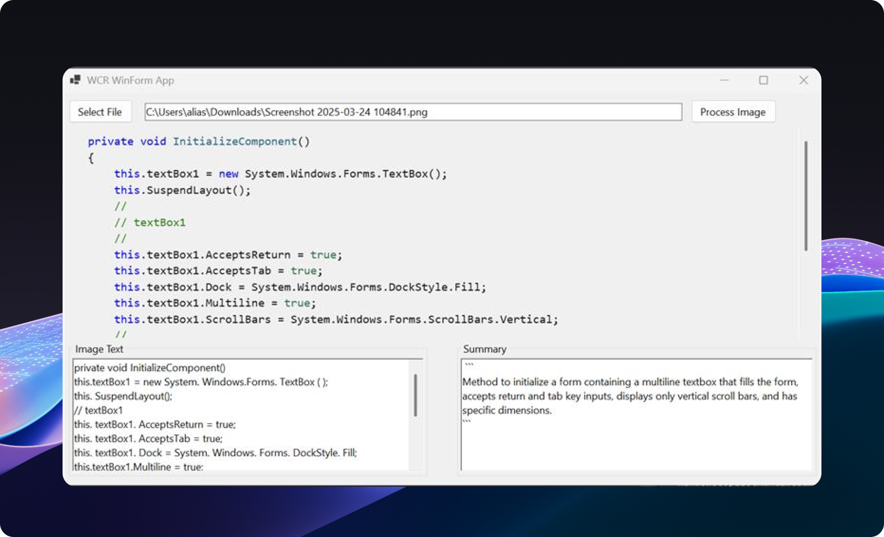

# Text recognizer walkthrough

This short tutorial walks through the text recognition functionality included in the [Windows AI API samples](https://github.com/microsoft/WindowsAppSDK-Samples/tree/release/experimental/Samples/WindowsAIFoundry) for WinForms. Specifically, it demonstrates how to use Windows AI APIs to perform text recognition on an image and summarize the recognized text.

> [!div class="button"]
> [Try text recognition in AI Dev Gallery](aidevgallery://apis/4bcc0137-0e9a-4eda-8096-b235fcb0e98b?src=docs)

Use AI Dev Gallery to explore the completed experience and export its source before you work through the WinForms sample.

## Prerequisites

To learn about the Windows AI API hardware requirements and how to configure your device to successfully build apps using the Windows AI APIs, see [Get started building an app with Windows AI APIs](/windows/ai/apis/get-started).

## Introduction

The **MainForm** class in MainForm.cs is the main user interface for the Windows AI API sample app that implements the following functionality:

- Select File: Lets the user select an image file from their file system and displays that image in a **PictureBox**.
- Process Image: Processes the selected image to extract text using Optical Character Recognition (OCR) and then summarizes the extracted text.

### Key functions and event handlers

Some of the more significant functions and event handlers in the [Windows AI API samples](https://github.com/microsoft/WindowsAppSDK-Samples/tree/release/experimental/Samples/WindowsAIFoundry) for WinForms include the following:

- `SelectFile_Click`: Opens a file dialog for the user to select an image file and displays the selected image.
- `ProcessButton_Click`: Handles the processing of the selected image, including loading AI models, performing text recognition, and summarizing the text.
- `LoadAIModels`: Loads the necessary AI models (TextRecognizer and LanguageModel) for text recognition and summarization.
- `PerformTextRecognition`: Uses the TextRecognizer to perform OCR on the selected image and extracts the text. This function is included in the following [Text recognition example](#text-recognition-example).
- `SummarizeImageText`: Uses the LanguageModel to generate a summary of the extracted text given a prompt.

### Text recognition example

The `PerformTextRecognition` function in this example





```c#
private async Task<string> PerformTextRecognition()
{
    using TextRecognizer textRecognizer = await TextRecognizer.CreateAsync();
    ImageBuffer? imageBuffer = await LoadImageBufferFromFileAsync(pathToImage);

    if (imageBuffer == null)
    {
        throw new Exception("Failed to load image buffer.");
    }

    RecognizedText recognizedText = 
        textRecognizer!.RecognizeTextFromImage(imageBuffer);

    var recognizedTextLines = recognizedText.Lines.Select(line => line.Text);
    string text = string.Join(Environment.NewLine, recognizedTextLines);

    richTextBoxForImageText.Text = text;
    return text;
}
```



## Build and run the sample

1. Clone the [WindowsAppSDK-Samples](https://github.com/microsoft/WindowsAppSDK-Samples) repo.
1. Switch to the "release/experimental" branch.
1. Navigate to the [Samples/WindowsAIFoundry/cs-winforms-pckg](https://github.com/microsoft/WindowsAppSDK-Samples/tree/release/experimental/Samples/WindowsAIFoundry/cs-winforms-pckg) folder.
1. Open WindowsAISample.sln in Visual Studio 2022.
1. Change the Solution Platform to match the architecture of your device (ARM64 for Copilot+ PCs, x64 for Intel/AMD devices).
1. Right-click on the solution in Solution Explorer and select "Build" to build solution.
1. Once the build is successful, right-click on the project in Solution Explorer and select "Set as Startup Project".
1. Press F5 or select "Start Debugging" from the Debug menu to run the sample (the sample can also be run without debugging by selecting "Start Without Debugging" from the Debug menu or Ctrl+F5).

## See also

- [Explore and export samples with AI Dev Gallery](../ai-dev-gallery/index.md)
- [Windows AI API samples](https://github.com/microsoft/WindowsAppSDK-Samples/tree/release/experimental/Samples/WindowsAIFoundry)
