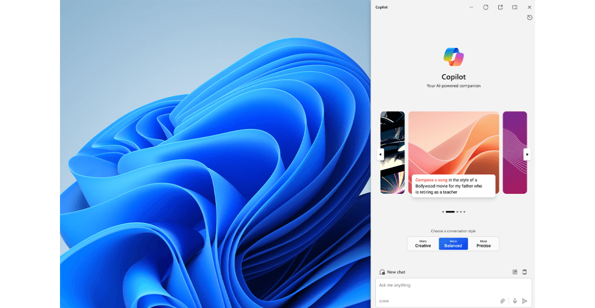

# Copilot in Windows Overview (Preview)

Copilot in Windows is in preview in select global markets. **Technical documentation will be coming soon.**

See [What is Copilot in Windows?](https://www.microsoft.com/windows/copilot-ai-features) for more information and a list of Frequently Asked Questions.

A few things that Copilot in Windows can help you with include:

- Change Windows settings
  - Turn on dark mode
  - Mute volume
  - Change wallpaper

- Perform common tasks
  - Take a screenshot
  - Set a focus timer for 30 minutes
  - Open File Explorer
  - Snap my windows

- Launch troubleshooters
  - Why isn't my audio working?
  - My camera isn't working
  - I can't update my device

For help getting started and more about what Copilot in Windows has to offer, see [Welcome to Copilot in Windows](https://support.microsoft.com/windows/welcome-to-copilot-in-windows-675708af-8c16-4675-afeb-85a5a476ccb0).

