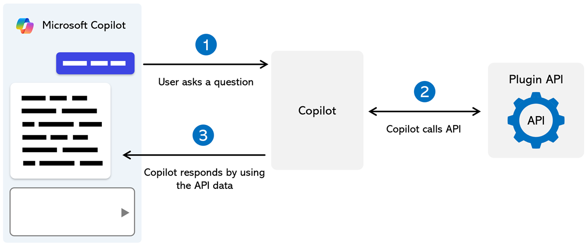

# Plugins for Copilot in Windows (Preview)

Plugin support that enables apps to interact with Copilot in Windows and perform local actions with Windows desktop API endpoints is coming soon.

In the meantime, you can learn more about plugins that enable a Microsoft Copilot experience to interact with your own APIs, enhancing the experience to perform a wider range of actions, by visiting [Overview of Plugins for Microsoft Copilot](/copilot-plugins/overview).

