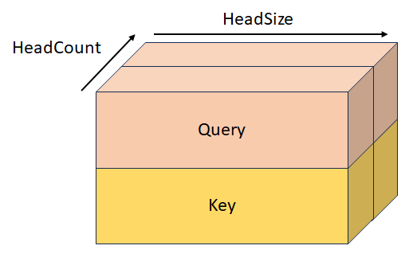
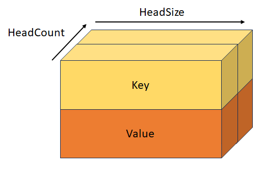
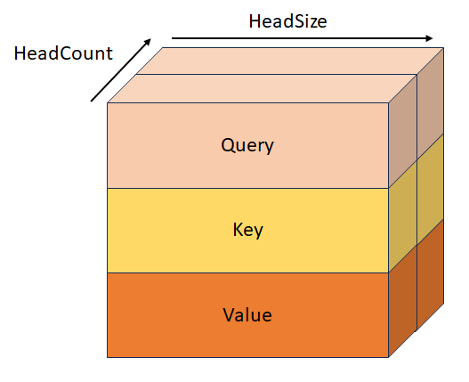

# DML_MULTIHEAD_ATTENTION_OPERATOR_DESC (directml.h)

Performs a multi-head attention operation (for more info, see [Attention is all you need](https://arxiv.org/abs/1706.03762)). Exactly one *Query*, *Key* and *Value* tensor must be present, whether or not they're stacked. For example, if *StackedQueryKey* is provided, both the *Query* and *Key* tensors must be null, since they're already provided in a stacked layout. The same goes for *StackedKeyValue* and *StackedQueryKeyValue*. The stacked tensors always have five dimensions, and are always stacked on the fourth dimension.

Logically, the algorithm can be decomposed into the following operations (operations in brackets are optional):

```
[Add Bias to query/key/value] -> GEMM(Query, Transposed(Key)) * Scale -> [Add RelativePositionBias] -> [Add Mask] -> Softmax -> GEMM(SoftmaxResult, Value);
```

> [!IMPORTANT]
> This API is available as part of the DirectML standalone redistributable package (see [Microsoft.AI.DirectML](https://www.nuget.org/packages/Microsoft.AI.DirectML/) version 1.12 and later. Also see [DirectML version history](../dml-version-history.md).

## Syntax

```cpp
struct DML_MULTIHEAD_ATTENTION_OPERATOR_DESC
{
    _Maybenull_ const DML_TENSOR_DESC* QueryTensor;
    _Maybenull_ const DML_TENSOR_DESC* KeyTensor;
    _Maybenull_ const DML_TENSOR_DESC* ValueTensor;
    _Maybenull_ const DML_TENSOR_DESC* StackedQueryKeyTensor;
    _Maybenull_ const DML_TENSOR_DESC* StackedKeyValueTensor;
    _Maybenull_ const DML_TENSOR_DESC* StackedQueryKeyValueTensor;
    _Maybenull_ const DML_TENSOR_DESC* BiasTensor;
    _Maybenull_ const DML_TENSOR_DESC* MaskTensor;
    _Maybenull_ const DML_TENSOR_DESC* RelativePositionBiasTensor;
    _Maybenull_ const DML_TENSOR_DESC* PastKeyTensor;
    _Maybenull_ const DML_TENSOR_DESC* PastValueTensor;
    const DML_TENSOR_DESC* OutputTensor;
    _Maybenull_ const DML_TENSOR_DESC* OutputPresentKeyTensor;
    _Maybenull_ const DML_TENSOR_DESC* OutputPresentValueTensor;
    FLOAT Scale;
    FLOAT MaskFilterValue;
    UINT HeadCount;
    DML_MULTIHEAD_ATTENTION_MASK_TYPE MaskType;
};
```

## Members

`QueryTensor`

Type: \_Maybenull\_ **const [DML_TENSOR_DESC](/windows/win32/api/directml/ns-directml-dml_tensor_desc)\***

Query with shape `[batchSize, sequenceLength, hiddenSize]`, where `hiddenSize = headCount * headSize`. This tensor is mutually exclusive with *StackedQueryKeyTensor* and *StackedQueryKeyValueTensor*. The tensor can also have 4 or 5 dimensions, as long as the leading dimensions are 1's.

`KeyTensor`

Type: \_Maybenull\_ **const [DML_TENSOR_DESC](/windows/win32/api/directml/ns-directml-dml_tensor_desc)\***

Key with shape `[batchSize, keyValueSequenceLength, hiddenSize]`, where `hiddenSize = headCount * headSize`. This tensor is mutually exclusive with *StackedQueryKeyTensor*, *StackedKeyValueTensor*, and *StackedQueryKeyValueTensor*. The tensor can also have 4 or 5 dimensions, as long as the leading dimensions are 1's.

`ValueTensor`

Type: \_Maybenull\_ **const [DML_TENSOR_DESC](/windows/win32/api/directml/ns-directml-dml_tensor_desc)\***

Value with shape `[batchSize, keyValueSequenceLength, valueHiddenSize]`, where `valueHiddenSize = headCount * valueHeadSize`. This tensor is mutually exclusive with *StackedKeyValueTensor*, and *StackedQueryKeyValueTensor*. The tensor can also have 4 or 5 dimensions, as long as the leading dimensions are 1's.

`StackedQueryKeyTensor`

Type: \_Maybenull\_ **const [DML_TENSOR_DESC](/windows/win32/api/directml/ns-directml-dml_tensor_desc)\***

Stacked query and key with shape `[batchSize, sequenceLength, headCount, 2, headSize]`. This tensor is mutually exclusive with *QueryTensor*, *KeyTensor*, *StackedKeyValueTensor*, and *StackedQueryKeyValueTensor*.



`StackedKeyValueTensor`

Type: \_Maybenull\_ **const [DML_TENSOR_DESC](/windows/win32/api/directml/ns-directml-dml_tensor_desc)\***

Stacked key and value with shape `[batchSize, keyValueSequenceLength, headCount, 2, headSize]`. This tensor is mutually exclusive with *KeyTensor*, *ValueTensor*, *StackedQueryKeyTensor*, and *StackedQueryKeyValueTensor*.



`StackedQueryKeyValueTensor`

Type: \_Maybenull\_ **const [DML_TENSOR_DESC](/windows/win32/api/directml/ns-directml-dml_tensor_desc)\***

Stacked query, key, and value with shape `[batchSize, sequenceLength, headCount, 3, headSize]`. This tensor is mutually exclusive with *QueryTensor*, *KeyTensor*, *ValueTensor*, *StackedQueryKeyTensor*, and *StackedKeyValueTensor*.



`BiasTensor`

Type: \_Maybenull\_ **const [DML_TENSOR_DESC](/windows/win32/api/directml/ns-directml-dml_tensor_desc)\***

This is the bias, of shape `[hiddenSize + hiddenSize + valueHiddenSize]`, which gets added to *Query*/*Key*/*Value* before the first GEMM operation. This tensor can also have 2, 3, 4 or 5 dimensions, as long as the leading dimensions are 1's.

`MaskTensor`

Type: \_Maybenull\_ **const [DML_TENSOR_DESC](/windows/win32/api/directml/ns-directml-dml_tensor_desc)\***

This is the mask that determines which elements get their value set to *MaskFilterValue* after the QxK GEMM operation. The behavior of this mask depends on the value of *MaskType*, and gets applied after *RelativePositionBiasTensor*, or after the first GEMM operation if *RelativePositionBiasTensor* is null. See the definition of *MaskType* for more information.

`RelativePositionBiasTensor`

Type: \_Maybenull\_ **const [DML_TENSOR_DESC](/windows/win32/api/directml/ns-directml-dml_tensor_desc)\***

This is the bias that gets added to the result of the first GEMM operation.

`PastKeyTensor`

Type: \_Maybenull\_ **const [DML_TENSOR_DESC](/windows/win32/api/directml/ns-directml-dml_tensor_desc)\***

Key tensor from the previous iteration with shape `[batchSize, headCount, pastSequenceLength, headSize]`. When this tensor is not null, it gets concatenated with the key tensor, which results in a tensor of shape `[batchSize, headCount, pastSequenceLength + keyValueSequenceLength, headSize]`.

`PastValueTensor`

Type: \_Maybenull\_ **const [DML_TENSOR_DESC](/windows/win32/api/directml/ns-directml-dml_tensor_desc)\***

Value tensor from the previous iteration with shape `[batchSize, headCount, pastSequenceLength, headSize]`. When this tensor is not null, it gets concatenated with *ValueDesc* which results in a tensor of shape `[batchSize, headCount, pastSequenceLength + keyValueSequenceLength, headSize]`.

`OutputTensor`

Type: **const [DML_TENSOR_DESC](/windows/win32/api/directml/ns-directml-dml_tensor_desc)\***

Output, of shape `[batchSize, sequenceLength, valueHiddenSize]`.

`OutputPresentKeyTensor`

Type: \_Maybenull\_ **const [DML_TENSOR_DESC](/windows/win32/api/directml/ns-directml-dml_tensor_desc)\***

Present state for cross attention key, with shape `[batchSize, headCount, keyValueSequenceLength, headSize]` or present state for self attention with shape `[batchSize, headCount, pastSequenceLength + keyValueSequenceLength, headSize]`. It contains either the content of the key tensor or the content of the concatenated *PastKey* + *Key* tensor to pass to the next iteration.

`OutputPresentValueTensor`

Type: \_Maybenull\_ **const [DML_TENSOR_DESC](/windows/win32/api/directml/ns-directml-dml_tensor_desc)\***

Present state for cross attention value, with shape `[batchSize, headCount, keyValueSequenceLength, headSize]` or present state for self attention with shape `[batchSize, headCount, pastSequenceLength + keyValueSequenceLength, headSize]`. It contains either the content of the value tensor or the content of the concatenated *PastValue* + *Value* tensor to pass to the next iteration.

`Scale`

Type: [**FLOAT**](/windows/win32/winprog/windows-data-types)

Scale to multiply the result of the QxK GEMM operation, but before the Softmax operation. This value is usually `1/sqrt(headSize)`.

`MaskFilterValue`

Type: [**FLOAT**](/windows/win32/winprog/windows-data-types)

Value that gets added to the result of QxK GEMM operation to the positions that the mask defined as padding elements. This value should be a very large negative number (usually -10000.0f).

`HeadCount`

Type: [**UINT**](/windows/win32/winprog/windows-data-types)

Number of attention heads.

`MaskType`

Type: **DML_MULTIHEAD_ATTENTION_MASK_TYPE**

Describes the behavior of *MaskTensor*.

**DML_MULTIHEAD_ATTENTION_MASK_TYPE_BOOLEAN**. When the mask contains a value of 0, *MaskFilterValue* gets added; but when it contains a value of 1, nothing gets added.

**DML_MULTIHEAD_ATTENTION_MASK_TYPE_KEY_SEQUENCE_LENGTH**. The mask, of shape `[1, batchSize]`, contains the sequence lengths of the unpadded area for each batch, and all elements after the sequence length get their value set to *MaskFilterValue*.

**DML_MULTIHEAD_ATTENTION_MASK_TYPE_KEY_SEQUENCE_END_START**. The mask, of shape `[2, batchSize]`, contains the end (exclusive) and start (inclusive) indices of the unpadded area, and all elements outside of of the area get their value set to *MaskFilterValue*.

**DML_MULTIHEAD_ATTENTION_MASK_TYPE_KEY_QUERY_SEQUENCE_LENGTH_START_END**. The mask, of shape `[batchSize * 3 + 2]`, has the following values: `[keyLength[0], ..., keyLength[batchSize - 1], queryStart[0], ..., queryStart[batchSize - 1], queryEnd[batchSize - 1], keyStart[0], ..., keyStart[batchSize - 1], keyEnd[batchSize - 1]]`.

## Availability
This operator was introduced in **DML_FEATURE_LEVEL_6_1**.

## Tensor constraints
*BiasTensor*, *KeyTensor*, *OutputPresentKeyTensor*, *OutputPresentValueTensor*, *OutputTensor*, *PastKeyTensor*, *PastValueTensor*, *QueryTensor*, *RelativePositionBiasTensor*, *StackedKeyValueTensor*, *StackedQueryKeyTensor*, *StackedQueryKeyValueTensor*, and *ValueTensor* must have the same *DataType*.

## Tensor support
| Tensor | Kind | Supported dimension counts | Supported data types |
| ------ | ---- | -------------------------- | -------------------- |
| QueryTensor | Optional input | 3 to 5 | FLOAT32, FLOAT16 |
| KeyTensor | Optional input | 3 to 5 | FLOAT32, FLOAT16 |
| ValueTensor | Optional input | 3 to 5 | FLOAT32, FLOAT16 |
| StackedQueryKeyTensor | Optional input | 5 | FLOAT32, FLOAT16 |
| StackedKeyValueTensor | Optional input | 5 | FLOAT32, FLOAT16 |
| StackedQueryKeyValueTensor | Optional input | 5 | FLOAT32, FLOAT16 |
| BiasTensor | Optional input | 1 to 5 | FLOAT32, FLOAT16 |
| MaskTensor | Optional input | 1 to 5 | INT32 |
| RelativePositionBiasTensor | Optional input | 4 to 5 | FLOAT32, FLOAT16 |
| PastKeyTensor | Optional input | 4 to 5 | FLOAT32, FLOAT16 |
| PastValueTensor | Optional input | 4 to 5 | FLOAT32, FLOAT16 |
| OutputTensor | Output | 3 to 5 | FLOAT32, FLOAT16 |
| OutputPresentKeyTensor | Optional output | 4 to 5 | FLOAT32, FLOAT16 |
| OutputPresentValueTensor | Optional output | 4 to 5 | FLOAT32, FLOAT16 |

## Requirements
| &nbsp; | &nbsp; |
| ---- |:---- |
| **Header** | directml.h |
