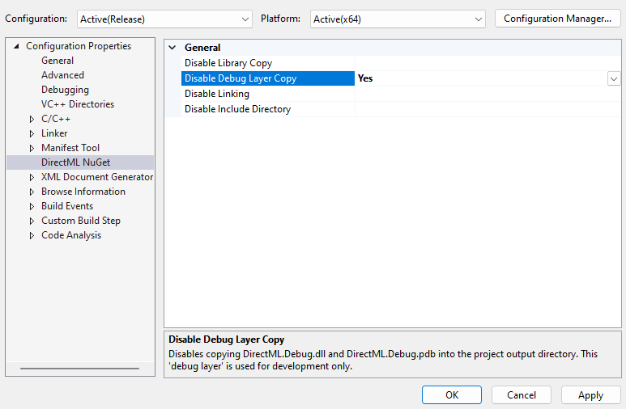

# Using the DirectML debug layer

The DirectML debug layer is an optional development-time component that helps you in debugging your DirectML code. When enabled, the DirectML debug layer wraps DirectML API calls, and provides additional validation and messages to you as the developer. The debug layer is implemented in a separate library, `DirectML.Debug.dll`, which is conditionally loaded at runtime by the core runtime library `DirectML.dll`.

We highly recommended that you enable the debug layer while developing applications using DirectML, because it can provide invaluable information in the event of invalid API usage.

## Overview of debug layer messages

The code example below illustrates how the debug layer can help in diagnosing incorrect API usage. This code attempts to construct a DirectML identity operation; so the input and output tensors should have the same shape and data type. However, in this example we illustrate a mistake in the output tensor parameters.

```cpp
uint32_t sizes[] = { 1 };

DML_BUFFER_TENSOR_DESC inputBufferDesc = {};
inputBufferDesc.DataType = DML_TENSOR_DATA_TYPE_FLOAT32;
inputBufferDesc.DimensionCount = ARRAYSIZE(sizes);
inputBufferDesc.Sizes = sizes;
inputBufferDesc.TotalTensorSizeInBytes = 256;

DML_BUFFER_TENSOR_DESC outputBufferDesc = {};
outputBufferDesc.DataType = DML_TENSOR_DATA_TYPE_FLOAT16; // Invalid: doesn't match input type!
outputBufferDesc.DimensionCount = ARRAYSIZE(sizes);
outputBufferDesc.Sizes = sizes;
outputBufferDesc.TotalTensorSizeInBytes = 256;

DML_TENSOR_DESC inputDesc = { DML_TENSOR_TYPE_BUFFER, &inputBufferDesc };
DML_TENSOR_DESC outputDesc = { DML_TENSOR_TYPE_BUFFER, &outputBufferDesc };

DML_ELEMENT_WISE_IDENTITY_OPERATOR_DESC identityDesc = {};
identityDesc.InputTensor = &inputDesc;
identityDesc.OutputTensor = &outputDesc;

DML_OPERATOR_DESC opDesc = { DML_OPERATOR_ELEMENT_WISE_IDENTITY, &identityDesc };

Microsoft::WRL::ComPtr<IDMLOperator> op;
THROW_IF_FAILED(dmlDevice->CreateOperator(&opDesc, IID_PPV_ARGS(&op)));
```

Without the DirectML debug layer, the final line to create the operator fails and returns `E_INVALIDARG` (0x80070057). The `THROW_IF_FAILED` macro (for more details, see [WIL](https://github.com/microsoft/wil)) translates that error code into the generic message "the parameter is incorrect", and prints it to the debugger output window.

```console
TensorValidator.h(203)\DirectML.dll!00007FF83D25ADC9: (caller: 00007FF83D267523) Exception(1) tid(3b54) 80070057 The parameter is incorrect.
```

But when the DirectML debug layer *is* enabled, you'll see additional information to narrow down the cause:

```console
D3D12 ERROR: Mismatched tensor data types. Tensor 'Output' has DataType of DML_TENSOR_DATA_TYPE_FLOAT16, while tensor 'Input' has DataType of DML_TENSOR_DATA_TYPE_FLOAT32. Both tensors are expected to have the same DataType. [ UNKNOWN ERROR #1: STRING_FROM_APPLICATION]

TensorValidator.h(203)\DirectML.Debug.dll!00007FF86DF66ADA: (caller: 00007FF86DF81646) Exception(1) tid(9f34) 80070057 The parameter is incorrect.
```

Notice how the extended information starts with *D3D12 ERROR*. When the DirectML debug layer detects an issue, it always prefers to send error messages to the [**ID3D12InfoQueue**](/windows/win32/api/d3d12sdklayers/nn-d3d12sdklayers-id3d12infoqueue) associated with the **ID3D12Device** passed in during DirectML device creation. Error messages in the info queue are always prefixed with *D3D12 ERROR*, as shown above; and they're also accessible programmatically using a Direct3D 12 debug layer message callback (see the blog post [D3D12 debug layer message callback](https://devblogs.microsoft.com/directx/d3d12-debug-layer-message-callback/)).

The **ID3D12InfoQueue** is available only when the Direct3D 12 debug layer is enabled with [**ID3D12Debug::EnableDebugLayer**](/windows/win32/api/d3d12sdklayers/nf-d3d12sdklayers-id3d12debug-enabledebuglayer). While it's always preferable to enable (or disable) both the Direct3D 12 and DirectML debug layers together, newer versions of DirectML support basic parameter validation without the Direct3D 12 debug layer. If you create a DirectML device with [**DML_CREATE_DEVICE_FLAG_DEBUG**](/windows/win32/api/directml/ne-directml-dml_create_device_flags) while the Direct3D 12 debug layer hasn't been enabled, error messages are instead printed using [**OutputDebugStringA**](/windows/win32/api/debugapi/nf-debugapi-outputdebugstringa):

```console
[DIRECTML WARNING]: enable the D3D debug layer for enhanced validation with DML_CREATE_DEVICE_FLAG_DEBUG.

[DIRECTML ERROR]: Mismatched tensor data types. Tensor 'Output' has DataType of DML_TENSOR_DATA_TYPE_FLOAT16, while tensor 'Input' has DataType of DML_TENSOR_DATA_TYPE_FLOAT32. Both tensors are expected to have the same DataType.

TensorValidator.h(218)\DirectML.Debug.dll!00007FF820C43AFB: (caller: 00007FF820C01CD1) Exception(1) tid(5df8) 80070057 The parameter is incorrect.
```

As the warning message suggests, it's best to enable the Direct3D 12 debug layer when also using the DirectML debug layer. Some types of validation are possible only when both debug layers are enabled.

## Installing the DirectML and Direct3D 12 debug layers (system component)

When using DirectML as a system component (see [DirectML version history](/windows/ai/directml/dml-version-history)), the debug layer is part of a separate Graphics Tools package, distributed as a feature-on-demand (FOD) (see [Features On Demand](/windows-hardware/manufacture/desktop/features-on-demand-v2--capabilities)). The Graphics Tools FOD must be installed on your system in order to use the debug layer with the system version of DirectML. The FOD also contains the Direct3D 12 debug layer, which is also useful (but not required) for debugging DirectML applications.

To install the optional Graphics Tools FOD package, run the following command from an administrator Powershell prompt.

```powershell
Add-WindowsCapability -Online -Name "Tools.Graphics.DirectX~~~~0.0.1.0"
```

Alternatively, you can install the Graphics Tools package from within Windows Settings. Navigate to **Settings** > **Apps** > [Windows 10: **Apps & features** >] **Optional features** > **Add an optional feature**, then search for **Graphics Tools**.

## Installing the DirectML debug layer (standalone redistributable)

When using DirectML as a standalone redistributable library (see [Microsoft.AI.DirectML](https://www.nuget.org/packages/Microsoft.AI.DirectML/)), the DirectML debug layer is provided in the package alongside the core runtime library. Place both `DirectML.Debug.dll` and `DirectML.dll` next to your application's executable.

If you use Visual Studio to add `Microsoft.AI.DirectML` as a NuGet package dependency, the project will show options in the project configuration page to copy or skip copying the core runtime and debug layer libraries. By default, the DirectML NuGet package is configured to always copy both DLLs to your project output folder. However, you might want to skip copying the debug layer in release builds if the debug layer isn't used.



## Enabling the Direct3D 12 Debug Layer

The [debug layer for Direct3D 12](/windows/win32/direct3d12/direct3d-12-sdklayers-reference) (`d3d12sdklayers.dll`) is independent of the DirectML debug layer (`DirectML.Debug.dll`): the DirectML debug layer provides enhanced validation for DirectML API usage, and the Direct3D 12 debug layer covers Direct3D 12 API usage. In practice, however, it is best to enable *both* debug layers when developing DirectML applications. The Direct3D 12 debug layer is installed as a part of the Graphics Tools FOD, which is is explained above. Refer to [ID3D12Debug::EnableDebugLayer](/windows/win32/api/d3d12sdklayers/nf-d3d12sdklayers-id3d12debug-enabledebuglayer) for an example of how to activate the Direct3D 12 debug layer.

> [!IMPORTANT]
> You must first enable the Direct3D 12 debug layer. And *then* enable the DirectML debug layer by calling **DMLCreateDevice**.

## Enabling the DirectML debug layer

You can enable the DirectML debug layer by supplying [**DML_CREATE_DEVICE_FLAG_DEBUG**](/windows/win32/api/directml/ne-directml-dml_create_device_flags) when you call [**DMLCreateDevice**](/windows/win32/api/directml/nf-directml-dmlcreatedevice). 

Once you've enabled the DirectML debug layer, any DirectML errors or invalid API calls will cause debugging information to be emitted as debug output. Here's an example.

```console
DML_OPERATOR_CONVOLUTION: invalid D3D12_HEAP_TYPE. DirectML requires all bound buffers to be D3D12_HEAP_TYPE_DEFAULT.
```

Up until **DML_FEATURE_LEVEL_5_2**, it's a *requirement* to enable the Direct3D 12 debug layer in order to enable the DirectML debug layer. In earlier versions of DirectML, if the [**DML_CREATE_DEVICE_FLAG_DEBUG**](/windows/win32/api/directml/ne-directml-dml_create_device_flags) flag is specified in *flags* and the debug layers are not installed, then **DMLCreateDevice** returns **DXGI_ERROR_SDK_COMPONENT_MISSING**. In newer versions of DirectML, messages are sent to [**OutputDebugStringA**](/windows/win32/api/debugapi/nf-debugapi-outputdebugstringa) when **ID3D12InfoQueue** isn't available.

## Code example

The following code illustrates enabling both the Direct3D 12 and DirectML debug layers for debug builds only.

```cpp
// By default, disable the DirectML debug layer.
DML_CREATE_DEVICE_FLAGS dmlCreateDeviceFlags = DML_CREATE_DEVICE_FLAG_NONE;

#if defined(_DEBUG)
// If the project is in a debug build, then enable the Direct3D 12 debug layer.
// This is optional (starting in DML_FEATURE_LEVEL_5_2) but strongly recommended!
Microsoft::WRL::ComPtr<ID3D12Debug> debugController;
if (SUCCEEDED(D3D12GetDebugInterface(IID_PPV_ARGS(&debugController))))
{
    debugController->EnableDebugLayer();
}

// If the project is in a debug build, then enable debugging via DirectML debug layers with this flag.
dmlCreateDeviceFlags |= DML_CREATE_DEVICE_FLAG_DEBUG;
#endif

// Create the DirectML device.
Microsoft::WRL::ComPtr<IDMLDevice> dmlDevice;
THROW_IF_FAILED(DMLCreateDevice(
    d3D12Device.Get(),
    dmlCreateDeviceFlags,
    IID_PPV_ARGS(&dmlDevice));
```

## See also

* [Windows AI](../index.yml)
* [DMLCreateDevice function](/windows/win32/api/directml/nf-directml-dmlcreatedevice)
* [Available features-on-demand](/windows-hardware/manufacture/desktop/features-on-demand-non-language-fod)
* [Use GPU-based validation with the Direct3D 12 Debug Layer](/windows/desktop/direct3d12/using-d3d12-debug-layer-gpu-based-validation)
* [Direct3D 12 Debug Layer reference](/windows/desktop/direct3d12/direct3d-12-sdklayers-reference)
