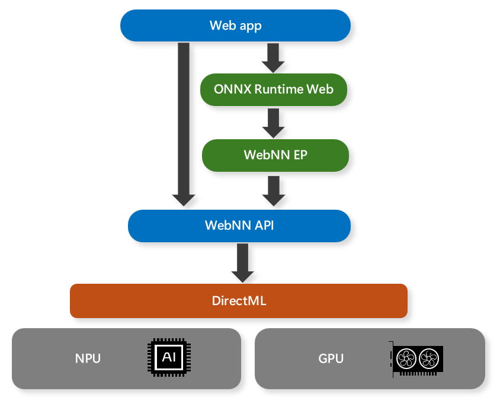

# WebNN Overview

The Web Neural Network (WebNN) API is an emerging web standard that allows web apps and frameworks to accelerate deep neural networks with GPUs, CPUs, or purpose-built AI accelerators such as NPUs. The WebNN API leverages the DirectML API on Windows to access the native hardware capabilities and optimize the execution of neural network models. 

As the use of AI/ML in apps become more popular, the WebNN API provides the following benefits: 

* *Performance Optimizations* – By utilizing DirectML, WebNN helps to enable web apps and frameworks to take advantage of the best available hardware and software optimizations for each platform and device, without requiring complex and platform-specific code. 
* *Low Latency* - In-browser inference helps enable novel use cases with local media sources, such as real-time video analysis, face detection, and speech recognition, without the need to send data to remote servers and wait for responses. 
* *Privacy Preservation* - User data stays on-device and preserves user-privacy, as web apps and frameworks do not need to upload sensitive or personal information to cloud services for processing. 
* *High Availability* - No reliance on the network after initial asset caching for offline case, as web apps and frameworks can run neural network models locally even when the internet connection is unavailable or unreliable. 
* *Low Server Cost* - Computing on client devices means no servers needed, which helps web apps to reduce the operational and maintenance costs of running AI/ML services in the cloud. 

AI/ML scenarios supported by WebNN include generative AI, person detection, face detection, semantic segmentation, skeleton detection, style transfer, super resolution, image captioning, machine translation, and noise suppression.

> [!NOTE]
> The WebNN API is still in progress, with GPU and NPU support in a preview state. The WebNN API should not currently be used in a production environment.

## Framework support

WebNN is designed as a backend API for web frameworks. For Windows, we recommend using [ONNX Runtime Web](https://onnxruntime.ai/docs/tutorials/web/). This gives a familiar experience to using DirectML and ONNX Runtime natively so you can have a consistent experience deploying AI in ONNX format across web and native applications.

## WebNN requirements

You can check information about your browser by navigating to about://version in your chromium browser's address bar.

| Hardware | Web Browsers | Windows version | ONNX Runtime Web version | Driver Version |
| --- | --- | --- | --- | --- | 
| **GPU** | WebNN requires a Chromium browser*. Please use the most recent version of Microsoft Edge Beta. | Minimum version: Windows 11, version 21H2. |Minimum version: 1.18 | Install the latest driver for your hardware. | 
| **NPU** | WebNN requires a Chromium browser*. Please use the most recent version of Microsoft Edge Canary. See note below for how to disable the GPU blocklist. | Minimum version: Windows 11, version 21H2. | Minimum version: 1.18 | Intel driver version: 32.0.100.2381. See FAQ for steps on how to update the driver. | 

> [!NOTE]
> Chromium based browsers can currently support WebNN, but will depend on the individual browser's implementation status.

> [!NOTE]
> For NPU support, launch edge from the command line with the following flag: `msedge.exe --disable_webnn_for_npu=0`

## Model support 

### GPU (Preview):
When running on GPUs, WebNN currently supports the following models:

* [Stable Diffusion Turbo](https://microsoft.github.io/webnn-developer-preview/demos/sd-turbo/)
* [Stable Diffusion 1.5](https://microsoft.github.io/webnn-developer-preview/demos/stable-diffusion-1.5/)
* [Whisper-base](https://microsoft.github.io/webnn-developer-preview/demos/whisper-base/)
* [MobileNetv2](https://microsoft.github.io/webnn-developer-preview/demos/image-classification/)
* [Segment Anything](https://microsoft.github.io/webnn-developer-preview/demos/segment-anything/)
* [ResNet](https://microsoft.github.io/webnn-developer-preview/demos/image-classification/?provider=webnn&devicetype=gpu&model=resnet-50&run=5)
* [EfficientNet](https://microsoft.github.io/webnn-developer-preview/demos/image-classification/?provider=webnn&devicetype=gpu&model=efficientnet-lite4&run=5)
* SqueezeNet 

WebNN also works with custom models as long as operator support is sufficient. Check status of operators [here](https://webmachinelearning.github.io/webnn-status/).

### NPU (Preview): 
On Intel’s® Core™ Ultra processors with Intel® AI Boost NPU, WebNN supports: 

* [Whisper-base](https://microsoft.github.io/webnn-developer-preview/demos/whisper-base/)
* [MobileNetV2](https://microsoft.github.io/webnn-developer-preview/demos/image-classification/?provider=webnn&devicetype=npu&model=resnet-50&run=5)
* [ResNet](https://microsoft.github.io/webnn-developer-preview/demos/image-classification/?provider=webnn&devicetype=npu&model=resnet-50&run=5)
* [EfficientNet](https://microsoft.github.io/webnn-developer-preview/demos/image-classification/?provider=webnn&devicetype=npu&model=efficientnet-lite4&run=5) 

## FAQ

#### **How do I file an issue with WebNN?**

For general issues with WebNN, please file an issue on our [WebNN Developer Preview GitHub](https://github.com/microsoft/webnn-developer-preview/issues)

For issues with ONNX Runtime Web or the WebNN Execution Provider, go to the [ONNXRuntime Github](https://github.com/microsoft/onnxruntime/issues).

#### **How do I debug issues with WebNN?**

The [WebNN W3C Spec](https://www.w3.org/TR/webnn/) has information on error propagation, typically through DOM exceptions. The log at the end of about://gpu may also have helpful information. For further issues please file an issue as linked above.

#### Does WebNN support other operating systems?

Currently, WebNN best supports the Windows operating system. Versions for other operating systems are in progress.

#### What hardware back-ends are currently available? Are certain models only supported with specific hardware back-ends?

You can find information about operator support in WebNN at [Implementation Status of WebNN Operations | Web Machine Learning](https://webmachinelearning.github.io/webnn-status/).

#### What are the steps to update the Intel driver for NPU Support (Preview)? 

1. Locate the updated driver from [Intel's Driver Website](https://www.intel.com/content/www/us/en/download/794734/intel-npu-driver-windows.html).
2. Uncompress the ZIP file. 
3. Press Win+R to open the Run dialog box. 
4. Type devmgmt.msc into the text field. 
5. Press Enter or click OK. 
6. In the Device Manager, open the "Neural processors" node 
7. Right click on the NPU who's driver you wish to update. 
8. Select "Update Driver" from the context menu 
9. Select "Browse my computer for drivers" 
10. Select "Let me pick from a list of available drivers on my computer" 
11. Press the "Have disk" button 
12. Press the "Browse" button 
13. Navigate to the place where you decompressed the aforementioned zip file. 
14. Press OK. 
