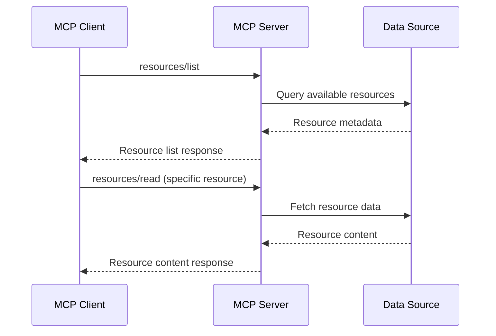

# MCP architecture on Windows

This article provides a comprehensive overview of the Model Context Protocol (MCP) architecture on Windows, covering the core components, communication patterns, integration models, and implementation considerations for building robust MCP solutions.

## Architecture overview

MCP on Windows follows a distributed architecture that enables secure, scalable communication between AI applications and contextual data sources. The architecture is designed to leverage Windows-specific capabilities while maintaining cross-platform compatibility.

:::image type="content" source="../images/mcp-windows-architecture.png" alt-text="Diagram showing the complete MCP architecture on Windows with all major components":::

## Core components

### MCP Client

The MCP Client is the AI application or service that requests contextual information. Key responsibilities include:

- **Connection management**: Establishing and maintaining connections to MCP servers
- **Request orchestration**: Coordinating multiple requests across different data sources
- **Response processing**: Handling and integrating responses from various MCP servers
- **Error handling**: Managing connection failures and retry logic
- **Resource discovery**: Finding and cataloging available resources

```csharp
public class McpClient
{
    private readonly Dictionary<string, IMcpServerConnection> _connections;
    private readonly ILogger<McpClient> _logger;
    
    public async Task<IEnumerable<Resource>> DiscoverResources()
    {
        var allResources = new List<Resource>();
        
        foreach (var connection in _connections.Values)
        {
            try
            {
                var resources = await connection.ListResourcesAsync();
                allResources.AddRange(resources);
            }
            catch (Exception ex)
            {
                _logger.LogWarning(ex, "Failed to discover resources from {Server}", 
                    connection.ServerInfo.Name);
            }
        }
        
        return allResources;
    }
}
```

### MCP Server

The MCP Server provides access to specific data sources and implements the MCP protocol. Core capabilities include:

- **Resource management**: Exposing available data resources
- **Tool execution**: Providing executable tools and functions
- **Prompt enhancement**: Offering prompts and templates
- **Sampling**: Providing data samples for training and fine-tuning
- **Authentication and authorization**: Securing access to resources

```csharp
public abstract class McpServerBase
{
    protected readonly ILogger _logger;
    protected readonly IResourceProvider _resourceProvider;
    
    public virtual async Task<InitializeResponse> InitializeAsync(InitializeRequest request)
    {
        return new InitializeResponse
        {
            ProtocolVersion = "2024-11-05",
            Capabilities = GetServerCapabilities(),
            ServerInfo = GetServerInfo()
        };
    }
    
    public virtual async Task<ResourceListResponse> ListResourcesAsync(ResourceListRequest request)
    {
        var resources = await _resourceProvider.GetResourcesAsync();
        return new ResourceListResponse { Resources = resources };
    }
    
    protected abstract ServerCapabilities GetServerCapabilities();
    protected abstract ServerInfo GetServerInfo();
}
```

### Transport Layer

The transport layer handles communication between clients and servers. Windows MCP implementations support multiple transport mechanisms:

#### Standard I/O Transport (stdio)

The primary transport mechanism for local MCP servers:

```csharp
public class StdioTransport : ITransport
{
    private readonly StreamReader _reader;
    private readonly StreamWriter _writer;
    
    public async Task<JsonRpcResponse> SendRequestAsync(JsonRpcRequest request)
    {
        var json = JsonSerializer.Serialize(request);
        await _writer.WriteLineAsync(json);
        await _writer.FlushAsync();
        
        var response = await _reader.ReadLineAsync();
        return JsonSerializer.Deserialize<JsonRpcResponse>(response);
    }
}
```

#### HTTP Transport

For remote MCP servers and cloud integration:

```csharp
public class HttpTransport : ITransport
{
    private readonly HttpClient _httpClient;
    private readonly string _endpoint;
    
    public async Task<JsonRpcResponse> SendRequestAsync(JsonRpcRequest request)
    {
        var content = new StringContent(
            JsonSerializer.Serialize(request), 
            Encoding.UTF8, 
            "application/json");
        
        var response = await _httpClient.PostAsync(_endpoint, content);
        var responseContent = await response.Content.ReadAsStringAsync();
        
        return JsonSerializer.Deserialize<JsonRpcResponse>(responseContent);
    }
}
```

#### Named Pipes Transport

For secure local inter-process communication:

```csharp
public class NamedPipeTransport : ITransport
{
    private readonly NamedPipeClientStream _pipeClient;
    
    public async Task ConnectAsync(string pipeName, CancellationToken cancellationToken = default)
    {
        _pipeClient = new NamedPipeClientStream(".", pipeName, PipeDirection.InOut);
        await _pipeClient.ConnectAsync(cancellationToken);
    }
    
    public async Task<JsonRpcResponse> SendRequestAsync(JsonRpcRequest request)
    {
        var requestBytes = Encoding.UTF8.GetBytes(JsonSerializer.Serialize(request));
        await _pipeClient.WriteAsync(requestBytes, 0, requestBytes.Length);
        
        var buffer = new byte[4096];
        var bytesRead = await _pipeClient.ReadAsync(buffer, 0, buffer.Length);
        var responseJson = Encoding.UTF8.GetString(buffer, 0, bytesRead);
        
        return JsonSerializer.Deserialize<JsonRpcResponse>(responseJson);
    }
}
```

## Protocol layers

### JSON-RPC 2.0 Layer

MCP uses JSON-RPC 2.0 as the message format for all communications:

```csharp
public class JsonRpcMessage
{
    [JsonPropertyName("jsonrpc")]
    public string JsonRpc { get; set; } = "2.0";
    
    [JsonPropertyName("id")]
    public object? Id { get; set; }
}

public class JsonRpcRequest : JsonRpcMessage
{
    [JsonPropertyName("method")]
    public string Method { get; set; } = "";
    
    [JsonPropertyName("params")]
    public object? Params { get; set; }
}

public class JsonRpcResponse : JsonRpcMessage
{
    [JsonPropertyName("result")]
    public object? Result { get; set; }
    
    [JsonPropertyName("error")]
    public JsonRpcError? Error { get; set; }
}
```

### MCP Protocol Layer

The MCP-specific protocol defines standard methods and message formats:

```csharp
public static class McpMethods
{
    public const string Initialize = "initialize";
    public const string ResourcesList = "resources/list";
    public const string ResourcesRead = "resources/read";
    public const string ToolsList = "tools/list";
    public const string ToolsCall = "tools/call";
    public const string PromptsList = "prompts/list";
    public const string PromptsGet = "prompts/get";
    public const string SamplingCreateMessage = "sampling/createMessage";
}
```

## Windows integration patterns

### Windows Service Integration

Deploy MCP servers as Windows services for enterprise scenarios:

```csharp
public class McpWindowsService : BackgroundService
{
    private readonly IHostApplicationLifetime _lifetime;
    private readonly ILogger<McpWindowsService> _logger;
    private readonly McpServerBase _mcpServer;
    
    protected override async Task ExecuteAsync(CancellationToken stoppingToken)
    {
        try
        {
            await _mcpServer.StartAsync(stoppingToken);
            _logger.LogInformation("MCP Server started successfully");
            
            await stoppingToken;
        }
        catch (Exception ex)
        {
            _logger.LogError(ex, "MCP Server failed to start");
            _lifetime.StopApplication();
        }
    }
}
```

### Registry Integration

Store configuration and discovery information in the Windows Registry:

```csharp
public class RegistryMcpDiscovery : IMcpServerDiscovery
{
    private const string MCP_REGISTRY_KEY = @"SOFTWARE\MCP\Servers";
    
    public async Task<IEnumerable<McpServerInfo>> DiscoverServersAsync()
    {
        var servers = new List<McpServerInfo>();
        
        using var key = Registry.LocalMachine.OpenSubKey(MCP_REGISTRY_KEY);
        if (key != null)
        {
            foreach (var serverName in key.GetSubKeyNames())
            {
                using var serverKey = key.OpenSubKey(serverName);
                if (serverKey != null)
                {
                    servers.Add(new McpServerInfo
                    {
                        Name = serverName,
                        ExecutablePath = serverKey.GetValue("ExecutablePath")?.ToString(),
                        Arguments = serverKey.GetValue("Arguments")?.ToString(),
                        WorkingDirectory = serverKey.GetValue("WorkingDirectory")?.ToString()
                    });
                }
            }
        }
        
        return servers;
    }
}
```

### COM Integration

Enable MCP servers to integrate with COM-based Windows applications:

```csharp
[ComVisible(true)]
[Guid("12345678-1234-5678-9012-123456789012")]
public interface IMcpComServer
{
    Task<string> GetResourcesAsync();
    Task<string> ReadResourceAsync(string uri);
}

[ComVisible(true)]
[ClassInterface(ClassInterfaceType.None)]
public class McpComServer : IMcpComServer
{
    private readonly McpServerBase _mcpServer;
    
    public async Task<string> GetResourcesAsync()
    {
        var resources = await _mcpServer.ListResourcesAsync(new ResourceListRequest());
        return JsonSerializer.Serialize(resources);
    }
}
```

## Data flow patterns

### Request-Response Pattern

The basic synchronous request-response pattern:



### Streaming Pattern

For large data sets or real-time updates:

```csharp
public class StreamingMcpServer : McpServerBase
{
    public async IAsyncEnumerable<ResourceUpdate> StreamResourceUpdatesAsync(
        string resourceUri,
        [EnumeratorCancellation] CancellationToken cancellationToken = default)
    {
        await foreach (var update in _resourceProvider.WatchResourceAsync(resourceUri, cancellationToken))
        {
            yield return new ResourceUpdate
            {
                ResourceUri = resourceUri,
                UpdateType = update.Type,
                Content = update.Content,
                Timestamp = DateTimeOffset.UtcNow
            };
        }
    }
}
```

### Pub/Sub Pattern

For event-driven scenarios:

```csharp
public class EventDrivenMcpServer : McpServerBase
{
    private readonly IEventBus _eventBus;
    
    public override async Task InitializeAsync(InitializeRequest request)
    {
        // Subscribe to relevant events
        _eventBus.Subscribe<FileSystemEvent>(OnFileSystemEvent);
        _eventBus.Subscribe<ApplicationEvent>(OnApplicationEvent);
        
        return await base.InitializeAsync(request);
    }
    
    private async Task OnFileSystemEvent(FileSystemEvent fileEvent)
    {
        // Notify connected clients of file system changes
        await NotifyClientsAsync(new ResourceChangeNotification
        {
            ResourceUri = fileEvent.FilePath,
            ChangeType = fileEvent.ChangeType
        });
    }
}
```

## Scalability and performance

### Connection Pooling

Manage multiple client connections efficiently:

```csharp
public class ConnectionPool : IDisposable
{
    private readonly ConcurrentQueue<IMcpServerConnection> _availableConnections = new();
    private readonly SemaphoreSlim _semaphore;
    private readonly int _maxConnections;
    
    public async Task<IMcpServerConnection> AcquireConnectionAsync()
    {
        await _semaphore.WaitAsync();
        
        if (_availableConnections.TryDequeue(out var connection))
        {
            return connection;
        }
        
        return await CreateNewConnectionAsync();
    }
    
    public void ReleaseConnection(IMcpServerConnection connection)
    {
        _availableConnections.Enqueue(connection);
        _semaphore.Release();
    }
}
```

### Caching Strategies

Implement intelligent caching for frequently accessed resources:

```csharp
public class CachingResourceProvider : IResourceProvider
{
    private readonly IResourceProvider _inner;
    private readonly IMemoryCache _cache;
    private readonly ILogger<CachingResourceProvider> _logger;
    
    public async Task<Resource?> GetResourceAsync(string uri)
    {
        var cacheKey = $"resource:{uri}";
        
        if (_cache.TryGetValue(cacheKey, out Resource? cachedResource))
        {
            _logger.LogDebug("Cache hit for resource {Uri}", uri);
            return cachedResource;
        }
        
        var resource = await _inner.GetResourceAsync(uri);
        if (resource != null)
        {
            var cacheEntryOptions = new MemoryCacheEntryOptions
            {
                SlidingExpiration = TimeSpan.FromMinutes(5),
                Priority = CacheItemPriority.Normal
            };
            
            _cache.Set(cacheKey, resource, cacheEntryOptions);
            _logger.LogDebug("Cached resource {Uri}", uri);
        }
        
        return resource;
    }
}
```

### Load Balancing

Distribute load across multiple MCP server instances:

```csharp
public class LoadBalancedMcpClient : IMcpClient
{
    private readonly List<IMcpServerConnection> _servers;
    private int _currentIndex;
    
    public async Task<T> ExecuteAsync<T>(Func<IMcpServerConnection, Task<T>> operation)
    {
        var server = GetNextServer();
        
        try
        {
            return await operation(server);
        }
        catch (Exception)
        {
            // Try next server on failure
            server = GetNextServer();
            return await operation(server);
        }
    }
    
    private IMcpServerConnection GetNextServer()
    {
        var index = Interlocked.Increment(ref _currentIndex) % _servers.Count;
        return _servers[index];
    }
}
```

## Deployment architectures

### Single-Machine Deployment

For development and small-scale scenarios:

```text
┌─────────────────────────────────────┐
│           Windows Machine            │
├─────────────────────────────────────┤
│  ┌─────────────┐  ┌───────────────┐ │
│  │ AI App      │  │ MCP Server A  │ │
│  │ (MCP Client)├──┤ (File System) │ │
│  │             │  └───────────────┘ │
│  │             │  ┌───────────────┐ │
│  │             ├──┤ MCP Server B  │ │
│  │             │  │ (Database)    │ │
│  └─────────────┘  └───────────────┘ │
└─────────────────────────────────────┘
```

### Distributed Deployment

For enterprise and cloud scenarios:

```text
┌─────────────────┐    ┌─────────────────┐    ┌─────────────────┐
│  Client Machine │    │  Server Farm    │    │  Data Sources   │
├─────────────────┤    ├─────────────────┤    ├─────────────────┤
│ ┌─────────────┐ │    │ ┌─────────────┐ │    │ ┌─────────────┐ │
│ │ AI App      │ │    │ │Load Balancer│ │    │ │ SQL Server  │ │
│ │(MCP Client) ├─┼────┼─┤             │ │    │ └─────────────┘ │
│ └─────────────┘ │    │ └─────┬───────┘ │    │ ┌─────────────┐ │
└─────────────────┘    │       │         │    │ │ File Share  │ │
                       │ ┌─────▼───────┐ │    │ └─────────────┘ │
                       │ │MCP Server 1 ├─┼────┤ ┌─────────────┐ │
                       │ └─────────────┘ │    │ │ Web APIs    │ │
                       │ ┌─────────────┐ │    │ └─────────────┘ │
                       │ │MCP Server 2 │ │    └─────────────────┘
                       │ └─────────────┘ │
                       └─────────────────┘
```

## Best practices

### Architecture Best Practices

- **Separation of concerns**: Keep transport, protocol, and business logic separate
- **Interface segregation**: Define focused interfaces for different capabilities
- **Dependency injection**: Use DI for testability and flexibility
- **Configuration externalization**: Keep configuration separate from code
- **Monitoring and observability**: Implement comprehensive logging and metrics

### Performance Best Practices

- **Resource pooling**: Reuse expensive resources like database connections
- **Async/await patterns**: Use asynchronous programming throughout
- **Streaming for large data**: Use streaming APIs for large data transfers
- **Caching strategies**: Implement appropriate caching at multiple layers
- **Connection management**: Optimize connection lifecycle management

### Security Best Practices

- **Transport security**: Always use encrypted transport (TLS, named pipes)
- **Authentication**: Implement strong authentication mechanisms
- **Authorization**: Apply principle of least privilege
- **Input validation**: Validate all inputs at protocol boundaries
- **Audit logging**: Log all security-relevant events

## See also

- [MCP for Windows overview](overview.md)
- [MCP Quick Start Guide](quickstart.md)
- [MCP Identity and Security Considerations](identity-considerations.md)
- [Windows AI Foundry overview](../overview.md)
