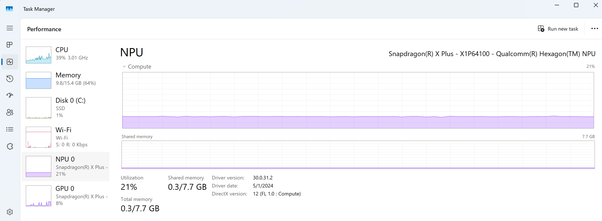
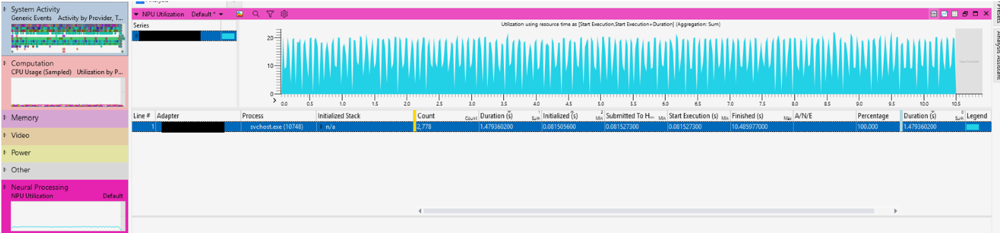

# Windows Copilot+ PCs Developer Guide

Copilot+ PCs are a new class of Windows 11 hardware powered by a turbocharged Neural Processing Unit (NPU) — a specialized computer chip for AI-intensive processes like real-time translations and image generation—that can perform more than 40 trillion operations per second (TOPS). Copilot+ PCs provide all–day battery life and access to the most advanced AI features and models. Learn more at [Introducing Copilot+ PCs - The Official Microsoft Blog](https://blogs.microsoft.com/blog/2024/05/20/introducing-copilot-pcs/).

The following Copilot+ PC Developer Guidance covers:

- Device Prerequisites
- What is the Arm-based Snapdragon Elite X+ chip?
- Unique AI features supported by Copilot+ PCs with an NPU processor
- How to access the NPU on a Copilot+ PC
- How to use ONNX Runtime to programmatically access the NPU on a Copilot+ PC
- How to measure performance of AI models running on your local device NPU

## Prerequisites

This guidance is specific to [Copilot+ PCs](https://www.microsoft.com/windows/copilot-plus-pcs), including but not limited to:

- Arm-based [Qualcomm Snapdragon X Elite](#what-is-the-arm-based-snapdragon-elite-x-chip) devices
- Intel Lunar Lake devices -- *Coming soon*
- AMD STRIX (Ryzen AI 9) devices -- *Coming soon*

## What is the Arm-based Snapdragon Elite X+ chip?

The new Snapdragon X Elite+ SoC Arm-based chip built by Qualcomm emphasizes AI integration through its industry-leading Neural Processing Unit (NPU). This NPU can perform 45 trillion operations per second with exceptional energy savings that result in longer device battery life. The NPU works in alignment with the CPU and GPU to deliver fast and efficient performance, enabling on-device AI intelligent experiences with Enterprise-grade security for enhanced protection from chip to cloud.

- Learn more about the [Qualcomm Snapdragon X Elite](https://www.qualcomm.com/products/mobile/snapdragon/pcs-and-tablets/snapdragon-x-elite).
- Learn more about using and developing for [Windows on Arm](/windows/arm/overview).

## Unique AI features supported by Copilot+ PCs with an NPU processor

Copilot+ PCs offer unique AI experiences that ship with modern versions of Windows 11. These AI features, designed to run on the device NPU, include:

- [Windows Studio Effects](/windows/ai/studio-effects/): a set of audio and video NPU-accelerated AI effects from Microsoft including Creative Filter, Background Blur, Eye Contact, Auto Framing, Voice Focus. Developers can also add toggles to their app for system level controls.

- [Recall](/windows/ai/apis/recall): the AI-supported UserActivity API that enables users to search for past interactions using natural language and pick up where they left off.  /Available for Copilot+ PCs via [Windows Insider Program (WIP)](https://www.microsoft.com/windowsinsider/). Learn more: [Retrace your steps with Recall](https://support.microsoft.com/windows/retrace-your-steps-with-recall-aa03f8a0-a78b-4b3e-b0a1-2eb8ac48701c)

- [Phi Silica](/windows/ai/apis/phi-silica): The Phi Small Language Model (SLM) that enables your app to connect with the on-device model to perform natural language processing tasks (chat, math, code, reasoning) using the Windows App SDK (available beginning in the Experimental 2 release).

- [Text Recognition](/windows/ai/apis/text-recognition): The Optical Character Recognition (OCR) API that enables the extraction of text from images and documents. Imagine tasks like converting a PDF, paper document, or picture of a classroom white board into editable digital text.

- [Cocreator with Paint](https://support.microsoft.com/windows/use-cocreator-in-paint-53857513-e36c-472d-8d4a-adbcd14b2e54) a new feature in Microsoft Pain that transforms images into AI Art.

- [Super Resolution](https://devblogs.microsoft.com/directx/autosr/): an industry-leading AI technology that uses the NPU to make games run faster and look better.

**Not all features may initially be available on all Copilot+ PCs.*

> [!IMPORTANT]
> AI models shipping in the latest releases of Windows will be available via APIs in the [Windows CoPilot Runtime](../overview.md) announced at Build 2024. [APIs for new AI features](../apis/index.md), such as [Phi Silica](../apis/phi-silica.md), are supported by models optimized to run (inference) on the NPU. These APIs are included in the [Windows App SDK](/windows/apps/windows-app-sdk/) beginning in Windows App SDK 1.6 Experimental 2. The Experimental SDK targets early development use, subject to extensive revision, and are not yet supported for general Windows users, in production environments, or able to be published to the Microsoft Store.

## How to access the NPU on a Copilot+ PC

The [Neural Processing Unit (NPU)](https://support.microsoft.com/windows/all-about-neural-processing-units-npus-e77a5637-7705-4915-96c8-0c6a975f9db4) is a new hardware resource. Like other hardware resources on a PC, the NPU needs software to be specifically programmed to take advantage of the benefits it offers. NPUs are designed specifically to execute the deep learning math operations that make up AI models.

The Windows 11 CoPilot+ AI features mentioned above have been specifically designed to take advantage of the NPU. Users will get improved battery life and faster inference execution time for AI models that target the NPU. Windows 11 support for NPUs will include Arm-based Qualcomm devices, as well as Intel and AMD devices (coming soon).

For devices with NPUs, the [Task Manager](/shows/inside/task-manager) can now be used to view NPU resource usage.



The recommended way to inference (run AI tasks) on the device NPU is to use [ONNX Runtime](#how-to-use-onnx-runtime-to-programmatically-access-the-npu-on-a-copilot-pc). ONNX Runtime is a flexible and performant stack to program against the NPU, as well as the GPU and CPU, enabling you to bring your own AI models or use Open Source AI models found on the web. Learn more about using ONNX Runtime to access the NPU below, or learn more about how to [use Machine Learning models in your Windows app](../models.md).

> [!NOTE]
> **What about using other Runtimes for PyTorch or Tensorflow?**
> Other runtimes for PyTorch, Tensorflow, and other Silicon vendor-provided SDK types are also supported on Windows. Currently you can run PyTorch, TensorFlow, and other model types by converting to the flexible ONNX format, but native support is coming soon.

## How to use ONNX Runtime to programmatically access the NPU on a Copilot+ PC

Microsoft provides a complete Open Source inferencing and training framework called [ONNX Runtime](https://onnxruntime.ai/). ONNX Runtime is the recommended open-source Microsoft solution to run AI models on an NPU. Since ONNX Runtime is flexible and supports a lot of different options to run AI models, the choices can be confusing. This guide will help you to select choices specific to Windows CoPilot+ PCs.

- **Qualcomm Snapdragon X**: Currently, developers should target the Qualcomm [QNN Execution Provider (EP)](https://onnxruntime.ai/docs/execution-providers/QNN-ExecutionProvider.html), which uses the Qualcomm AI Engine Direct SDK (QNN). [Pre-built packages](https://onnxruntime.ai/docs/execution-providers/QNN-ExecutionProvider.html#pre-built-packages-windows-only) with QNN support are available to download. This is the same stack currently used by the Windows CoPilot Runtime and experiences on CoPilot+ PC Qualcomm devices. [DirectML](../directml/dml.md) and [WebNN](../directml/webnn-overview.md) support for Qualcomm Snapdragon Elite NPUs was announced at BUILD 2024 and will be available soon.
- **Intel and AMD NPU devices**: Additional NPU devices will be available later in 2024. [DirectML](../directml/dml.md) is the recommended method to target these devices.

### Supported model formats

AI models are often trained and available in larger data formats, such as FP32. Many NPU devices, however, only support integer math in lower bit format, such as INT8, for increased performance and power efficiency. Therefore, AI models need to be converted (or "quantized") to run on the NPU. There are many models available that have already been converted into a ready-to-use format. You can also *bring your own model* (BYOM) to convert or optimize.

- **[Qualcomm AI Hub (Compute)](https://aihub.qualcomm.com/compute/models)**: Qualcomm provides AI models that have already been validated for use on Copilot+ PCs with Snapdragon X with the available models specifically optimized to run efficiently on this NPU. Learn more: [Accelerate model deployment with Qualcomm AI Hub | Microsoft Build 2024](https://build.microsoft.com/en-US/sessions/ff420023-a836-4843-8aaf-00c1f8141b4d).
- **[ONNX Model Zoo](https://github.com/onnx/models)**: This Open Source repository offers a curated collection of pre-trained, state-of-the-art models in the ONNX format. These models are recommended for use with NPUs across all Copilot+ PCs, including Intel and AMD devices (coming soon).

For those who want to bring your own model, we recommend using the hardware-aware model optimization tool, [Olive](https://onnxruntime.ai/docs/performance/olive.html). Olive can help with model compression, optimization, and compilation to work with ONNX Runtime as an NPU performance optimization solution. Learn more: [AI made easier: How the ONNX Runtime and Olive toolchain will help you Q&A | Build 2023](https://www.youtube.com/watch?v=7_0N1VL5ZmA).

## How to measure performance of AI models running on your local device NPU

To measure the performance of AI feature integration in your app and the associated AI model runtimes:

- **Record a trace**: Recording device activity over a period of time is known as system tracing. System tracing produces a "trace" file that can be used to generate a report and help you identify how to be improve your app's performance. Learn more: [Capture a system trace to analyze memory usage](/windows/apps/performance/disk-memory#capture-a-system-trace-to-analyze-memory-usage).

- **View NPU usage**: Examine which processes are using the NPU and the callstacks submitting work.

- **View work and callstacks on the CPU**: Examine the results of the pre-work feeding AI models and post-work processing AI models.

- **Load and Runtime**: Examine the length of time to load an AI model and create an ONNX Runtime session.

- **Runtime parameters**: Examine ONNX Runtime configuration and Execution Provider (EP) parameters that affect model runtime performance and optimization.

- **Individual inference times**: Track per-inference times and sub-details from the NPU.

- **Profiler**: Profile AI model operations to see how long each operator took to contribute to the total inference time.

- **NPU Specific**: Examine NPU sub-details such as sub-HW metrics, memory bandwidth, and more.



To perform these measurements, we recommend the following diagnostic and tracing tools:

- **[Task Manager](/shows/inside/task-manager)**: Enables a user to view the performance of the Windows Operating System installed on their device, including Processes, Performance, App history, Startup apps, Users, Details, and Services. Real-time performance data will be shown for your device CPU, Memory, Storage Disk, Wi-Fi, GPU... and now NPU. Data includes the percentage of utilization, available memory, shared memory, driver version, physical location, and more.
- **[Windows Performance Recorder (WPR)](/windows-hardware/test/wpt/whats-new-in-the-windows-performance-toolkit-v11)**: WPR now ships with a Neural Processing profile to record NPU activity. This records [Microsoft Compute Driver Model (MCDM)](/windows-hardware/drivers/display/mcdm) interactions with the NPU. Developers can now see NPU usage, which processes are using the NPU, and the callstacks submitting work.
- **[Windows Performance Analyzer (WPA)](/windows-hardware/test/wpt/whats-new-in-the-windows-performance-toolkit-v11#windows-performance-analyzer)**: WPA now includes a welcome launch screen to streamline workflow and provide convenient access points for analyzing the CPU, Disk, Network, ONNX Runtime Events... and a new table for [NPU analysis](/windows-hardware/test/wpt/whats-new-in-the-windows-performance-toolkit-v11#npu-analysis), all in a single timeline. WPA can now view the work and callstacks on the CPU related to pre-work feeding AI models and post-work processing AI model results. [Download Windows Performance Analyzer from the Microsoft Store](https://apps.microsoft.com/detail/9n58qrw40dfw).
- [GPUView](/windows-hardware/drivers/display/installing-gpuview): GPUView.exe is a development tool that reads logged video and kernel events from an event trace log (.etl) file and presents the data graphically to the user. This tool now includes both GPU and NPU operations, as well as support for viewing DirectX events for [MCDM](/windows-hardware/drivers/display/mcdm) devices like the NPU.
- **[ONNX Runtime events in Windows Performance Analyzer](https://onnxruntime.ai/docs/performance/tune-performance/logging_tracing.html)**: Starting with ONNXRuntime 1.17 (and enhanced in 1.18.1) the following use cases are available with events emitted in the runtime:
  - See how long it took to load an AI model and create an ONNX Runtime session.
  - See ONNX Runtime configuration and Execution Provider (EP) parameters that affect model runtime performance and optimization.
  - Track per inference times and sub-details from the NPU (QNN).
  - Profile AI Model operations to see how long each operator took to contribute to the total inference time.
  - Learn more about [ONNX Runtime Execution Provider (EP) Profiling](https://onnxruntime.ai/docs/performance/tune-performance/profiling-tools.html#execution-provider-ep-profiling).

> [!IMPORTANT]
> WPR, WPA, and GPUView are all part of Windows Performance Toolkit (WPT), version May 2024+. To use the WPT, you will need to: [Download the Windows ADK Toolkit](/windows-hardware/get-started/adk-install#download-the-adk-101261001-may-2024).

For a quickstart on viewing ONNX Runtime events with the Windows Performance Analyzer (WPA), follow these steps:

1. Download [ort.wprp](https://github.com/microsoft/onnxruntime/blob/main/ort.wprp) and [etw_provider.wprp](https://github.com/microsoft/onnxruntime/blob/main/onnxruntime/test/platform/windows/logging/etw_provider.wprp).

2. Open your command line and enter:

    ```powershell
    wpr -start ort.wprp -start etw_provider.wprp -start NeuralProcessing -start CPU
    echo Repro the issue allowing ONNX to run 
    wpr -stop onnx_NPU.etl -compress
    ```

3. Combine the Windows Performance Recorder (WPR) profiles with other [Built-in Recording Profiles](/windows-hardware/test/wpt/built-in-recording-profiles) such as CPU, Disk, etc.

Additional performance measurement tools to consider using with the Microsoft Windows tools listed above, include:

- [Qualcomm Snapdragon Profiler](https://www.qualcomm.com/developer/software/snapdragon-profiler) (qprof): A GUI and system-wide performance profiling tool designed to visualize system performance, as well as identify optimization and application scaling improvement opportunities across Qualcomm SoC CPUs, GPUs, DSPs and other IP blocks. The Snapdragon Profiler allows viewing NPU sub-details, such as sub-HW metrics, memory bandwidth and more.

## Addition Resources

- [Windows Copilot Runtime overview](../overview.md)
- [Windows app performance and fundamentals overview](/windows/apps/performance/)
- [Windows on Arm overview](/windows/arm/overview)
- [All about neural processing units (NPUs)](https://support.microsoft.com/windows/all-about-neural-processing-units-npus-e77a5637-7705-4915-96c8-0c6a975f9db4)
