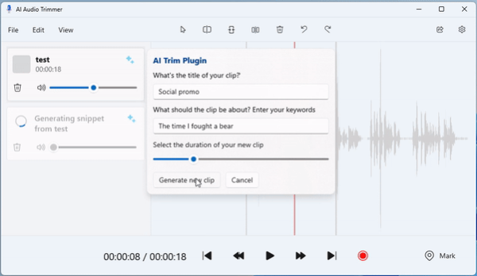
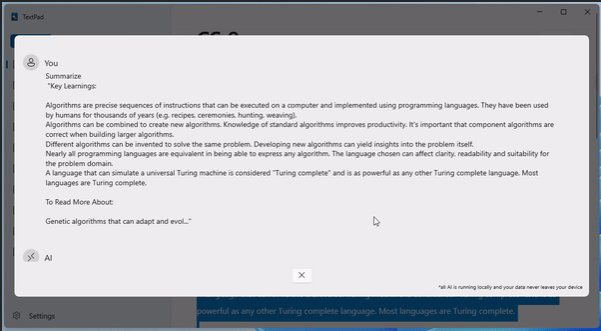
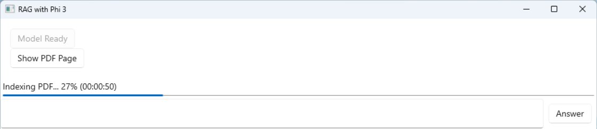
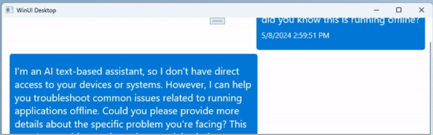
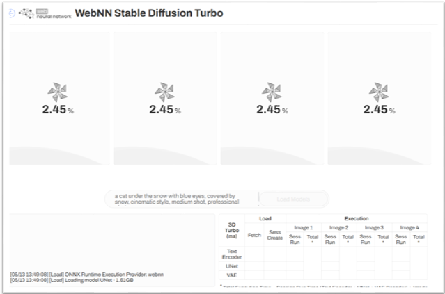
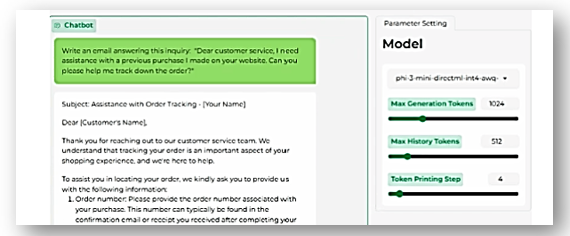
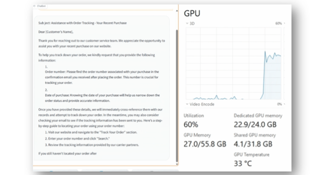

# AI on Windows Sample Gallery

A collection of samples that demonstrate a variety of ways to enhance your Windows apps using local APIs and Machine Learning (ML) models, local hardware acceleration using DirectML, and using cloud-based APIs.

## Enhance your Windows apps with AI using local APIs and ML models

These samples will help you to enhance your Windows apps with AI using local APIs and Machine Learning models.

### AI-powered Audio Editor

**GitHub Repo**: [AI Audio Editor Sample](https://github.com/microsoft/AI-Audio-Editor)

**Description**: The AI-powered Audio Editor demonstrates building a WinUI 3 audio editing app which utilizes AI to match snips of audio to a relevant query. An example use-case could be a podcast creator who wants to create short audio clips of their content to promote on Social Media. The sample uses local ML model inference to handle transcription and semantic search.

**Features**: Local Model Inferencing with ONNX Runtime, Whisper model, Embeddings model

**App Type**: [C#](/dotnet/csharp/), [WinUI 3](/windows/apps/winui/winui3/)

### AI-powered Notes App

**GitHub Repo**: [AI-powered Notes Sample App](https://aka.ms/real-ai-demo)

**Description**:  This AI-powered note taking application demonstrates the use of APIs including [OCR Text Recognition](../apis/text-recognition.md), Audio Transcription through local ML model, Semantic Search through a local embeddings model, local language model usage with Phi3 for summarization, autocomplete, and text reasoning, and Retrieval Augmented Generation (RAG) for grounding language models to real data.

**Features**: Semantic search with local model, Audio transcription with local model, Local Retreval Augmented generation (RAG) with [Phi3](https://huggingface.co/microsoft/Phi-3-mini-4k-instruct-onnx), Local Text summarization and reasoning with Phi3, Text extraction from images with [OCR API](../apis/text-recognition.md)

**App Type**: [C#](/dotnet/csharp/), [WinUI 3](/windows/apps/winui/winui3/)

### Retrieval Augmented Generation (RAG) with PDFs and Phi3

**GitHub Repo**: [RAG PDF Analyzer WPF Sample App](https://github.com/microsoft/RAG-PDF-Analyzer-WPF-Sample/)

**Description**: This WPF sample app demonstrates how to build an experience with a local language model (such as Phi3) to answer questions about content in a PDF document. The sample finds answers by referencing a knowledge base outside of the model's own training data before generating a response. This pattern, called Retrieval Augmented Generation (RAG), is an example of how to ground a language model to real-world authoritative data.

**Features**: Retrieval Augmented Generation (RAG), ONNX Runtime Generative AI, DirectML

**App Type**: [C#](/dotnet/csharp/), [WPF](/dotnet/desktop/wpf/)

### Phi3 Generative AI Chat

**GitHub Repo**: [Phi3 Chat WinUI 3 Sample](https://github.com/microsoft/Phi3-Chat-WinUI3-Sample)

**Description**: This WinUI 3 app sample demonstrates how to use the ONNX Runtime Generative AI library to build a chat experience with a local language model, specifically the Phi3 Small Language Model (SLM).

**Features**: [Phi3](https://huggingface.co/microsoft/Phi-3-mini-4k-instruct-onnx), [ONNX Runtime Generative AI](https://onnxruntime.ai/docs/genai/howto/install.html), [DirectML](../directml/dml.md)

**App Type**: [C#](/dotnet/csharp/), [WinUI 3](/windows/apps/winui/winui3/)

### Windows Studio Effects sample

**GitHub Repo**: [Windows Studio Effects sample app](https://github.com/microsoft/Windows-Camera/tree/master/Samples/WindowsStudio)

**Description**: Learn how to control Camera Studio Effects from your Windows application in this code sample. Check if a supported camera is available on the system (requires a device with an NPU and built-in camera), then gets and sets extended camera controls associated with Windows Studio Effects, such as Background Blur, Eye Gaze Correction and Automatic Framing.

**Features**: [Windows Studio Effects](../studio-effects/index.md)

**App Type**: [C#](/dotnet/csharp/), [WPF](/dotnet/desktop/wpf/)

## Local Hardware Acceleration through DirectML

### Hardware accelerated Stable Diffusion on the web

**GitHub Repo**: [WebNN Stable Diffusion Turbo](https://microsoft.github.io/webnn-developer-preview/demos/sd-turbo/)

**Description**: This sample illustrates how to use WebNN with ONNX Runtime web to run Stable Diffusion locally on the GPU with DirectML. [SD-Turbo](https://huggingface.co/onnxruntime-web-temp/demo/tree/main/sd-turbo) is a fast generative text-to-image model that can synthesize photorealistic images from a text prompt in a single network evaluation. In the demo, you can generate an image in 2s on AI PC devices by leveraging WebNN API, a dedicated low-level API for neural network inference hardware acceleration.

**Features**: Local Image Generation, [WebNN](https://www.w3.org/TR/webnn/), [DirectML](../directml/dml.md)

**App Type**: [JavaScript](/windows/dev-environment/javascript/), Web apps

### Hardware accelerated Segment Anything on the web

**GitHub Repo**: [WebNN
Segment Anything](https://microsoft.github.io/webnn-developer-preview/demos/segment-anything/)

**Description**: This sample illustrates how to use WebNN with ONNX Runtime web to run Segment Anything locally on the GPU with DirectML. [Segment Anything](https://huggingface.co/onnxruntime-web-temp/demo/tree/main/segment-anything) is a new AI model from Meta AI that can "cut out" any object. In the demo, you can segment any object from your uploaded images.

**Features**: Local Image Segmentation, [WebNN](https://www.w3.org/TR/webnn/), [DirectML](../directml/dml.md)

**App Type**: [JavaScript](/windows/dev-environment/javascript/), Web apps

### Hardware accelerated Whisper on the web

**GitHub Repo**: [WebNN
Whisper Base](https://microsoft.github.io/webnn-developer-preview/demos/whisper-base/)

**Description**: This sample illustrates how to use WebNN with ONNX Runtime web to run the Whisper model’s speech-to-text capabilities locally on the GPU or NPU with DirectML. [Whisper Base](https://huggingface.co/onnxruntime-web-temp/demo/tree/main/whisper-base) is a pre-trained model for automatic speech recognition (ASR) and speech translation. In the demo, you can experience the speech to text feature by using on-device inference powered by WebNN API and DirectML, especially the NPU acceleration.

**Features**: Local speech-to-text, [WebNN](https://www.w3.org/TR/webnn/), [DirectML](../directml/dml.md)

**App Type**: [JavaScript](/windows/dev-environment/javascript/), Web apps

## Hardware accelerated and pre-optimized ONNX Runtime language models (Phi3, Llama3, etc) with DirectML

**GitHub Repo**: [DirectML examples in the Olive repo](https://github.com/microsoft/Olive/tree/main/examples/directml/llm)

**Description**: This sample illustrates how to run a pre-optimized ONNX Runtime (ORT) language model locally on the GPU with DirectML. The sample includes instructions on how to set up your environment, download the latest pre-trained language models using the ORT Generate API and run the model in a Gradio app.

**Features**: Hardware Acceleration, GenAI, [ONNX](https://onnx.ai/), [ONNX Runtime](https://onnxruntime.ai/), [DirectML](../directml/dml.md)

**App Type**: [Python](/windows/python/), Gradio

## Hardware accelerated PyTorch models (Phi3, Llama3, etc) with DirectML

**GitHub Repo**: [DirectML PyTorch samples](https://aka.ms/torchdml-llm)

**Description**: This sample illustrates how to run a PyTorch language model locally on the GPU with DirectML. The sample includes instructions on how to set up your environment, download the latest pre-trained language models and run the model in a Gradio app. This sample supports various open-source language models such as Llama models, Phi3-mini, Phi2 and Mistral-7B.

**Features**: Hardware Acceleration, [PyTorch](https://pytorch.org/), [DirectML](../directml/dml.md)

**App Type**: [Python](/windows/python/), Gradio

## Enhance your Windows apps with AI using cloud APIs

More cloud-based API samples can be found in the [Azure AI services documentation](/azure/ai-services/).

### Add OpenAI chat completions to your WinUI 3 / Windows App SDK app

**Tutorial**: [Add OpenAI chat completions to your WinUI 3 / Windows App SDK app](/windows/apps/how-tos/chatgpt-openai-winui3)

**Description**: Integrate the OpenAI chat completion capabilities into a WinUI 3 / Windows App SDK desktop app.

**Features**: OpenAI chat completion

**App Type**: [C#](/dotnet/csharp/), [WinUI 3](/windows/apps/winui/winui3/)

### Add DALL-E to your WinUI 3 / Windows App SDK desktop app

**Tutorial**: [Add DALL-E to your WinUI 3 / Windows App SDK desktop app](/windows/apps/how-tos/dall-e-winui3)

**Description**: Integrate the OpenAI DALL-E image generation capabilities into a WinUI 3 / Windows App SDK desktop app.

**Features**: Image generation

**App Type**: [C#](/dotnet/csharp/), [WinUI 3](/windows/apps/winui/winui3/)

### Create a recommendation app with .NET MAUI and ChatGPT

**Tutorial**: [Create a recommendation app with .NET MAUI and ChatGPT](tutorial-maui-ai.md)

**Description**: Integrate the OpenAI chat completion capabilities into a .NET MAUI desktop app.

**Features**: Image generation

**App Type**: [C#](/dotnet/csharp/), [.NET MAUI](/dotnet/maui/)

### Add DALL-E to your .NET MAUI Windows desktop app

**Tutorial**: [Add DALL-E to your .NET MAUI Windows desktop app](dall-e-maui-windows.md)

**Description**: Integrate the OpenAI DALL-E image generation capabilities into a .NET MAUI desktop app.

**Features**: Image generation

**App Type**: [C#](/dotnet/csharp/), [.NET MAUI](/dotnet/maui/)

### Legacy WinML samples

**GitHub Repo**: [WinML samples on GitHub](https://github.com/Microsoft/Windows-Machine-Learning)

**Description**: WinML continues to be supported, but these samples have not been updated to reflect modern AI use.