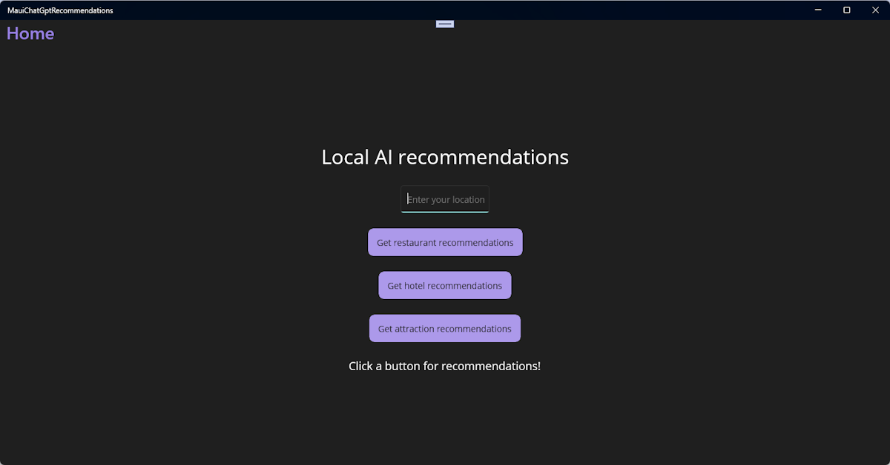
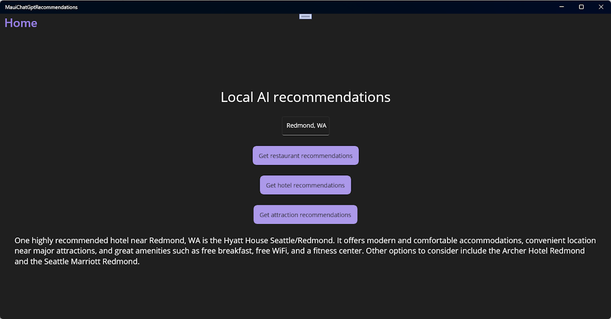

# Tutorial: Create a recommendation app with .NET MAUI and ChatGPT

In this tutorial, you'll learn how to create a .NET MAUI app for Windows in Visual Studio that calls OpenAI's ChatGPT APIs to provide recommendations based on a location entered by the user. The app will have a simple UI that allows the user to enter a location and get recommendations for restaurants, hotels, and attractions.

In this tutorial, you learn how to:

> [!div class="checklist"]
> * Create a simple user interface for your .NET MAUI app
> * Reference and bootstrap the **OpenAI .NET API** library
> * Use an API key to link your app to an OpenAI API account
> * Make calls to the OpenAI chat APIs to get recommendations

## Prerequisites

* An OpenAI [account](https://platform.openai.com/login?launch)
* An OpenAI [API key](https://platform.openai.com/docs/guides/production-best-practices/api-keys)
* The .NET MAUI [installation requirements](/dotnet/maui/get-started/installation)
* If you are new to .NET MAUI on Windows, you should start with the [Build your first .NET MAUI app for Windows](/windows/apps/windows-dotnet-maui/walkthrough-first-app) tutorial.

## Set your environment variable

In order to use the OpenAI SDK, you'll need to set an environment variable with your API key. In this example, we'll use the `OPENAI_API_KEY` environment variable. Once you have your API key from the [OpenAI developer dashboard](https://platform.openai.com/api-keys), you can set the environment variable from the command line as follows:

```powershell
setx OPENAI_API_KEY <your-api-key>
```

Note that this method works for development on Windows, but you'll want to use a more secure method for production apps and for mobile support. For example, you can store your API key in a secure key vault that a remote service can access on behalf of your app. See [Best practices for OpenAI key safety](https://help.openai.com/articles/5112595-best-practices-for-api-key-safety) for more information.

## Create a new .NET MAUI project with the required UI elements

We're going to start by creating a new .NET MAUI project in Visual Studio. We'll use the **.NET MAUI App** template and add some UI elements to the **MainPage** to provide users with some recommendations based on a provided location. The UI will have buttons to get recommendations for restaurants, hotels, and attractions.

1. In Visual Studio, create a new **.NET MAUI App** project named **ChatGptRecommendationApp**.
1. Run the new project to make sure the app builds and runs successfully.
1. Open **MainPage.xaml** from the Solution Explorer.
1. Replace the contents of the `VerticalStackLayout` with the following XAML markup:

    ```xaml
    <Label
        Text="Local AI recommendations"
        SemanticProperties.HeadingLevel="Level1"
        FontSize="32"
        HorizontalOptions="Center" />
    
    <Entry
        x:Name="LocationEntry"
        Placeholder="Enter your location"
        SemanticProperties.Hint="Enter the location for recommendations"
        HorizontalOptions="Center"/>
    
    <Button
        x:Name="RestaurantBtn"
        Text="Get restaurant recommendations"
        SemanticProperties.Hint="Gets restaurant recommendations when you click"
        Clicked="OnRestaurantClicked"
        HorizontalOptions="Center" />
    
    <Button
        x:Name="HotelBtn"
        Text="Get hotel recommendations"
        SemanticProperties.Hint="Gets hotel recommendations when you click"
        Clicked="OnHotelClicked"
        HorizontalOptions="Center" />
    
    <Button
        x:Name="AttractionBtn"
        Text="Get attraction recommendations"
        SemanticProperties.Hint="Gets attraction recommendations when you click"
        Clicked="OnAttractionClicked"
        HorizontalOptions="Center" />
    
    <Label x:Name="SmallLabel"
        Text="Click a button for recommendations!"
        SemanticProperties.HeadingLevel="Level2"
        FontSize="18"
        HorizontalOptions="Center" />
    ```

1. In order to build the project, you will need to add `Clicked` event handlers for each of the buttons. Add the following code to the **MainPage.xaml.cs** file and remove the existing event handler:

    ```csharp
    private async void OnRestaurantClicked(object sender, EventArgs e)
    {
    }
    
    private async void OnHotelClicked(object sender, EventArgs e)
    {
    }
    
    private async void OnAttractionClicked(object sender, EventArgs e)
    {
    }
    ```

The event handlers are all marked as `async` because we will be making asynchronous calls to the OpenAI .NET API library. Now when you run the app, you should see the following UI:



Users can enter their location in the `Entry` control and click one of the buttons to get recommendations for restaurants, hotels, or attractions. The `Label` control at the bottom of the UI will display the results.

Next, let's add the **OpenAI** library to the project and get it ready to make some API calls.

## Reference and initialize the OpenAI library for .NET

To call OpenAI's ChatGPT APIs, we're going to use a pre-release version of the [OpenAI library for .NET](https://www.nuget.org/packages/OpenAI/) NuGet package. This library provides .NET applications with access to the OpenAI REST API. We'll add the library to our project and bootstrap it with our API key.

1. Open the **Package Manager Console** from the **Tools** menu in Visual Studio.
1. Install the OpenAI library by running the following command. The `IncludePrerelease` flag is required because the library is still in preview:

    ```powershell
    Install-Package OpenAI -IncludePrerelease
    ```

    This should install a pre-release of version 2.0.0 or later to your project. You can also install a specific [version](https://www.nuget.org/packages/OpenAI/#versions-body-tab) of the library by specifying the version number in the command. For example, to install version 2.0.0-beta.4, you would run the following command:

    ```powershell
    Install-Package OpenAI -Version 2.0.0-beta.4
    ```

1. Open **MainPage.xaml.cs**, the code-behind file for the **MainPage**. Add the following code to the top of the file to reference the OpenAI library and create a variable to hold your OpenAI client. Update the constructor to call the `MainPage_Loaded` method when the page is loaded, and add the `MainPage_Loaded` method to get your OpenAI API key from the Windows registry and initialize the OpenAI client:

    ```csharp
    private OpenAIClient _chatGptClient;

    public MainPage()
    {
        InitializeComponent();
        this.Loaded += MainPage_Loaded;
    }

    private void MainPage_Loaded(object sender, EventArgs e)
    {
        var openAiKey = Environment.GetEnvironmentVariable("OPENAI_API_KEY");

        _chatGptClient = new(openAiKey);
    }
    ```

    This will bootstrap the OpenAI library with your API key. You can create your API key on the [OpenAI API settings page](https://platform.openai.com/account/api-keys).

1. In order to compile the project, you will need to add the following `using` statements to the top of the **MainPage.xaml.cs** file:

    ```csharp
    using OpenAI;
    using OpenAI.Chat;
    using System.ClientModel;
    ```

Now we're ready to put it all together. In the next section, we'll add some code to the three event handlers to make calls to the OpenAI library and display the recommendation results.

## Add ChatGPT API calls and test the app

It's time to add the code to our code-behind file that will use the OpenAI library for .NET to make calls to the OpenAI ChatGPT API. We'll add the code to the three event handlers we created earlier. The code will get the user's location from the `Entry` control and pass it to the API to get recommendations. Then we'll display the results in the `Label` control at the bottom of the UI.

1. Create an `async` method named `GetRecommendationAsync` and call it from each of the event handlers:

    ```csharp
    private async void OnRestaurantClicked(object sender, EventArgs e)
    {
        await GetRecommendationAsync("restaurant");
    }

    private async void OnHotelClicked(object sender, EventArgs e)
    {
        await GetRecommendationAsync("hotel");
    }

    private async void OnAttractionClicked(object sender, EventArgs e)
    {
        await GetRecommendationAsync("attraction");
    }

    private async Task GetRecommendationAsync(string recommendationType)
    {
        if (string.IsNullOrWhiteSpace(LocationEntry.Text))
        {
            await DisplayAlert("Empty location", "Please enter a location (city or postal code)", "OK");
            return;
        }

        // The model passed to GetChatClient must match an available OpenAI
        // model in your account.
        var client = _chatGptClient.GetChatClient("gpt-3.5-turbo-16k");
        string prompt = $"What is a recommended {recommendationType} near {LocationEntry.Text}";

        AsyncResultCollection<StreamingChatCompletionUpdate> updates = client.CompleteChatStreamingAsync(prompt);
        StringWriter responseWriter = new();

        await foreach (StreamingChatCompletionUpdate update in updates)
        {
            foreach (ChatMessageContentPart updatePart in update.ContentUpdate)
            {
                responseWriter.Write(updatePart.Text);
            }
        }

        var returnMessage = responseWriter.ToString();
        SmallLabel.Text = returnMessage;
    }
    ```

    This code first checks to make sure the user has entered a location in the `Entry` control. If not, it displays an alert and returns. If the user has entered a location, it gets a `ChatClient` instance and calls the `CompleteChatStreamingAsync` method on the that object to make a call to OpenAI. The `CompleteChatStreamingAsync` method takes a `ChatMessage[]` parameter, which can be provided as a string, as we're doing in the example.

    The method returns a `AsyncResultCollection<StreamingChatCompletionUpdate>`, which will stream responses from the API as they're generated. We iterate asynchronously over the `updates` and subsequently iterate over each `ChatMessageContentPart` in the response to build the response string. The response is then displayed in the `SmallLabel` control at the bottom of the UI.

   > [!NOTE]
   > It's' a good idea to add error handling to the `GetRecommendationAsync` method to handle any exceptions that might be thrown by the API call. We've left that out of this example for simplicity.

1. Run the app, enter a location, and test the recommendation buttons. You should see a response from the API in the `Label` control at the bottom of the UI:

    

That's it! You've successfully created a Windows .NET MAUI app that uses the OpenAI ChatGPT API to provide recommendations for restaurants, hotels, and attractions. Try changing the prompts to see if you can improve the results. You can also try changing the model name passed to `GetChatClient` in `GetRecommendationAsync` to see if you get better results from a different model.

> [!IMPORTANT]
> Remember to keep an eye on your API usage after your trial period has expired. You can also set monthly spending limits on your OpenAI account to avoid unexpected charges.

## Next steps

Advance to the next article to learn how to...
> [!div class="nextstepaction"]
> [Add DALL-E to your .NET MAUI Windows desktop app](dall-e-maui-windows.md)

## See also

* [Create a .NET MAUI app with C# Markup and the Community Toolkit](/windows/apps/windows-dotnet-maui/tutorial-csharp-ui-maui-toolkit)
* [Build Windows apps with .NET MAUI](/windows/apps/windows-dotnet-maui/)
* [Announcing the official OpenAI library for .NET](https://devblogs.microsoft.com/dotnet/openai-dotnet-library/)
* [Developing Responsible Generative AI Applications and Features on Windows](../rai.md)
* [Microsoft DevRadio Video: How to build an app with OpenAI and .NET MAUI](https://www.youtube.com/watch?v=G1sUld48b_A)
