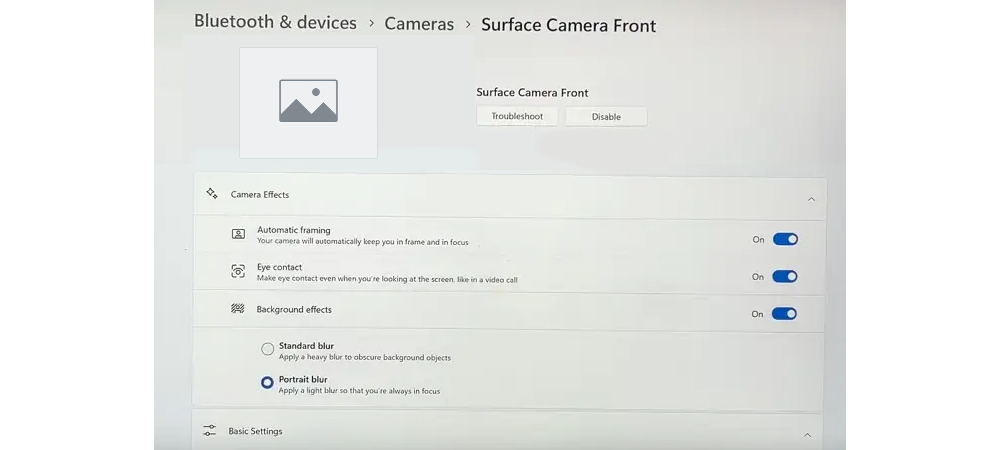

# Windows Studio Effects Overview (Preview)

Windows Studio Effects utilizes AI on select Windows devices with compatible Neural Processing Units (NPUs) to apply special effects to the device camera (currently supports front-facing camera) or built-in microphone (coming soon). AI effects supported by the NPU include:

- Background Blur
- Background Segmentation
- Eye Contact
- Auto Framing


## Prerequisites

- Windows 11, version 22H2 or newer (Build 22623.885+).
- Device must have a supported NPU and the hardware manufacturer must have opted in by installing the Windows Studio Effect driver on the system.

## How does Windows Studio Effects work with your device hardware?

Windows Studio Effects leverages AI models built by Microsoft and compiled/optimized for devices with a Neural Processing Unit (NPU) to deliver high-fidelity, battery-friendly AI effects that reduce the burden on the device CPU and GPU and provide a trusted Microsoft AI experience that scales across the entire Windows ecosystem for any compatible devices.

Windows Studio Effects standardizes control interfaces for the device camera and microphone (Kernel Streaming properties and APIs). Using this control interface, any application can:

- Discover if effects are supported
- Turn effects on or off as-needed
- Access any available metadata

Effects are applied at the hardware level for the camera (or microphone), so once an effect is turned on in the Camera Settings, it is on by default for any app using the camera, even if the app doesn’t know about the effect.

Learn more about the details of how this works in [Windows Studio Effects Architecture](#windows-studio-effects-architecture).

## How to control Windows Studio Effects in Settings

Windows Studio Effects can be opened from the taskbar (as displayed in the image above), but can also be controlled from the Settings menu.

- Open **Settings** > **Bluetooth & devices** > **Cameras**, then select from the list of **Connected cameras** and open the settings for that camera.
- You will see a preview of your front-facing camera display and the **Camera Effects** listed under it.



The **Camera Settings app** is a new feature in Windows 11 that allows customers to view all of the cameras on their system, selecting preferred “default” values from a set of controls on a per-camera, per-user, per-machine basis.

The Camera Settings app can adjust basic controls, such as Brightness and Contrast, but also Windows Studio effects like Background Blur and Eye Contact.

The Camera Settings app also supports extensibility via companion apps provided by camera manufacturers. These companion apps allow device manufacturers to offer their own custom user interface to adjust camera settings, and/or to provide controls for additional custom camera effects (for example, an on/off toggle for a “Funny Hat” effect provided by the camera manufacturer).

Supported Windows Studio Effects for the integrated front-facing camera, include:

- **Background Effects**: Two supported models...
  - **Standard Blur** - a simple gaussian blur effect
  - **Portrait Blur** - a subtle bokeh-style blur effect
- **Eye Contact**: Two supported models...
  - **Standard** - subtle correction for a device user looking down from the camera to the screen
  - **Enhanced** - more aggressive correction for a customer scanning their eyes all around the screen as they read content
- **Automatic Framing**: Detects a person in the camera field of view and crops/zooms to keep them framed

> [!NOTE]
> Lower-capacity NPUs may support “Standard Blur”, but not “Portrait Blur” due to compute limitations. When a device supports both Standard and Portrait blur, the UI displays as an On/Off toggle for “Background effects” with a radio button selection between “Standard blur” and “Portrait blur”. When a system supports only Standard blur, the UI displays as an On/Off toggle for “Background blur”.
> Additionally, lower-capcity NPUs may support "Standard", but not "Enhanced" Eye Contact effects, with UI offering an On/Off toggle with a radio button selection including the "Enhanced" effect when supported.

## Windows Studio Effects Architecture

When a camera is opted into using Windows Studio Effects, the Windows Studio Effects package gets chained on to the end of the camera. This happens transparently so that the “real” camera is replaced with a “composite” camera consisting of the features of the camera plus the Windows Studio AI effects. The end customer still sees only the “real” camera, but Windows Studio Effects are now available on behalf of that camera.


The "Real" camera includes [Kernal Streaming (KS)](/windows-hardware/drivers/stream/ks-properties) properties, such as Brightness, Contrast, and other Microsoft-implemented properties, as well as any customer properties implemented by the device manufacturer (OEM) driver.

Since Windows Studio Effects is always the last item in the chain, applications can be assured that if Windows Studio Effects is enabled for a camera, that the Background Blur, Background Segmentation, Eye Contact, and Automatic Framing KS properties implemented by the camera are provided by Windows Studio Effects.

When the camera **is not opted in** to using Windows Studio Effects, any apps accessing the camera see only the "Real" camera KS properties (Brightness, Contrast, etc).

When the camera **is opted in** to using Windows Studio Effects, any apps accessing the camera can see the both the "Real" camera KS properties, in addition to the Windows Studio Effects KS properties representing AI effects, such as Background Blur, Eye Contact, etc.

In the event of a second implementation of the same KS Property lower in the chain (for example, a [DMFT from the OEM](/windows-hardware/drivers/stream/dmft-design) also implements Background Blur effect), that implementation will remain OFF since the default value for the Blur KS Property is OFF. When Blur is turned ON for the camera, Windows Studio handles that request internally and does not forward it up the chain to other components (DMFTs, AVStream driver, etc.).

This approach allows device manufacturers (OEMs, such as Dell or Lenovo, and IHVs, such as Intel, AMD, or NVIDIA) to implement their own camera processing features within their DMFTs or directly in the camera before Windows Studio adds the standard Windows AI experiences on top of it.

## App integration with Windows Studio Effects

Whenever any application uses Windows APIs to start the camera stream, Windows will set the current value of the Kernel Streaming (KS) property to match the default value specified in the Windows Studio Effects Camera Settings before handing control over to the application. By matching the default value specified in Camera Settings, the camera will always **start in a known state**.

When integrating with Windows Studio Effects, an application can:

- **Always accept the system default** - User determines basic settings (ie. Brightness) in the Camera Settings, applying this value without any in-app controls.
- **Start at system default, but user adjusts in real time** - User can adjust camera settings while using the app (ie. a Brightness slider within the app) without changing the system default. User can choose to save the in-app camera setting to establish a new default setting.

If the application has already written a value to a KS Property that also has a default value set from the Settings page before starting the stream, Windows skips applying the user’s default value when starting the stream. For example, if the user’s default brightness is set to 60, but the app sets the current value of brightness to 65 before starting the stream, the camera will start with brightness at 65 instead of 60.

> [!NOTE]
> Some controls are such an integral part of the app experience, that the app may want to always override the system default. For example, Microsoft Teams does this with Background Effects. Regardless of whether the user enabled or disabled blur globally in the Camera Settings Page, the Background Effects control is visible when joining a call in Teams and the value selected in that app UI will be applied. Under the hood, Teams intelligently leverages Windows Studio’s NPU-accelerated background segmentation to apply the background blur/replacement effects.

Regardless of which experience your app offers, it’s always a good idea to provide an in-app button / hyperlink to launch the Camera Settings app. The Camera Settings can be accessed with this link: `ms-settings`

Camera Settings for a specific camera can be launched with this link format: `ms-settings:camera?cameraId=<symbolic link name in URI data-escaped format>`

### Sample code snippet to invoke Camera Settings for a specific camera

```csharp
// C# snippet for button click handler that will launch Camera Settings for specific camera device identified by symbolic link name

private async void Button_Click(object sender, RoutedEventArgs e)
{

 // Hard coded for this example, one can use DeviceInformation and/or
 // MediaCapture VideoDeviceController.Id to get the symbolic link

 string symlink = "\\?\USB#VID_04F2&PID_B6B6&MI_00#6&12293a26&1&0000#{e5323777-f976-4f5b-9b55-
b94699c46e44}\GLOBAL";
 
 bool result = await Windows.System.Launcher.LaunchUriAsync(new Uri("ms-settings:camera?cameraId=" + 
Uri.EscapeDataString(symlink) ));
}
```

This is available on Windows 11, version 22H2 and newer. On older versions of Windows 11, invoking this `ms-settings` link will take the user to the root Camera Settings page.

### Apply additional camera settings

After the camera stream is set to a known state, an application is welcome to query and apply further configuration, writing new KS Property values to the camera as-needed. If a customer uses an app that is not aware of specific camera controls (for example, Brightness or Background Blur), the settings for those controls that the user specified in the Camera Settings will still apply to the app. But, if a customer uses an app that is aware of those controls, the app is able to change the current value of those controls while using the camera.

Applications are not allowed to change the default value of controls. This precaution ensures that one app does not change the behavior of other apps that use the camera. Defaults can only be changed from the Camera Settings app.

In Windows 11, version 22H2, customers who have a device supporting Windows Studio Effects can turn the effects on/off directly from the Camera Settings Page, alongside other common settings for their camera hardware.

## Windows Hardware Manufacturer Guidance

Original Equipment Manufacturers (OEMs) that are [designing hardware with the latest Windows 11 features](/windows-hardware/get-started/#design-hardware-with-the-latest-features) can opt-in to using Windows Studio Effects.

<!-- OEM guidance on how to opt-in? -->

## Troubleshooting

Your Windows app may have existing in-app functionality that overlaps with the AI effects applied to your camera by Windows Studio Effects (for example, Background Blur). If the [Camera Settings app](#how-to-control-windows-studio-effects-in-settings) does not manage the state of the camera-provided effects, your in-app functionality can fall out of sync, causing user experience issues.

### How to avoid overlapping effects

Consider an app that offers a *Background Blur* feature, running on a system where the camera also supports the *Background Blur KS Property* applied by Windows Studio Effects and the Camera Settings app.

If the customer turned Background Blur **ON** in Windows Camera Settings app, the camera-provided effect will be applied when the camera starts. Then, the in-app blur control would either display as **OFF** despite a blur effect clearly being on, or as **ON** with a double-blur (the camera’s blur plus your app’s blur effect), wasting resources.

When running on a supported device,  we recommend directly leveraging Windows Studio Effects to deliver high fidelity effects with lower system resources and battery life impact. This way, when a customer interacts with your in-app controls, they directly sync to the Windows Studio Effects features of the camera itself. See the [App integration with Windows Studio Effects](#app-integration-with-windows-studio-effects) section above for steps on how to set up this sync and avoid this overlap issue.

If your app is running on a device that supports Windows Studio Effects, but you prefer effects to be applied by another 3rd party service (or not applied at all), you should turn off the conflicting Windows Studio Effects.

To turn off Windows Studio Effects:

1. Check for the presence of overlapping KS Properties.
2. If overlapping properties are present, set them to **OFF** when starting the camera.

For example, if you wish to ensure that the camera-level blur feature is **off**, check for if the camera offers `KSPROPERTY_CAMERACONTROL_EXTENDED_BACKGROUNDSEGMENTATION`, and if so, ensure it is set to `KSCAMERA_EXTENDEDPROP_BACKGROUNDSEGMENTATION_OFF`.

## Additional resources

- []