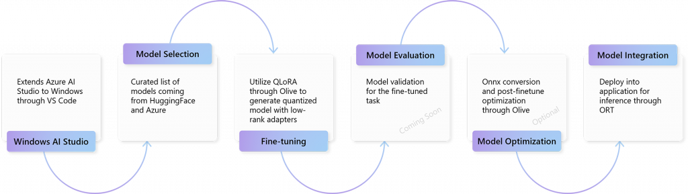

# Windows AI Studio Overview

## Coming soon

Windows AI Studio simplifies generative AI app development by bringing together cutting-edge AI development tools and models from [Azure AI Studio](https://azure.microsoft.com/products/ai-studio) and other catalogs such as [Hugging Face](https://huggingface.co).

Windows AI Studio enables developers to fine-tune, customize and deploy state-of-the-art small language models, or SLMs, for local use in their Windows apps. It provides an end-to-end guided workspace setup that includes model configuration UI and guided walkthroughs to fine-tune popular SLMs – like Phi - and state of the art models such as [Llama 2](https://blogs.windows.com/windowsdeveloper/2023/11/15/announcing-preview-support-for-llama-2-in-directml/) and Mistral.

Developers can rapidly test their fine-tuned model using the Prompt Flow and Gradio templates integrated into the workspace.

Windows AI Studio is currently in preview and will soon be available as a Visual Studio Code extension.

Watch the [Introduction to Windows AI Studio at Microsoft Ignite 2023](https://www.youtube.com/watch?v=qc9VWbYLzRg).

## What can I do with Windows AI Studio?

Download AI models to your local machine in order to fine-tune and optimize the model for integration into your Windows application.

## What AI models are available?

Currently a curated list of models from HuggingFace and Azure are available to try with the preview of Windows AI Studio, with more models to come as the product continues to develop.

## What is the Windows AI Studio process flow?

Select a model from the Windows AI Studio gallery > Fine-tune that model utlizing QLoRA through Olive to generate a quantized model with low-rank adapters > Model Evaluaion and validation for the fine-tuned task > Model Optimization using Onnx conversion and post-finetuneing optimizing using Olive > Model Integration deploying into your Windows application for inference using ORT.

