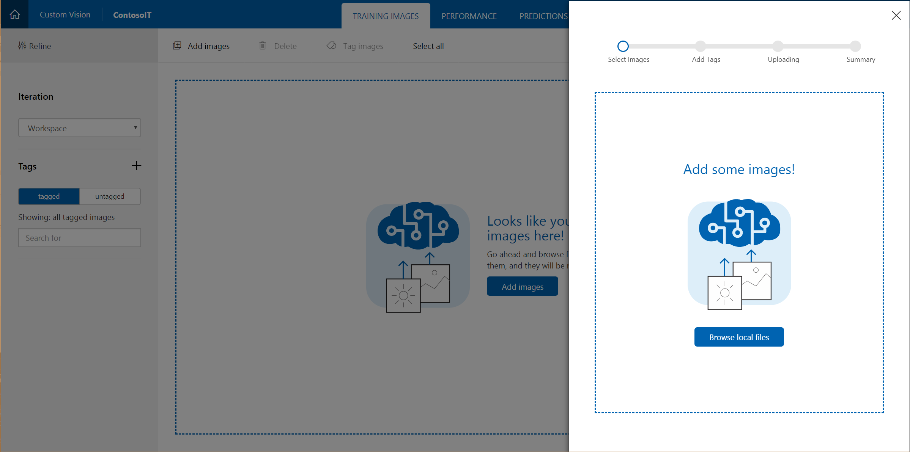
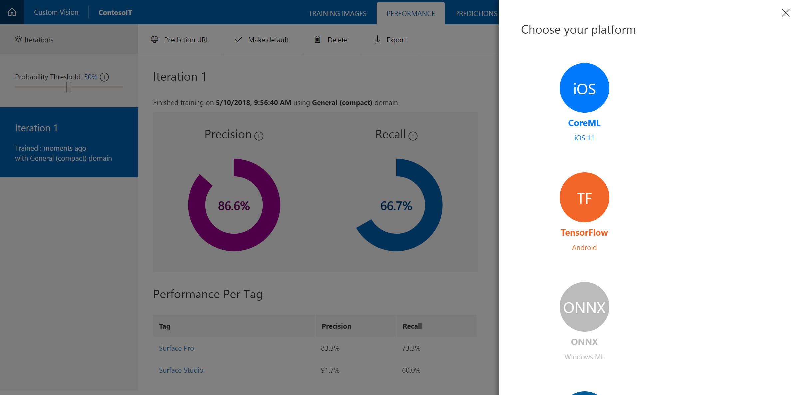

# Train a model with Custom Vision for Windows ML

In this tutorial, we'll demonstrate how to use:

- [Azure Custom Vision](https://azure.microsoft.com/services/cognitive-services/custom-vision-service/) to train a model
- WinMLTools to convert the model to ONNX format
- Windows ML's mlgen to integrate the model into an app

We'll create an application that detects which Microsoft Surface product appears in an image or video feed, and displays help information for the detected product.

## 1. Download the example

1. Download the ContosoIT UWP application, and uncompress it in a folder of your choice.

    This application allows the user to pick an image of the product from the disk or from the webcam. It includes support for two different products, Surface Pro and Surface Studio.

2. Open the project using Visual Studio. If you run the project, note that, no matter which image you pick, it will always detect Surface Pro as the product.

    We'll add intelligence to the application, so it can detect the correct product.

## 2. Create your Custom Vision project

First, we'll create the Custom Vision model we'll use in the ContosoIT application.

1. Open a browser, and go to the <a href="https://customvision.ai/projects">Custom Vision</a> site. Log in with your account, or create one for free if you don't have one.

2. Create a new project with the following settings:
    - Name: ContosoIT
    - Project Types: Classification
    - Domains: General (compact)
    
    >[!NOTE]
    > Make sure you pick "General (compact)" and not "General", so you can later export the model.
    
    

## 3. Train your model

Now, we'll use some images of each product to train the model. The downloaded lab contains a set of images for this purpose.

1. Click on "Add images" on the menu at the top of the page, and then in "Browse local files".
    
    
    
    Go to your ContosoIT application folder, and select all images in \resources\training\surface-pro.
    
    Add a "surface-pro" tag, and upload the files.

2. Repeat the process with the images in \resources\training\surface-studio folder, but set the tag as "surface-studio".

3. Click Train at the top of the page. The Performance tab will open and show Iteration 1 is in process. Wait until it finishes, and then your model will be ready to test!

> It's recommended that at least 30 images of each class or category are included for a prototype classifier. In the interests of time, we're only providing 15 images for each class so we should expect slightly lower accuracy compared to a fully trained version.

## 4. Test the model

1. Click on "Quick test" on the top of the Performance tab.

2. Select the image you want to use from the \resources\prediction\ folder of your ContosoIT application.

    A prediction will appear with the probability of each of the two classes supported by the model.
    
    Note that those classes correspond with the tags you set before.

## 5. Export the model

Now, we can export the model to use in the application.

Now that our classifier's complete, it's time to export it to the ONNX format for use with our UWP app.

1. Click on the **Performance** tab at the top of the page.
1. Click on the **Export** button.
1. Click on **CoreML** when asked for the desired format.

    > In this lab, we'll opt for a model in the CoreML format so we can show you how to use WinMLTools to convert it into ONNX. In general though, you should prefer native ONNX models where available. If you'd like to skip the section on WinMLTools, download the model as a native ONNX model instead.
1. Click **Export**. This might take a few seconds.
1. Click **Download** and then **Save** to the `Desktop\WinML lab` folder when prompted.

    

## Converting the CoreML model to ONNX

### A) Ensure tools are installed

WinMLTools is a Python package built by Microsoft to convert a variety of common deep learning model formats to ONNX. For this lab, your environment has been preconfigured and WinMLTools is already installed. We have also preinstalled a Python package called CoreMLTools, which we will use to load the CoreML format we exported from Custom Vision.

### B) Convert the Custom Vision model to ONNX

In this section, we'll use the tools to convert our model. We'll use the interactive Python shell (but you could just as easily write a short `.py` script to complete this task).

1. Open a **Command Prompt** from the Start menu.
1. **Change** directory to `Desktop\Win ML lab`.

    ```
    cd "Desktop\Win ML lab"
    ```
1. Start **Python** by running `python`.
1. **Import** the `load_spec` function to load the CoreML model.

    ```py
    from coremltools.models.utils import load_spec
    ```
1. Use the new function to **load** the model you downloaded from Custom Vision.

    ```py
    model_coreml = load_spec('your-model-name-here.mlmodel')
    ```
1. **Import** the `convert_coreml` function to convert the model into the ONNX format.

    ```py
    from winmltools import convert_coreml
    ```
1. Use the new function **convert** the model.

    ```py
    model_onnx = convert_coreml(model_coreml, name='Surface')
    ```
1. **Import** the `save_model` function to write the ONNX model to disk.

    ```py
    from winmltools.utils import save_model
    ```
1. Use the new function to **save** the model.

    ```py
    save_model(model_onnx, 'Surface.onnx')
    ```

### C) Explore the models

Optionally, you can continue using the Python shell to better understand the characteristics of the model.

1. **Invoke** the `description` property to see inputs and outputs for the CoreML model.

    ```py
    model_coreml.description
    ```

    > You'll see the input and output properties present in the generated code in Visual Studio in the next section.
1. **Invoke** the `input` and `output` properties to see the inputs and outputs for the ONNX version of the model.

    ```py
    model_onnx.graph.input
    model_onnx.graph.output
    ```

    > While the structure is different to CoreML, the inputs and outputs of the model are same in the ONNX version (as you'd expect).

## Using the ONNX model in your app

## 6. Add your model to the ContosoIT application

1. First, rename the downloaded model `ContosoIT.onnx`.

2. In your project in Visual Studio, ensure the selected platform of your UWP application is x64.

3. Drag and drop the `ContosoIT.onnx` file to the Assets folder in Solution Explorer.

You'll notice Visual Studio automatically generates a new `ContosoIT.cs` file with the necessary code to create and evaluate the model.

4. Right-click the `ContosoIT.onnx` file in Solution Explorer, and select Properties. Set Build Action to "Content" and Copy to Output Directory to "Copy if newer"

5. Review the `ContosoIT.cs` code and replace the generated GUIDs with "ContosoIT". Your file should now contain the ContosoITModelInput, ContosoITModelOutput, and ContosoITModel classes

## 7. Run the model from your application

Finally, we'll edit the Devices page to use the Custom Vision model.

1. Open `Pages/DevicesPage.xaml.cs`, and add the following using clause at the top of the file.

    ```csharp
    using Windows.Storage.Streams;
    ```

2. Add a global variable to contain the model.

    ```csharp
    private ContosoIT.ContosoITModel model;
    ```

3. Add a method to initialize the model. Note the path of your onnx file is used during model creation.

    ```csharp
    private async Task InitializeModel()
    {
        string modelPath = @"ms-appx:///Assets/ContosoIT.onnx";
        StorageFile modelFile = await StorageFile.GetFileFromApplicationUriAsync(new Uri(modelPath));
        model = await ContosoIT.ContosoITModel.CreateContosoITModel(modelFile);
    }
    ```

4. Call the method InitializeModel from the OnNavigatedTo event handler, before the BeginDetection call.

    ```csharp
    protected override async void OnNavigatedTo(NavigationEventArgs e)
    {
        base.OnNavigatedTo(e);

        await InitializeModel();

        var selectedFile = (DetectionDataParametersModel)e.Parameter;
        await BeginDetection(selectedFile);
    }
    ```

5. Since the model expects a VideoFrame as input, we need add the following method:

    ```csharp
    private async Task<VideoFrame> ImageToVideoframe(StorageFile imageFile)
    {
        using (IRandomAccessStream imageStream = await imageFile.OpenAsync(FileAccessMode.Read))
        {
            // Create the decoder from the stream
            BitmapDecoder decoder = await BitmapDecoder.CreateAsync(imageStream);

            // Get the SoftwareBitmap representation of the file
            SoftwareBitmap softwareBitmap = await decoder.GetSoftwareBitmapAsync();

            VideoFrame imageFrame = VideoFrame.CreateWithSoftwareBitmap(softwareBitmap);

            return imageFrame;
        }
    }
    ```

6. Finally, we can tell the application to use machine learning! Look for the comment that says "Your code goes here", and replace the following line:

    ```csharp
    var classLabel = "surface-pro";
    ```

    With these ones:

    ```csharp
    ContosoITModelInput modelInput =
        new ContosoITModelInput() { data = await ImageToVideoframe(detectionDataParameters.SelectedFile) };
    ContosoITModelOutput modelResult = await model.EvaluateAsync(modelInput);
    var classLabel = modelResult.classLabel.FirstOrDefault();
    ```

    Now, the detected product is no longer fixed to "surface-pro." Instead, it shows the result of the evaluation of the trained Custom Vision classification model.
    
    Use the test images you used before on the Custom Vision web, and check the results!