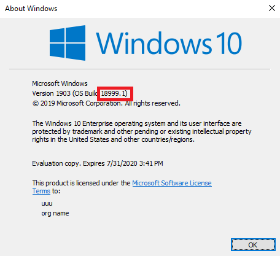
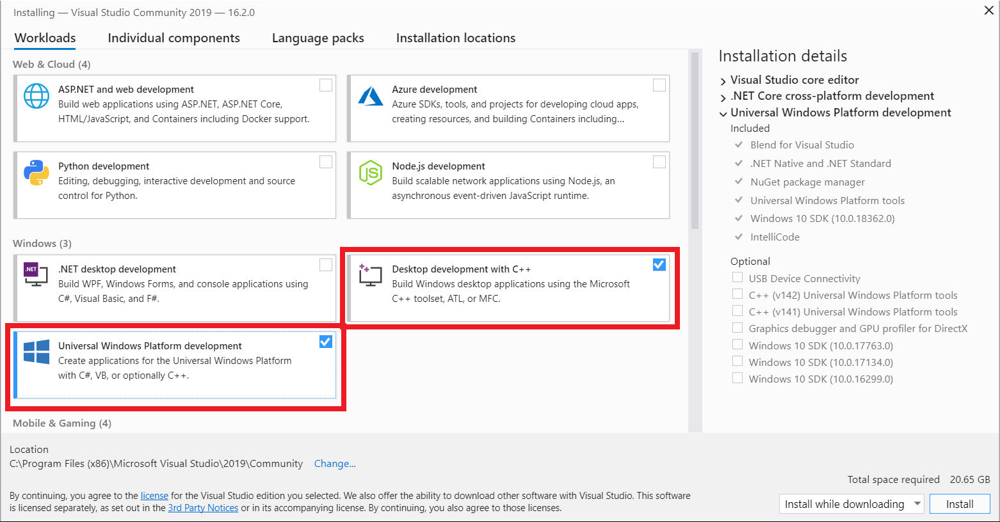
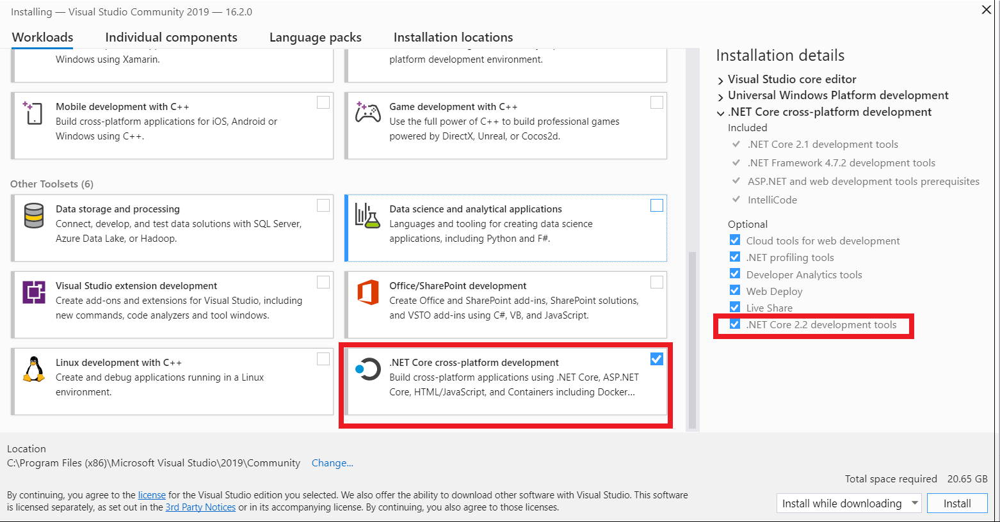
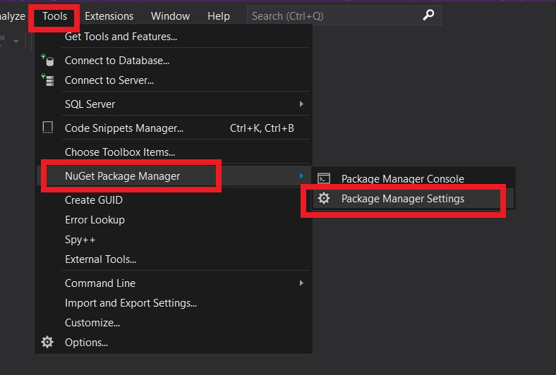
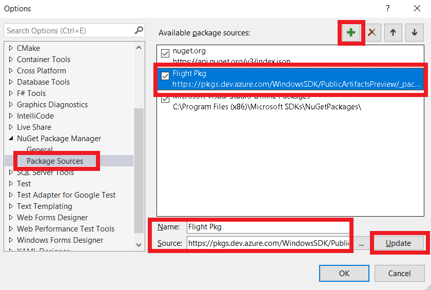
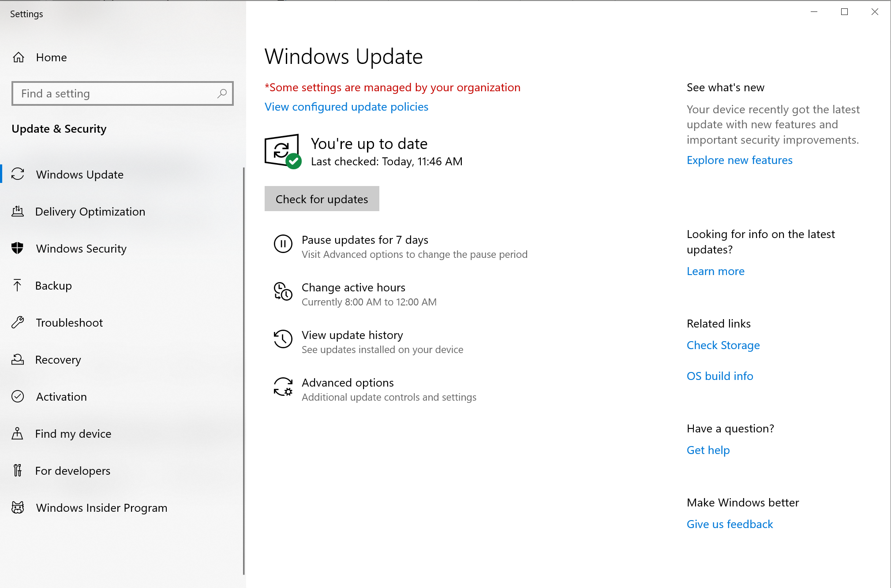
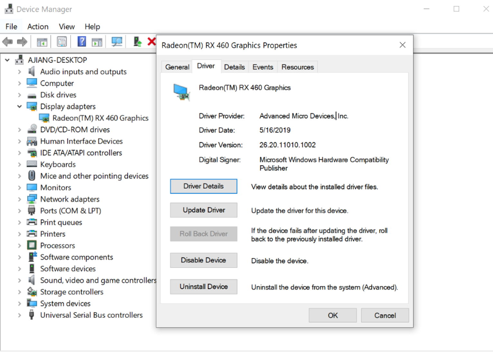
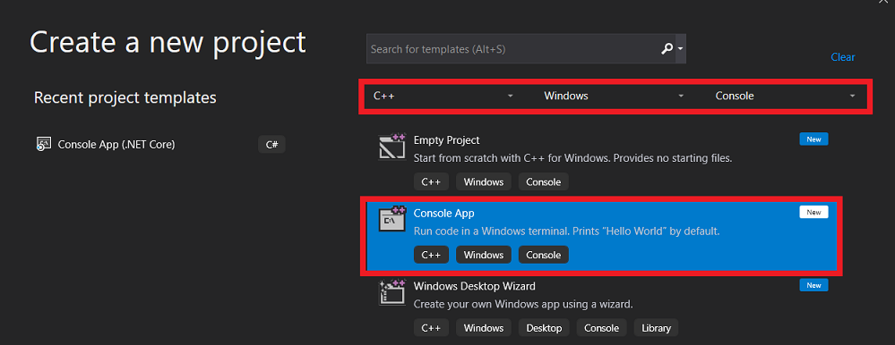
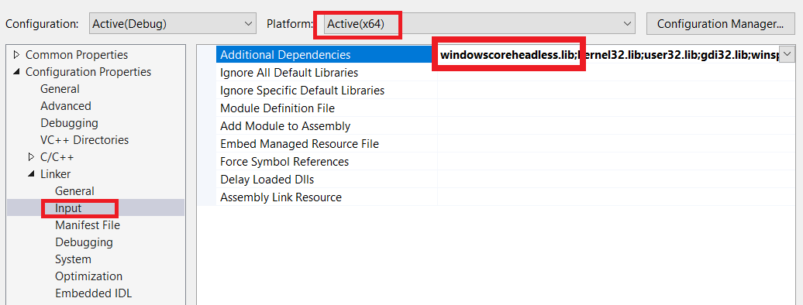

# Getting started

The Windows ML container is intended for use by developers who are already familiar with the basics of IoT and Windows ML development. To learn more about using Windows ML, see [the Windows ML docs](../windows-ml/index.md).

## Prerequisites and environment setup

To install the Insider version of Windows, you will need to [join the Windows Insider Program](https://insider.windows.com/register/).

Once you have installed the Insider release of Windows host, you can run `winver` in a command prompt to find the host version.



In the example above, the host version is `18999.1`.

### Host OS and container version matching requirements

Windows ML container runs on top of the Windows Enterprise host. Your version of the Windows ML container must be an exact match to the version of the **fast ring Windows 10 Insider Preview Build (20H1)**.

### Windows ML container on Docker hub

Once you have identified the version of the host, find the matching tag on Docker Hub page for [Window ML container Insider](https://hub.docker.com/_/microsoft-windows-ml-insider). Locate a corresponding version tag and Docker pull URL.

```console
10.0.18999.1 (20H1)
docker pull mcr.microsoft.com/windows/ml/insider:10.0.18999.1
```

### Visual Studio 2019

We recommend you use Visual Studio 2019 when developing for the Windows ML container. The latest Community edition is available free [at the Visual Studio site](https://visualstudio.microsoft.com/vs/). If you have not worked with Visual Studio before, follow the instructions and guidance on the site for more information.

When configuring your Visual Studio installation, please ensure you have installed the following packages:
- Universal Windows Platform development
- .NET Core cross-platform development.NET Core 2.2 development tools





### Windows SDK Insider Preview

Ensure that the version of your Windows ML container and your Windows SDK Insider Preview are matched as closely as possible. An exact version match is not required, but the larger the mismatch, the greater the chance of errors or other issues.

[The latest Insider SDK is available here.](https://www.microsoft.com/software-download/windowsinsiderpreviewSDK)

### Configure Visual Studio 2019 NuGet package source

While Windows ML container is in Preview, the [Windows Headless WinRT contract](api-list.md) is provided via NuGet package from a separate package source.

Make sure the following sources are in the package source:

- https://api.nuget.org/v3/index.json
- https://pkgs.dev.azure.com/WindowsSDK/PublicArtifactsPreview/_packaging/WindowsSDKFlight/nuget/v3/index.json

To add the new source, follow these steps:

- Open Visual Studio 2019
- Select **Tools -> NuGet Package Manager -> Package Manager Settings -> Package Sources** and add the package SDK flight source URL.





### GPU support

For GPU acceleration to be supported by the container, the host must be able to use a GPU and graphics driver that meets these requirements:

#### GPU requirements


|Vendor   |Architecture        |Typical customer-facing GPU names  |
|---------|--------------------|-----------------------------------|
|AMD      | GCN 4 or later     |Radeon RX 400 series or later, or Radeon Pro WX series|
|Intel    | Kaby Lake or later |Intel HD Graphics 600 series or later |
|NVIDIA   | Kepler or later    |GeForce 600 series or later, or Quadro K-series or later|

#### Graphics driver requirements

|Vendor|Min driver version  |
|------|--------------------|
|AMD   |26.20.12002.65 |
|Intel |26.20.100.6812 |
|NVIDIA|26.21.14.3086  |

If the GPU or driver does not meet the requirements above, or if the container host OS is running in a VM, then only CPU-based inferencing is supported.

#### Graphics driver installation

Download the most recent graphics drivers for your system by navigating to **Settings > Update & Security > Windows Update > Check for updates**.



#### Troubleshooting graphics driver

Check that your driver version meets the minimum requirements by navigating to **Device Manager > Display Adapters**, right-clicking on your graphics adapter and selecting **Properties**, and looking under the **Driver** tab:



If you are unable to download a graphics driver through Windows Update that meets the minimum version requirements, please email winmlc-questions@microsoft.com with your system’s DxDiag information attached. For instructions on running and saving DxDiag information, [see this support page](https://support.microsoft.com/help/4028644/windows-open-and-run-dxdiagexe).

## Set up and test a basic environment

1.	Ensure your host OS and Windows ML container image share the same version number.

2.	Enable the **Containers** functionality on the host OS.

    Run the following command in an *elevated* command window.  You may be prompted to restart the system.

```console
dism /online /Enable-Feature /FeatureName:Containers
```

3.	Download the nightly build versions of docker.exe and dockerd.exe.

```console
curl.exe -o %windir%\system32\dockerd.exe https://master.dockerproject.org/windows/x86_64/dockerd.exe
```
```console
curl.exe -o %windir%\system32\docker.exe https://master.dockerproject.org/windows/x86_64/docker.exe
```

Register and start the Docker service.

```console
dockerd.exe --register-service

net start docker
```

You should see the following output message.

```console
The Docker Engine service is starting.
The Docker Engine service was started successfully.
```

4.  You can confirm that Docker is running correct correctly with the following command.

```console
docker version
```

This should produce the following output message.

```console
Client:
    Version:           master-dockerproject-2019-08-03
    API version:       1.40
    Go version:        go1.12.7
    Git commit:        e505a7c2
    Built:             Sun Aug  4 00:02:51 2019
    OS/Arch:           windows/amd64
    Experimental:      false

Server:
    Engine:
    Version:          master-dockerproject-2019-08-03
    API version:      1.41 (minimum version 1.24)
    Go version:       go1.12.7
    Git commit:       7449ca3
    Built:            Sun Aug  4 00:12:27 2019
    OS/Arch:          windows/amd64
    Experimental:     false
```

5.	Once Docker is started, import the container image file into Docker using the following command.

```console
docker pull mcr.microsoft.com/windows/ml/insider:10.0.18999.1
docker tag mcr.microsoft.com/windows/ml/insider:10.0.18999.1 windowsml:latest
```

6.	After the image is installed, you can run `docker images` to enumerate all available container images. By default, this image will not have a repository name or tag. You may specify one, or simply use the image ID from the hash provided to reference the image in future steps.

The output may look similar to this.

```console
C:\Windows\system32>docker images
REPOSITORY          TAG                 IMAGE ID            CREATED             SIZE
<none>              <none>              a9d5d08d079f        10 seconds ago      319MB

C:\Windows\system32>docker tag a9d5d08d079f windowsml:latest

C:\Windows\system32>docker images
REPOSITORY          TAG                 IMAGE ID            CREATED             SIZE
windowsml           latest              a9d5d08d079f        25 seconds ago      319MB
```


7.	Download WinMLRunner v1.2.1.1 from https://github.com/microsoft/Windows-Machine-Learning/releases/tag/1.2.1.1 with the following command.

```console
curl -o WinMLRunner.zip -L https://github.com/microsoft/Windows-Machine-Learning/releases/download/1.2.1.1/WinMLRunner.v1.2.1.1.zip
```

Then, unzip the .zip into the current folder.

8.	Download SqueezeNet.onnx sample from https://github.com/microsoft/Windows-Machine-Learning/tree/1.2.1.1/SharedContent/models with the following command.

```console
curl -o SqueezeNet.onnx -L https://github.com/microsoft/Windows-Machine-Learning/raw/1.2.1.1/SharedContent/models/SqueezeNet.onnx
```

9.	Create a Dockerfile to copy the necessary files into the imported Windows ML container image.

You can copy the commands below to directly create a Dockerfile:     

```console
echo FROM windowsml:latest               >  Dockerfile
echo WORKDIR C:/App                      >> Dockerfile
echo COPY ./x64/WinMLRunner.exe C:/App/  >> Dockerfile
echo COPY ./SqueezeNet.onnx C:/App/      >> Dockerfile
```

```console
C:\tgz>type Dockerfile
FROM windowsml:latest
WORKDIR C:/App
COPY ./x64/WinMLRunner.exe C:/App/
COPY ./SqueezeNet.onnx C:/App/
```


10.	Build a new container based on the Dockerfile, with the `docker build command`.

```console
C:\tgz>docker build -t winmlrunner:latest .
```

Results will be similar to the following.


```console
Sending build context to Docker daemon  5.525MB
Step 1/4 : FROM windowsml:latest
 ---> a9d5d08d079f
Step 2/4 : WORKDIR C:/App
 ---> Running in 37e9d759365f
Removing intermediate container 37e9d759365f
 ---> 8ab270ff4deb
Step 3/4 : COPY ./x64/WinMLRunner.exe C:/App/
 ---> 16e2b23a5de0
Step 4/4 : COPY ./SqueezeNet.onnx C:/App/
 ---> 05269bb7c5f8
Successfully built 05269bb7c5f8
Successfully tagged winmlrunner:latest

C:\tgz>docker images
REPOSITORY          TAG                 IMAGE ID            CREATED              SIZE
winmlrunner         latest              ed74203b2655        About a minute ago   325MB
windowsml           latest              a9d5d08d079f        23 minutes ago       319MB
```

11.	Launch a GPU-enabled process-isolated container based on the Windows ML container and WinMLRunner image.

```console
docker run -it --isolation process --device class/5B45201D-F2F2-4F3B-85BB-30FF1F953599 winmlrunner:latest cmd /k
```

There are a few important arguments that you must specify for running Windows ML containers using Docker.

- `-it`  
    Used to allow interactive shell components to forward `stdin` and use `tty`. If you omit this argument, the command line interface will not function properly.
- `--isolation process`
    Specifies the type of container as a process-isolated container.
- `--device class/5B45201D-F2F2-4F3B-85BB-30FF1F953599`
    Specifies the class GUID for the device that should be exposed into the container. `class/5B45201D-F2F2-4F3B-85BB-30FF1F953599` refers to `GUID_DEVINTERFACE_DISPLAY_ADAPTER`, which enables DirectX GPUs.
- `winmlrunner:latest`
    Specifies the image to run, that was created in previous steps. This can either be the repository name and tag you provided during a `docker tag` command, or the image ID/hash of the image. If you used **latest** as the tag name, it can be omitted.
- `cmd /k`  
    This is the command that docker will execute inside the container.

12. From the container command line, run WinMLRunner using CPU.

```console
WinMLRunner.exe -model C:/App/SqueezeNet.onnx -cpu
```

Output should appear similar to the following.

```console
DXGI module not found.
Loading model (path = C:/App/SqueezeNet.onnx)...
=================================================================
Name: squeezenet_old
Author: onnx-caffe2
Version: 9223372036854775807
Domain:
Description:
Path: C:/App/SqueezeNet.onnx
Support FP16: false

Input Feature Info:
Name: data_0
Feature Kind: Float

Output Feature Info:
Name: softmaxout_1
Feature Kind: Float

=================================================================


Creating Session with CPU device
Binding (device = CPU, iteration = 1, inputBinding = CPU, inputDataType = Tensor, deviceCreationLocation = WinML)...[SUCCESS]
Evaluating (device = CPU, iteration = 1, inputBinding = CPU, inputDataType = Tensor, deviceCreationLocation = WinML)...[SUCCESS]
```
Congratulations, your environment is now set up correctly to use Windows ML container.

13.	You can also run WinMLRunner using the GPU. Specify one of AMD Radeon, Nvidia or Intel through the `-GPUAdapterName` command line argument.

```console
WinMLRunner.exe -model C:/App/SqueezeNet.onnx -GPUAdapterName [radeon/nvidia/intel]
```

## Build Apps the for Windows ML container

### Samples for Windows ML container

To get started, make sure your Visual Studio 2019 is set up and configured according to the above instructions. Then, try the following samples:

- [CustomVision](https://github.com/imingc/Windows-Machine-Learning/tree/winml_container/Samples/CustomVision). This sample uses the model trained by [Azure Custom Vision Service](/azure/cognitive-services/custom-vision-service/home). The trained model is [exported as an ONNX](/azure/cognitive-services/custom-vision-service/custom-vision-onnx-windows-ml) file, and included as part of the sample app that runs inside the container.
- [SqueezeNetObjectDetection](https://github.com/microsoft/Windows-Machine-Learning/tree/master/Samples/SqueezeNetObjectDetection). This app (cpp and c\# only) uses the SqueezeNet model to detect the predominant object in an image.

### Create a Visual Studio 2019 C# project from scratch

Windows ML container only supports a [subset of Windows APIs](api-list.md) due to its small size. When you create a Visual Studio project, you can specify this smaller API surface, to detect unsupported APIs before runtime.

To use the Headless WinRT API contract:

1. In Visual Studio 2019, create a new **C\# Console App (.NET Core)** project.


1. Select **Tools->Nuget->Package Manager Console**

1. In the Package Manager Console, run:

```console
Install-Package Microsoft.Windows.SDK.Headless.Contracts -Prerelease
```

### Create a Visual Studio 2019 C++ project from scratch

1. In Visual Studio 2019, create a new **C++ Console App** project.



1. Select **Tools->Nuget->Package Manager Console**

1. In the Package Manager Console, run:

```console
Install-Package Microsoft.Windows.SDK.Headless.Contracts -Prerelease
Install-Package Microsoft.Windows.CppWinRT -Version 2.0.190730.2
```

4. Update project to use `windowscoreheadless.lib`:
    1. Right click on your project.
    1. Choose properties
    1. In the dialog choose Linker->Input
    1. Update Additional Dependencies to include `windowscoreheadless.lib`. For example:
        1. `windowscoreheadless.lib;%(...AdditionalDependencies...)`


