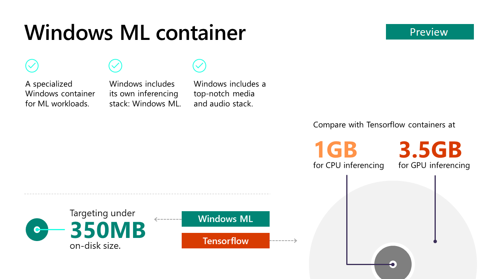

# Windows ML container Insider Preview

[Windows ML](https://docs.microsoft.com/windows/ai/windows-ml/) is a high-performance API set, which provides ML inferencing on Windows by consuming standard [ONNX models](https://docs.microsoft.com/windows/ai/windows-ml/get-onnx-model).  Often, Machine Learning requires a lot of computing power to use. One of Windows ML’s main benefits is that it can use any DirectX12-compliant GPU or Microsoft Compute Driver Model-compliant ASIC to perform hardware accelerated calculations, making it more accessible.

The Windows ML container is a new Windows container that is specifically designed for containerizing workloads that utilize Windows ML APIs. In addition, it also provides direct access to peripheral devices such as sensors or USB cameras on buses such as USB, I2C, SPI, and GPIO. By optimizing the container specifically for those workloads, we're able to reduce the on-disk size of the container to around 350MB. This is significantly less than any other container that has hardware-accelerated ML inferencing capabilities.  

Windows ML container gives businesses a fast and agile platform to build enterprise-grade IoT solutions. It combines the advanced features of Windows with the security of the Windows 10 IoT platform and the manageability of the Azure IoT Edge service.

## Getting started

Interested in using the Windows ML container? Check out our [Getting Started guide](getting-started.md) for more information.

## Supported APIs

Windows ML container supports workloads written in various languages and frameworks, such as C++, C#, .NET Core, Node.JS, and Python. However, due to performance and size optimizations, the OS API surface supported by Windows ML container is smaller than that of the full Windows container. Many User Interface APIs and high level UWP APIs are not available upon workloads running on the container. Supported APIs include those in the OneCore API surface, WinRT contracts for supporting device access, and Windows ML APIs.

For a detailed list of support APIs and contracts, see the [list of supported APIs](api-list.md).

## Feedback

We want to hear from you!

As always, your feedback is very important to us! Please share your comments and experience with us at winmlcfb@microsoft.com
