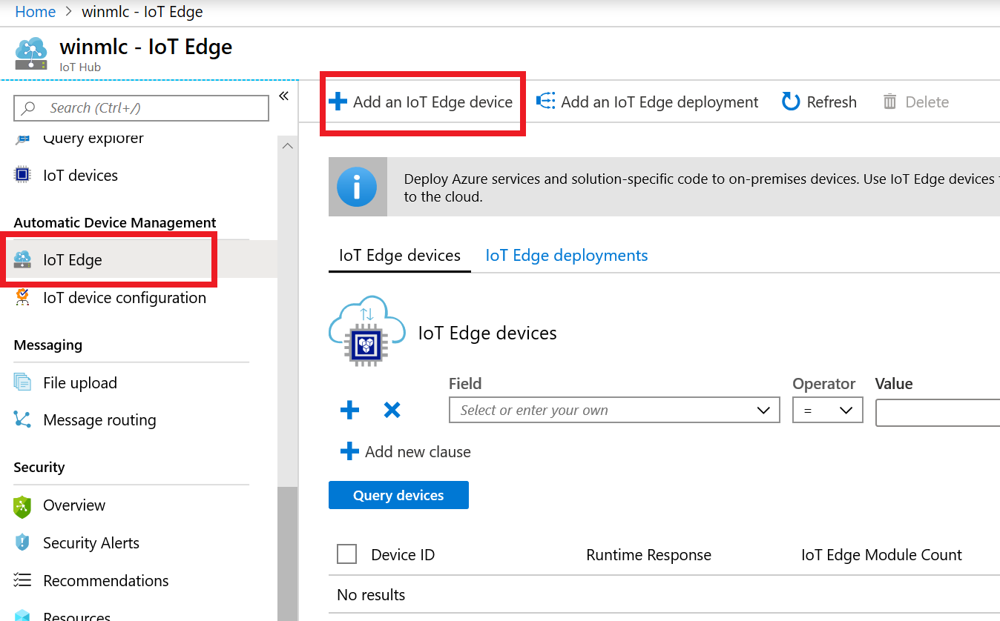
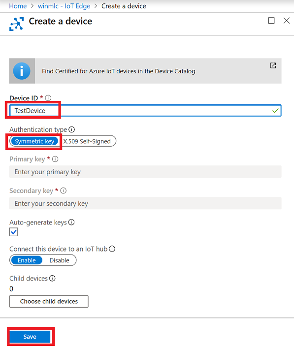
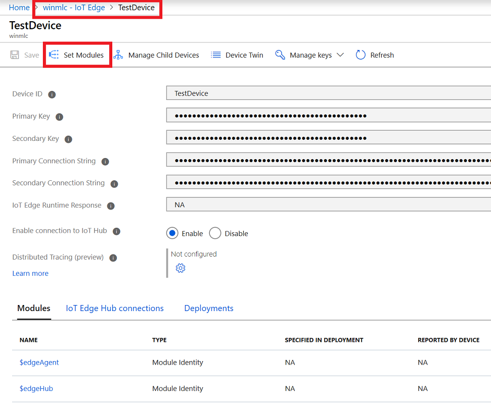
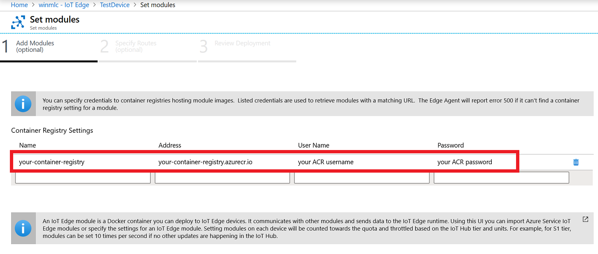
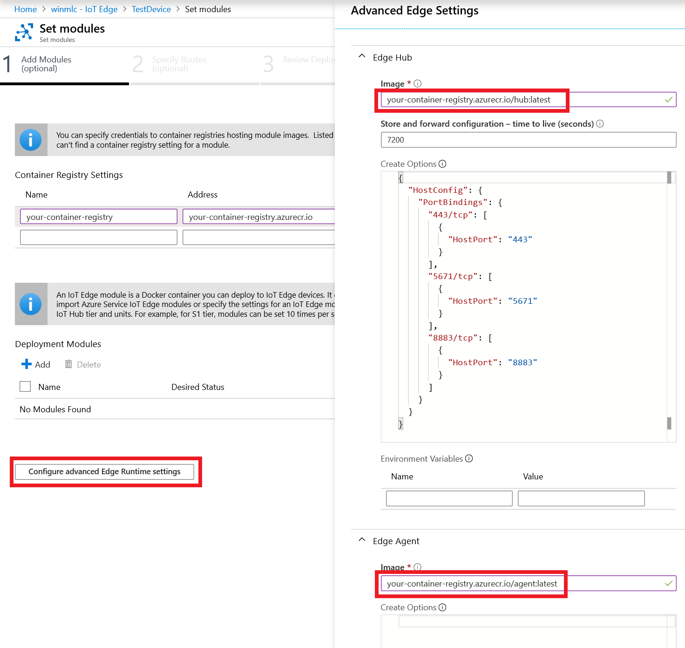

# Use the Windows ML container Insider Preview with Azure IoT Edge Runtime

Due to host OS and container version matching requirements, in order to use Azure IoT Edge Runtime with Windows ML container Insider Preview, there are a few steps that need to be taken to prepare Azure IoT Edge runtime environment.  

> [!IMPORTANT]
> The steps below assume some experience and familiarity with using [Docker](https://docs.docker.com/engine/reference/commandline/cli/) and [Azure IoT Edge](https://docs.microsoft.com/azure/iot-edge/).

## Environment Setup

On a Windows Insider Preview host machine with a matching version to the installed Windows ML container, do the following:
- [Install the .NET Core SDK](https://dotnet.microsoft.com/download).
- [Install Git](https://git-scm.com/downloads).
- Install Docker from Docker Master, following the instructions in [getting started](getting-started.md).
- [Install Azure CLI](https://docs.microsoft.com/cli/azure/install-azure-cli-windows?view=azure-cli-latest).
- [Create a private container registry](https://docs.microsoft.com/azure/container-registry/container-registry-get-started-portal) on Azure Container Registry for storing Azure IoT Edge modules. (Note that It may be easier to login if [Admin account](https://docs.microsoft.com/azure/container-registry/container-registry-authentication) is enabled.)
- [Create an Azure IoT Hub](https://docs.microsoft.com/en-us/azure/iot-hub/iot-hub-create-through-portal) to manage devices and deployments on the cloud.

## Build private Azure IoT Edge runtime module

### Prepare base OS image

- Launch CMD or powershell as admin,
- Login to Azure Container Registry from docker.
- Pull Windows ML container base image (*change the tag to match your Insider host version*) with the following commands.
    - `docker pull mcr.microsoft.com/windows/ml/insider:10.0.18999.1`
    - `docker tag mcr.microsoft.com/windows/ml/insider:10.0.18999.1 windowsml:latest`
- Clone Azure IoT Edge into `C:\iotedge`.
    - `cd /d c:\`
    - `git clone https://github.com/Azure/iotedge.git`

### Build Edge hub container

Execute the following commands to build your Edge hub container.

- `cd c:\iotedge\edge-hub\src\Microsoft.Azure.Devices.Edge.Hub.Service\`
- `dotnet publish -r win-x64`
- `cd bin\Debug\netcoreapp2.1\win-x64\`

- Create a Dockerfile with content like below following and save it at `c:\iotedge\edge-hub\src\Microsoft.Azure.Devices.Edge.Hub.Service\bin\Debug\netcoreapp2.1\win-x64`:

    ```console
    FROM windowsml:latest
    WORKDIR /app
    COPY publish/ ./
    # Expose MQTT, AMQP and HTTPS ports-
    EXPOSE 8883/tcp
    EXPOSE 5671/tcp
    EXPOSE 443/tcp
    CMD ["Microsoft.Azure.Devices.Edge.Hub.Service.exe"]
    ```

    Continue with the following commands.

    - `docker build . -t your-own-registry.azurecr.io/hub:latest`
    - `docker push your-own-registry.azurecr.io/hub:latest`

### Build Agent container

Execute the following commands to build your Agent container.

- `cd c:\iotedge\edge-agent\src\Microsoft.Azure.Devices.Edge.Agent.Service\`
- `dotnet publish -r win-x64`
- `cd bin\Debug\netcoreapp2.1\win-x64`

- Create a Dockerfile with content like the following and save it at: `c:\iotedge\edge-agent\src\Microsoft.Azure.Devices.Edge.Agent.Service\bin\Debug\netcoreapp2.1\win-x64`
    ```console
    FROM windowsml:latest
    # Configure web servers to bind to port 80 when present
    ENV ASPNETCORE_URLS=http://+:80
    WORKDIR /app
    COPY publish/ ./
    CMD ["Microsoft.Azure.Devices.Edge.Agent.Service.exe"]
    ```

Continue with the following commands.

- `docker build . -t your-own-registry.azurecr.io/agent:latest`
- `docker push your-own-registry.azurecr.io/agent:latest`

### Build other Azure IoT Edge modules

If there are other modules that will be deployed to the Edge device running Azure IoT Edge and Windows ML Insider Preview container on a Windows Insider host, you will need to rebuild those modules based on the same Windows Insider container image that is matched to the version of the Windows Insider host.

## Configure IoT Edge in the Azure IoT Hub portal

- Create an IoT Edge device on your Azure IoT Hub.
    

- Name the device **TestDevice** and select Symmetric Key.
    

- Select **Set Modules**.
    

- Specify your container registry details where the privately built modules was pushed to.
    

- Click on **Configure advanced Edge Runtime Settings** button on Set Modules page, then set Edge Hub and Edge Agent to where you published the private containers to.
    

- Select the **Save**  button.
- Don’t forget to select **next -> next - submit**

From this point, you can optionally add some Deployment modules to your device.

## Setting up Azure IoT Edge on Windows ML container host

> [!IMPORTANT]
> When setting up Azure IoT Edge, make sure that the version of the container OS matches the version of the container host that was used to build the Edge Hub and Edge Agent modules.

- The device where IoT Edge is being installed on below should **not** have Docker running.
- You can stop and disable Docker service if you are experimenting on the container build machine from above.

### Download and modify installation powershell script

- Save a copy of `IoTEdgeSecurityDaemon.ps1` locally, with this command running from an *elevated* commant prompt.

```console
curl -o c:\IotEdgeSecurityDaemon.ps1 -L  https://raw.githubusercontent.com/Azure/iotedge/1.0.8/scripts/windows/setup/IotEdgeSecurityDaemon.ps1
```

- Modify `IoTEdgeSecurityDaemon.ps1` to disable build version constraints
-	In the `Initialize-IoTedge` function, comment out the following line.

```console
 #   if (-not (Setup-Environment -ContainerOs $ContainerOs -SkipArchCheck -SkipBatteryCheck)) {
 #       return
 #   }
```
-	In the `Install-Packages` function, comment out the following line:

```console
#    if (-not (Setup-Environment -ContainerOs $ContainerOs -SkipArchCheck:$SkipArchCheck -SkipBatteryCheck:$SkipBatteryCheck)) {
#        return
#    }
```

### Install IoT Edge

- Run the following command from an *elevated* PowerShell instance:

```console
. {Invoke-WebRequest -useb c:\IotEdgeSecurityDaemon.ps1} | Invoke-Expression;  Deploy-IoTEdge
```

- If your device reboots, wait for it to restart. If necessary, launch an *elevated* PowerShell instance once again, and run the following command.

> [!NOTE]
> Remember to replace the container registry, username, password, and connection string in the below example.

```console
. {Invoke-WebRequest -useb c:\IotEdgeSecurityDaemon.ps1} | Invoke-Expression; Initialize-IoTEdge -AgentImage your-container-registry.azurecr.io/agent:latest  -Username yourRegistryUserName -Password $(ConvertTo-SecureString yourregistryPassword -AsPlainText -Force)  -Manual -DeviceConnectionString connectionstringOfTestDevice
```

- Wait for a few minutes for the process to conclude, then run the following command.

```console
PS C:\> iotedge list
```

You should be able to see the agent and hub running, as displayed below.

```
NAME             STATUS           DESCRIPTION      CONFIG
edgeHub          running          Up 9 seconds     winmlc.azurecr.io/hub:latest
edgeAgent        running          Up 22 seconds    winmlc.azurecr.io/agent:latest
```
