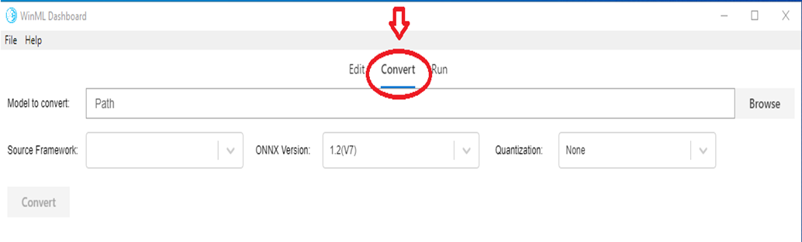
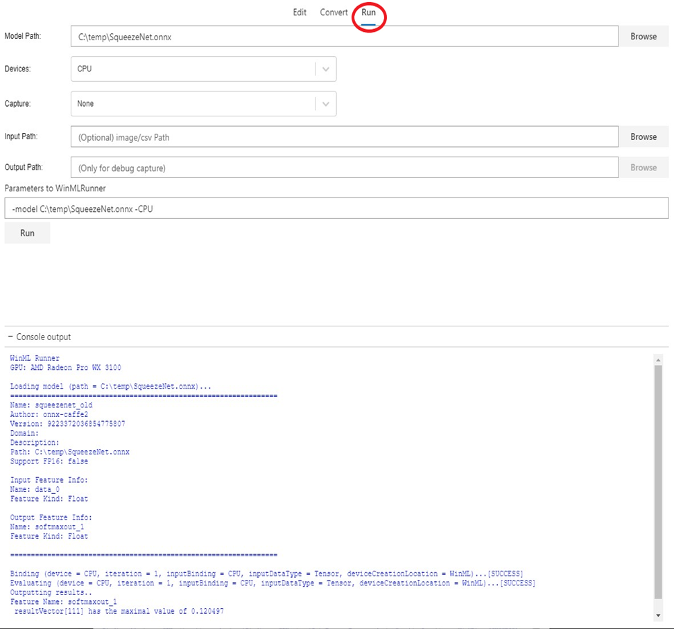
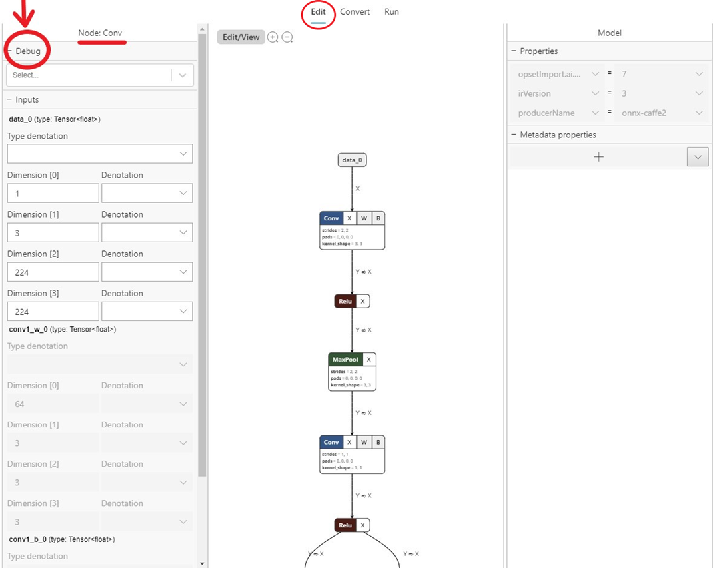

# WinML Dashboard

WinML Dashboard is a tool for viewing, editing, converting, and validating machine learning models for Windows ML inference engine. The engine is built into Windows 10 and evaluates trained models locally on Windows devices using hardware optimizations for CPU and GPU to enable high performance inferences. 

## Getting the tool

You can [download the WinML Dashboard here](https://github.com/Microsoft/Windows-Machine-Learning/releases/tag/v0.7.0), or you can build the app from source following the instructions below.

### Build from source

When building the app from source, you'll need the following:

| Requirements | Version | Download | Command to check |
| --- | --- | --- | --- |
| Python3 | 3.4+ | [here](https://www.python.org/) | `python --version` |
| Yarn | latest | [here](https://yarnpkg.com/en/docs/install) | `yarn --version` |
| Node.js | latest | [here](https://nodejs.org/en/) | `node --version` |
| Git | latest | [here](https://git-scm.com/download/win) | `git --version` |
| MSBuild | latest | [here](https://visualstudio.microsoft.com/downloads/) | `msbuild -version` |
| Nuget | latest | [here](https://www.nuget.org/downloads) | `nuget help` |

All six prerequisites *must be added to the Environment Path*. Note that MSBuild and Nuget will be included in a Visual Studio 2017 installation.

### Steps to build and run

To run the WinML Dashboard, follow these steps:

1.	In the command line, clone the repository: `git clone https://github.com/Microsoft/Windows-Machine-Learning`
2.	Within the repository, enter the following to access the right folder: `cd Tools/WinMLDashboard`
3.	Run `git submodule update --init --recursive` to update Netron.
4.	Run yarn to download dependencies.
5.	Then, run `yarn electron-prod` to build and start the desktop application, which will launch the Dashboard.

All available Dashboard commands can be seen at [package.json](https://github.com/microsoft/Windows-Machine-Learning/blob/master/Tools/WinMLDashboard/package.json).

## Viewing and Editing Models

The Dashboard uses [Netron](https://github.com/lutzroeder/netron) for viewing machine learning models. Although WinML uses ONNX format, the Netron viewer supports viewing several different framework formats.

Many times a developer may need to update certain model metadata or modify model input and output nodes. This tool supports modifying model properties, metadata and input/output nodes of an ONNX model.

Selecting the `Edit` tab (center top as shown in the snip below) takes you to viewing and editing panel. The left pane in the panel allows editing model input and output nodes, and the right pane allows editing Model properties. The center portion shows the graph. At this time, editing support to limited to model input/output node (and not inner nodes), model properties and model metadata.

The `Edit/View` button switches from *Edit mode* to *View-only mode*, and vice versa. *View-only mode* doesn't allow editing and enables Netron viewer's native features such as the ability to see detailed information for each node.

 
## Converting models

Today there are several different frameworks available for training and evaluating machine learning models, which makes it difficult for app developers to integate models into their product. Windows ML uses the [ONNX machine learning model format](http://onnx.ai/) that allows conversion from one framework format to another, and this Dashboard makes it easy to convert models from different frameworks to ONNX.

The Convert tab supports converting to ONNX from the following source frameworks:

* Apple Core ML
* TensorFlow (subset of models convertible to ONNX)
* Keras
* Scikit-learn (subset of models convertible to ONNX)
* Xgboost
* LibSVM

The tool also allows validation of the converted model by evaluating the model with built-in Windows ML inference engine using synthetic data (default) or real input data on CPU or GPU.

## Validating Models

Once you have an ONNX model, you can validate whether the conversion has happened successfully and that the model can be evaluated in Windows ML inference engine. This is done using the `Run` tab (see snip below).

You can choose various options such as CPU (default) vs GPU, real input vs synthetic input (default) etc. The result of model evaluation appears in the console window at the bottom.

Note that model validation feature is only available on [Windows 10 October 2018 Update](https://www.microsoft.com/software-download/windows10) or newer version of Windows 10, as the tool relies on built-in Windows ML inference engine.

 
## Debugging Inference

You can utilize the debug feature of WinML Dashboard to gain insight into how raw data is flowing through operators in your model. You can also choose to visualize this data for computer vision inference.

To debug your model follow these steps:

1. Navigate to the `Edit` tab and select the operator for which you wish to capture intermediate data. On the left side panel, there will be a `Debug` menu where you can select the formats of intermediate data you wish to capture. The options are currently **text** and **png**. **Text** will output a text file containing the dimensions, data type and raw tensor data produced by this operator. Png will format this data into an image file which can be useful for computer vision applications.

2.	Navigate to the `Run` tab and select the model you wish to debug.
8.	For the `Capture` field, select `Debug` from the dropdown.
9.	Select an input image or csv to supply to your model at execution. Note that this is required when capturing Debug data.
10.	Select an output folder to export debug data.
11.	Select `Run`. Once execution is complete you can navigate to this selected folder to view your Debug capture.
 

You can also open debug view in the Electron app with one of the following options:
* Run it with `flag --dev-tools`
* Or select `View -> Toggle Dev Tools` in the application menu
* Or press `Ctrl + Shift + I`.