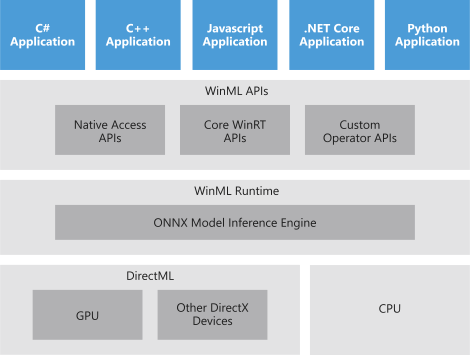
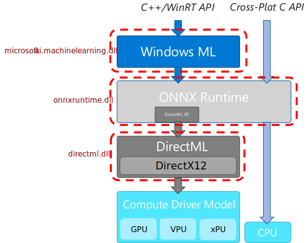

# Windows Machine Learning

Implement Machine Learning in your Windows apps using Windows ML — a high-performance, reliable API for deploying hardware-accelerated ML inferences on Windows devices. 

## Overview

Windows ML is built into the latest versions of Windows 10 and Windows Server 2019, and is also available as a [NuGet package](https://aka.ms/windowsmlredist) for down-level reach to Windows 8.1. Windows ML provides developers with the following advantages:

- **Ease of development:** With Windows ML built into the latest versions of Windows 10 and Windows Server 2019, all you need is Visual Studio and a trained ONNX model, which can be distributed along with the Windows application. Also, if you need to deliver your AI-based features to older versions of Windows (down to 8.1), Windows ML is also available as a NuGet package that you can distribute with your application.

- **Broad hardware support:** Windows ML allows you to write your ML workload once and automatically get highly optimized performance across different hardware vendors and silicon types, such as CPUs, GPUs, and AI accelerators. In addition, Windows ML guarantees consistent behavior across the range of supported hardware.

- **Low latency, real-time results:** ML models can be evaluated using the processing capabilities of the Windows device, enabling local, real-time analysis of large data volumes, such as images and video. Results are available quickly and efficiently for use in performance-intensive workloads like game engines, or background tasks such as indexing for search.

- **Increased flexibility:** The option to evaluate ML models locally on Windows devices lets you address a broader range of scenarios. For example, evaluation of ML models can run while the device is offline, or when faced with intermittent connectivity. This also lets you address scenarios where not all data can be sent to the cloud due to privacy or data sovereignty issues.

- **Reduced operational costs:** Training ML models in the cloud and then evaluating them locally on Windows devices can deliver significant savings in bandwidth costs, with only minimal data sent to the cloud—as might be needed for continual improvement of your ML model. Moreover, when deploying the ML model in a server scenario, developers can leverage Windows ML hardware acceleration to speed-up model serving, reducing the number of machines needed in order to handle the workload.

## Get Started 

The process of incorporating trained ML models into your application code is simple, requiring just a few straightforward steps:  

1. Get a trained Open Neural Network Exchange (ONNX) model, or convert models trained in other ML frameworks into ONNX with [WinMLTools](convert-model-winmltools.md).

2. Add the ONNX model file to your application, or make it available in some other way on the target device.

3. Integrate the model into your application code, then build and deploy the application.

To start with the in-box Windows ML, go to [Integrate a model into your app with Windows ML](integrate-model.md). You can also try out the sample apps in the [Windows-Machine-Learning repo on GitHub](https://github.com/Microsoft/Windows-Machine-Learning).

If you want to use the NuGet package, please see [Tutorial: Port an Existing WinML App to NuGet Package](port-app-to-nuget.md).

For the latest Windows ML features and fixes, see our [release notes](release-notes.md).

## In-box vs NuGet WinML solutions

The table below highlights the availability, distribution, language support, servicing, and forward compatibility aspects of the In-Box and NuGet package for Windows ML. 

| | In-Box | NuGet |
| --- | --- | --- |
| Availability | Windows 10 version 1809 or higher | Windows 8.1 or higher |
| Distribution | Built into the Windows SDK | Package and distribute as part of your application |
| Servicing | Microsoft-driven (customers benefit automatically) | Developer-driven |
| Forward compatibility | Automatically rolls forward with new features | Developer needs to update package manually |

:::row:::
    :::column:::
	When your application runs with the in-box solution, the Windows ML runtime (which contains the ONNX Model Inference Engine) evaluates the trained model on the Windows 10 device (or Windows Server 2019 if targeting a server deployment). Windows ML handles the hardware abstraction, allowing developers to target a broad range of silicon—including CPUs, GPUs, and, in the future, AI accelerators. Windows ML hardware acceleration is built on top of [DirectML](https://docs.microsoft.com/windows/desktop/direct3d12/dml), a high-performance, low-level API for running ML inferences that is part of the DirectX family. 
    :::column-end:::
    :::column:::
        
    :::column-end:::
:::row-end:::

:::row:::
    :::column:::
	
    :::column-end:::
    :::column:::
    For the NuGet package, these layers appear as binaries shown in the diagram below. Windows ML is built into the Microsoft.ai.machinelearning.dll. It does not contain an embedded ONNX runtime, instead the ONNX runtime is built into the file: onnxruntime.dll. The version included in the WindowsAI NuGet packages contains a DirectML EP embedded inside of it. The final binary, DirectML.dll, is the actual platform code as DirectML and is built on top of the Direct 3D and compute drivers that are built into Windows. All three of these binaries are included in the NuGet releases for you to distribute along with your applications. 

	Direct access to the onnxruntime.dll also allows you to target cross-platform scenarios while getting the same hardware agnostic acceleration that scales across all Windows devices. 
    :::column-end:::
:::row-end:::

## Other machine learning solutions from Microsoft

Microsoft offers a variety of machine learning solutions to suit your needs. These solutions run in the cloud, on-premises, and locally on the device. See [What are the machine learning product options from Microsoft?](https://docs.microsoft.com/azure/machine-learning/service/overview-more-machine-learning) for more information.

[!INCLUDE [help](../includes/get-help.md)]
