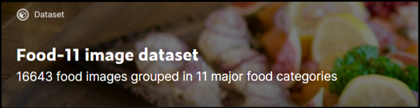

# Image Classification with Custom Vision and Windows Machine Learning

This guide will show you how to train a neural network model to classify images of food using Azure Custom Vision service, export the model to ONNX format, and deploy the model in a Windows Machine Learning application running locally on Windows device. No previous expertise in machine learning is required! We will guide you step by step through the process. 

If you like to learn how to build and train a model with Custom Vision, you can proceed to [Train a Model](image-classification-train-model.md).

If you have a model and want to learn how to create a Windows ML app from scratch, navigate to the complete [Windows ML app tutorial](image-classification-deploy-model.md). 

If you want to get the predefined solution for a Windows ML app, you can clone [the solution file](https://github.com/microsoft/Windows-Machine-Learning/tree/master/Samples/Tutorial%20Samples/Custom%20Vision%20and%20Windows%20ML) and test it right away.

## Scenario

In this tutorial, we'll create a machine learning food classification application that runs on Windows devices. The model will be trained to recognize certain types of patterns to classify an image of food, and when given an image will return a classification tag and the associated percentage confidence value of that classification.

### Prerequisites for model training

To build and train a model, you'll need a subscription to Azure Custom Vision services.

If you're new to Azure, you may sign up for an [Azure free account](https://azure.microsoft.com/free/services/machine-learning/). This will give you an opportunity to build, train, and deploy machine learning models with Azure AI. 

> [!NOTE]
> Interested in learning more about Azure sign-up options and Azure free accounts? Check out [Create an Azure account](/learn/modules/create-an-azure-account/) on Microsoft Learn.

### Prerequisites for Windows ML app deployment

To create and deploy a Windows ML app, you'll need the following: 

*	Windows 10 version 1809 (build 17763) or higher. You can check your build version number by running `winver` via the Run command `(Windows logo key + R)`.
*	Windows SDK for build 17763 or higher. [You can get the SDK here.](https://developer.microsoft.com/windows/downloads/windows-10-sdk/)
*	Visual Studio 2017 version 15.7 or later. We recommend using Visual Studio 2019, and some screenshots in this tutorial may be different if you use VS2017 instead. [You can get Visual Studio here.](https://developer.microsoft.com/windows/downloads/)
*	Windows ML Code Generator (mlgen) Visual Studio extension. Download for [VS 2019](https://marketplace.visualstudio.com/items?itemName=WinML.mlgenv2) or for [VS 2017](https://marketplace.visualstudio.com/items?itemName=WinML.mlgen).
*	If you decide to create a UWP app, you'll need to enable the Universal Windows Platform development workload in Visual Studio.
*	You'll also need to [enable Developer Mode on your PC](/windows/apps/get-started/enable-your-device-for-development)

> [!NOTE]
> Windows ML APIs are built into the latest versions of Windows 10 (1809 or higher) and Windows Server 2019. If your target platform is older versions of Windows, you can [port your Windows ML app to the redistributable NuGet package (Windows 8.1 or higher)](../port-app-to-nuget.md). 

## Prepare the data

Machine learning models must be trained with existing data. In this guide, you will use a dataset of food images from Kaggle Open Datasets. This dataset is distributed under the public domain license.

> [!IMPORTANT]
> To use this dataset, you need to adhere to the term of using the Kaggle site and the liscence terms accompanying the Food-11 dataset itself. Microsoft makes no warranty or representation concerning the site or this dataset.

The dataset has three splits - evaluation, training and validation - and contains 16643 food images grouped in 11 major food categories. The images in the dataset of each category of food are placed in a separate folder, which makes the model training process more convenient. 

Download the dataset [here](https://www.kaggle.com/trolukovich/food11-image-dataset). Please note that the dataset is around 1 gb in size, and you may be asked to create an account on the Kaggle website to download the data.

If you want, you're welcome to use any other dataset of relevant images. As a minimum, we recommend you use at least 30 images per tag in the initial training set. You'll also want to collect a few extra images to test your model once it is trained.

Additionally, make sure all your training images meet the following criteria:
*	.jpg, .png, .bmp, or .gif format.
*	no greater than 6MB in size (4MB for prediction images).
*	no less than 256 pixels on the shortest edge; any images shorter than this will be automatically scaled up by the Custom Vision Service.

## Next Steps

Now that you've gotten your prerequisites sorted out and have prepared your dataset, you can proceed to creation of your Windows ML model. [In the next part](image-classification-train-model.md), you'll use the web-based Custom Vision interface to create and train your classification model.
