# Train your model with Custom Vision

In the [previous stage of this tutorial](image-classification-intro.md), we discussed the prerequisites of creating your own Windows Machine Learning model and app, and downloaded an image set to use. In this stage, we'll learn how to use the web-based Custom Vision interface to turn our image set into an image classification model.

Azure Custom Vision is an image recognition service that lets you build, deploy, and improve your own image identifiers. The Custom Vision Service is available as a set of native SDKs, as well as through a web-based interface on the Custom Vision website.

## Create Custom Vision resources and project

### Create Custom Vision resource

To use the Custom Vision Service, you'll need to create Custom Vision resources in Azure.

1. Navigate to the main page of your Azure account and select `Create a resource`.

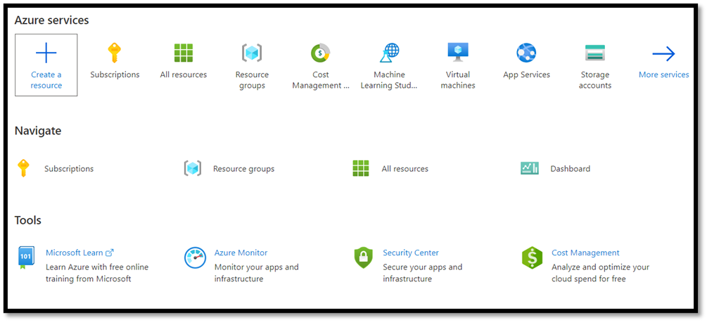

2. In the search box, search for `Custom Vision`, and you'll enter the Azure marketplace. Select `Create Custom Vision` to open the dialog window on the Create Custom Vision page.

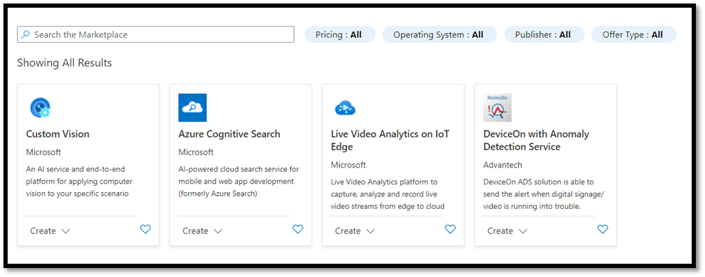

3. On the Custom Vision dialog page, choose the following:

* 	Select both `Training` and `Prediction` resources.
*	Select the subscription to manage deployed resources. If you do not see your Azure Subscription in the menu, sign out and reopen your Azure account using the same credentials you opened your account with. 
*	Create a new resource group and give it a name. In this tutorial, we've called ours `MLTraining`, but feel free to choose your own name or use the existing resource group if you have one. 
*	Give a name to your project. In this tutorial, we've called ours `classificationApp`, but you can use any name of your choice.
*	For both `Training` and `Prediction` resources, set the location as **(US) East US**, and **Pricing tier** as **Free FO**. 

4. Press `Review + create` to deploy your Custom Vision resources. It may take a few minutes to deploy your resources. 

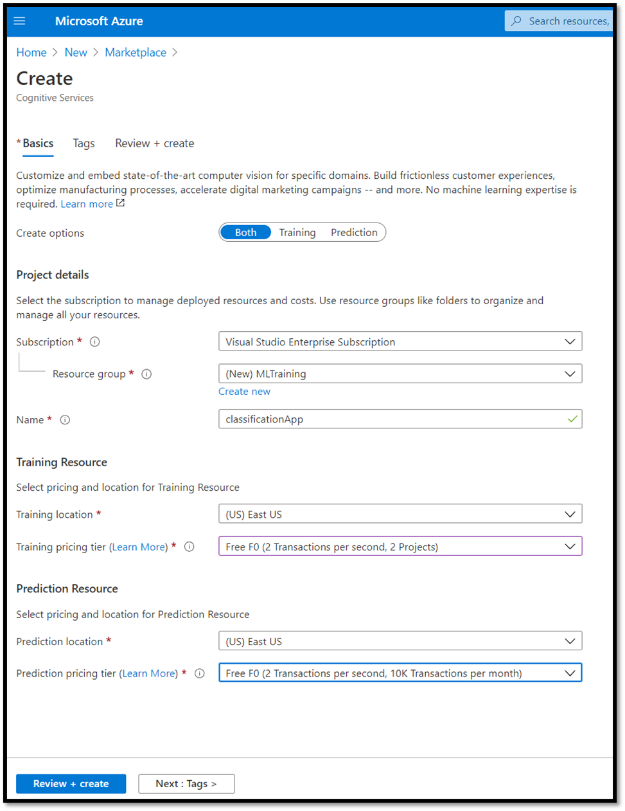

### Create a new project within Custom Vision

Now that you've created your resource, it's time to create your training project within Custom Vision.

1. In your web browser, navigate to the [Custom Vision](https://www.customvision.ai/) page and select `Sign in`. Sign in with the same account you used to sign into the Azure Portal.

2. Select `New Project` to open a new project dialog.

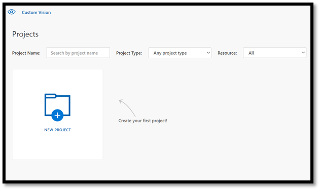

3. Create a new project as follow: 

*   `Name`: FoodClassification.
*	`Description`: Classification of different types of food.
*	`Resource`: keep the same resource you opened previously – `ClassificationApp [F0]`.
*	`Project Types`: `classification`
*	`Classification Types`: `Multilabel (Multiple tags per image)`
*	`Domains`: `Food (compact)`.
*	`Export Capabilities`: `Basic platforms (Tensorflow, CoreML, ONNX, ...)`

> [!NOTE]
> In order to export to the ONNX format, ensure that you choose the `Food (compact)` domain. Non-compact domains cannot be exported to ONNX.

> [!IMPORTANT]
> If your signed-in account is associated with an Azure account, the Resource Group dropdown will display all of your Azure Resource Groups that include a Custom Vision Service Resource. If no resource group is available, please confirm that you have logged in to customvision.ai with the same account as you used to log into the Azure Portal.

4. Once you filled the dialog, select `Create project`.

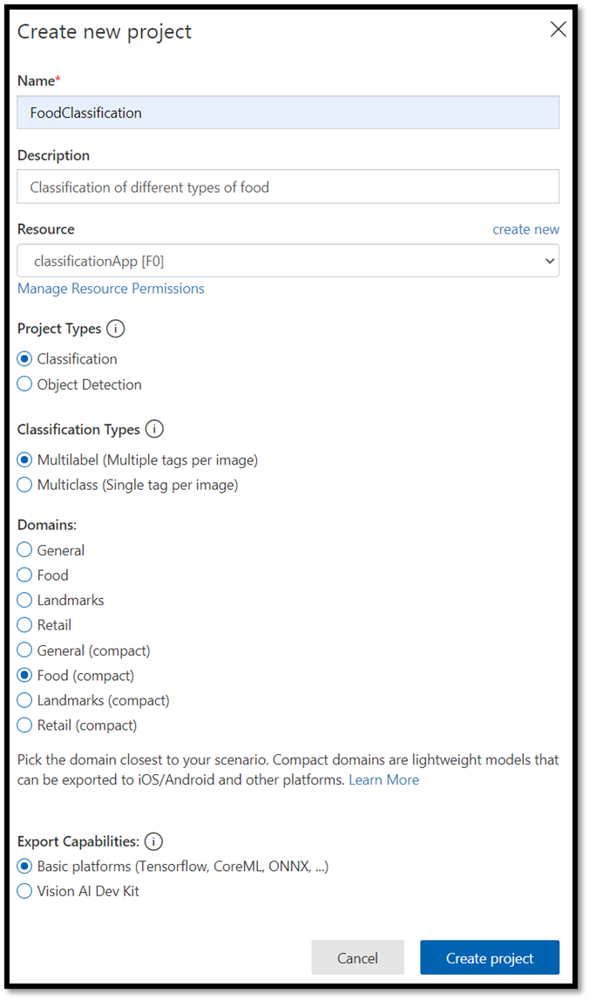

## Upload the training dataset

Now that you've created your project, you'll upload a previously prepared dataset of food images from Kaggle Open Datasets. 

1. Select your `FoodClassification` project to open the web-based interface of the Custom Vision website.

2. Select the `Add images` button and choose `Browse local files`.

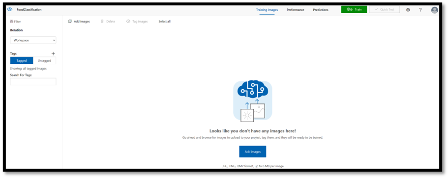

3. Navigate to the location of the image dataset and select the training folder – `vegetable-fruit`. Select all images in the folder, and select `open`. The tagging option will open.

4. Enter `vegetable-fruit` in the `My Tags` field and press `Upload`. 

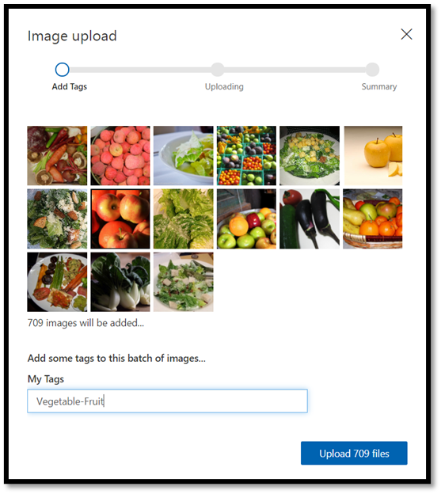

Wait until the first group of images are uploaded to your project and then press `done`. The tag selection will be applied to the entire group of images you have selected to upload. That’s why it is easier to upload images from already pre-built groups of images. You can always change the tags for individual images after they've been uploaded.

5. After the first group of images successfully uploaded, repeat the process twice more to upload the images of dessert and soup. Make sure you label them with the relevant tags. 

At the end, you will have three different groups of images ready for training.

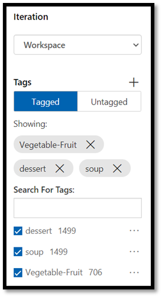

## Train the model classifier

You'll now train the model to classify the vegetables, soup, and desserts from the set of images you downloaded in the previous part.

1. To start the training process, select the `Train` button from the upper right corner. The classifier will use the images to create a model that identifies the visual qualities of each tag.

There's an option to change the probability threshold using the slider on the left upper corner. The probability threshold sets the level of confidence that a prediction needs to have in order to be considered correct. If the probability threshold is too high, you'll get more correct classification, but fewer will be detected. On the other hand, if the probability threshold is too low, you'll detect many more classifications, but with a lower confidence or more false positive results. 

In this tutorial, you can keep probability threshold at 50%. 

2. Here, we'll use the `Quick Training` process. `Advanced Training` has more settings, and allows you to specifically set the time used for training, but we don't need that level of control here. Press ``Train`` to initiate the training process.

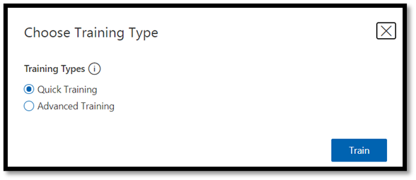

A quick training process will only take a few minutes to complete. During this time, information about the training process is displayed in the `Performance` tab.

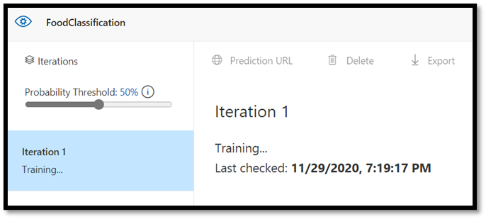

## Evaluate and Test

### Evaluate the results

Once the training is completed, you'll see the summary of the first training iteration. It includes the estimation of the model performance – **Precision** and **Recall**.

* **Precision** indicates the fraction of identified classifications that were correct. In our model, precision is 98.2%, so if our model classifies an image, it's very likely to be predicted correctly.
* **Recall** indicates the fraction of actual classifications that were correctly identified. In our model, recall is 97.5%, so our model properly classifies the vast majority of images presented to it.
* **AP** stands for Additional Performance. This provides an additional metric, that summarizes the precision and recall at different thresholds. 

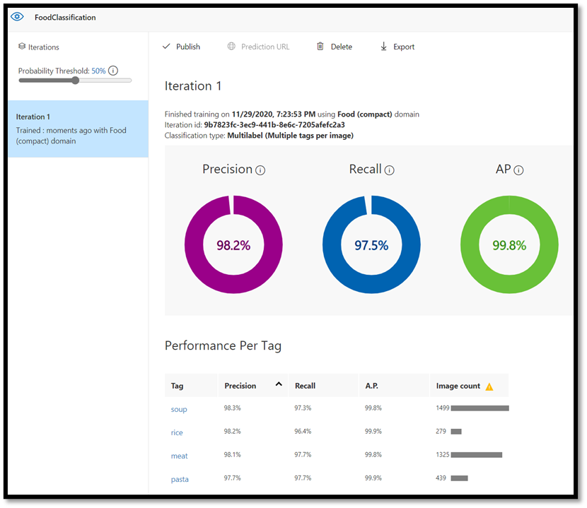

### Test the model

Before you export the model, you can test its performance. 

1. Select ``Quick Test`` on the top right corner of the top menu bar, to open a new testing window.

In this window, you can provide a URL of the image to test, or select ``Browse local files`` to use a locally stored image.

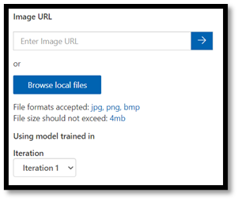

2. Choose ``Browse local files``, navigate to the food data set, and open a validation folder. Choose any random image from the `fruit-vegetable` folder and press `open`. 

The result of the testing will appear on the screen. In our test, the mode successfully classified the image with 99.8% certainty.

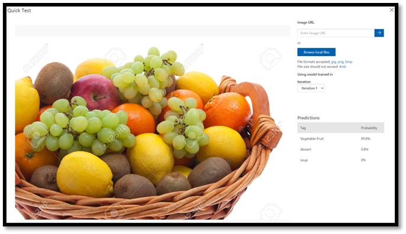

You can use the prediction for training in the `Predictions` tab, which can improve the model performance. For more information, see [How to improve your classifier](/azure/cognitive-services/custom-vision-service/getting-started-improving-your-classifier).

> [!NOTE]
> Interested in learning more about Azure Custom Vision APIs? The [Custom Vision Service documentation](/azure/cognitive-services/custom-vision-service/) has more information on Custom Vision web portal and SDK.

## Export the model to ONNX

Now that we've trained our model, we can export it to ONNX.

1. Select the `Performance` tab, and then choose `Export` to open an export window.

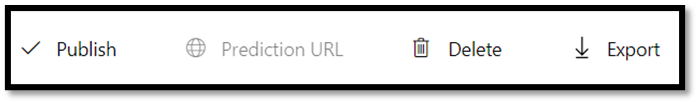

2. Select `ONNX` to export your model to ONNX format. 

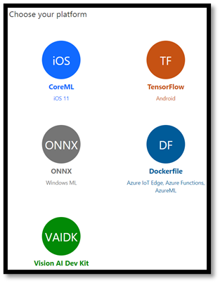

3. You can choose the `ONNX 16` float option if required, but in this tutorial we don't need to change any settings. Select `Export and Download`. 

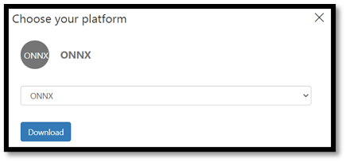

4. Open the downloaded .zip file and extract the `model.onnx` file from it. This file contains your classifier model. 

Congratulations! You've successfully built and exported the classification model.

### Next Steps

Now that we have a classification model, the next step is to [build a Windows application and run it locally on your Windows device](image-classification-deploy-model.md).
