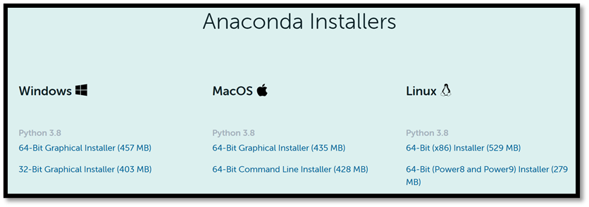
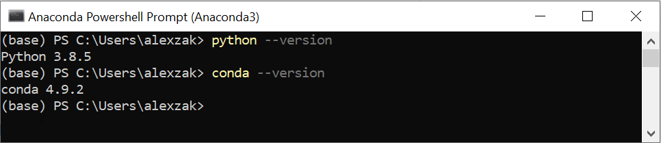
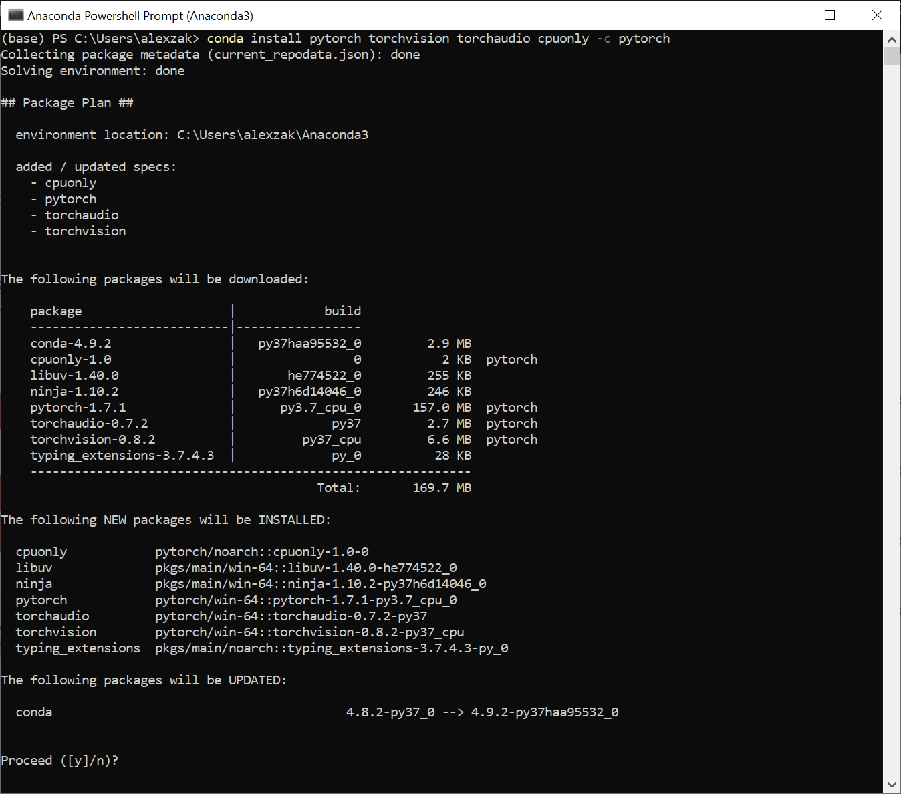
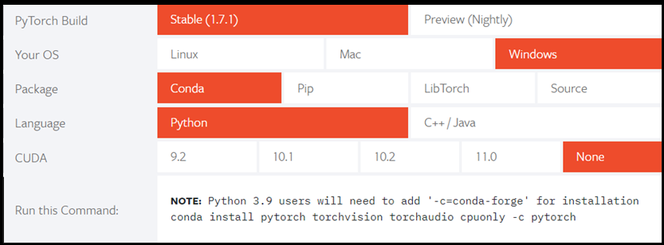
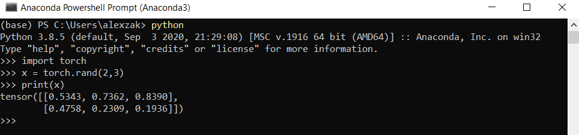

## Get PyTorch

This tutorial uses an Anaconda environment on 64-bit Windows to train and run your model on the CPU. For the Windows ML application later in the tutorial, you need Windows 10, version 1809 (build 17763), or later. You don't need a GPU or CUDA for these steps.

> [!IMPORTANT]
> This is a legacy tutorial. The steps retain Python 3.8 and the PyTorch 1.7.1 package versions shown in the original installation examples, rather than upgrading the downstream training and ONNX export code. [Python 3.8 is no longer supported](https://devguide.python.org/versions/), and [PyTorch stopped publishing official Conda packages starting with version 2.6](https://pytorch.org/blog/pytorch2-6/). Use a separate test machine or virtual machine to reproduce this environment, not a production environment. For new projects, follow the [current PyTorch installation guidance](https://pytorch.org/get-started/locally/); newer packages aren't validated with this tutorial.

1. Download the 64-bit Windows installer `Anaconda3-2020.11-Windows-x86_64.exe` from the [Anaconda installer archive](https://repo.anaconda.com/archive/) and install it on your test machine. [Anaconda 2020.11 includes Python 3.8.5](https://www.anaconda.com/blog/individual-edition-2020-11) and the data analysis packages used later in the tutorial.

   

2. Open **Start > Anaconda3 > Anaconda PowerShell Prompt**. Check your Python and Conda versions:

   ```console
   python --version
   conda --version
   ```

   Verify that Python reports version 3.8 before continuing.

   

3. Review the **v1.7.1 > Conda > Linux and Windows > CPU Only** instructions on the [previous PyTorch versions page](https://pytorch.org/get-started/previous-versions/#v171). This tutorial uses the Windows, Conda, Python, and CPU options, not the current stable release selector. CUDA builds are available for compatible NVIDIA GPUs, but GPU setup isn't part of this procedure.

   

4. In the same Anaconda PowerShell Prompt, install the CPU packages. The versions are pinned to avoid selecting a newer PyTorch release:

   ```console
   conda install pytorch==1.7.1 torchvision==0.8.2 torchaudio==0.7.2 cpuonly -c pytorch
   ```

   

   The screenshots are historical examples; their Python versions and unpinned commands can differ. Follow the commands in the text.

5. Review the package plan, enter `y` when prompted, and wait for installation to finish. If Conda can't resolve the legacy packages, don't substitute the latest PyTorch release and assume that the later tutorial steps are compatible.

6. In the same prompt, start Python:

   ```console
   python
   ```

   Enter the following code to construct a randomly initialized tensor:

   ```python
   import torch

   x = torch.rand(2, 3)

   print(x)
   ```

   The output should be a random 2x3 tensor (two rows and three columns). Your numbers will differ, but the shape should match this example:

   ```output
   tensor([[0.5343, 0.7362, 0.8390],
           [0.4758, 0.2399, 0.1936]])
   ```

   

   Enter `exit()` to return to the Anaconda PowerShell Prompt. Use this same Anaconda environment when you select the Python interpreter in the next stage of the tutorial.

> [!NOTE]
> Interested in learning more? Visit the [PyTorch official website](https://pytorch.org/).
