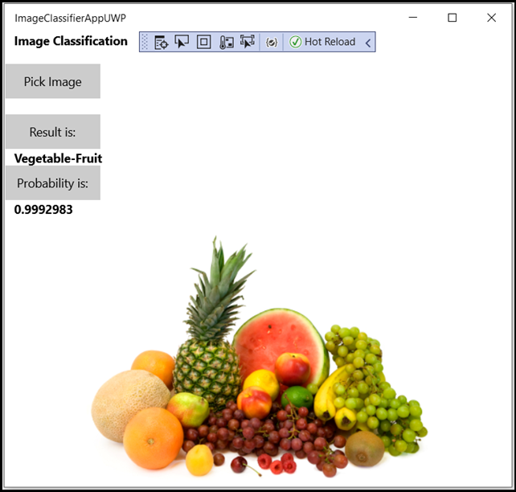

# Windows Machine Learning tutorials

Windows Machine Learning can be used in a variety of customizeable app solutions. Here, we provide several full tutorials covering how to create a Machine Learning model from a variety of potential non-code or programmatic services, and integrate them into a basic Windows ML app. In addition, we cover several advanced methods to tweak the functionality of your app. And if you're looking for just a basic introductory use of the APIs with an existing model, or if you want to check out our samples, check out further links below.

## Full app tutorials

These following tutorials cover the creation of a Machine Learning model, and how to incorporate it into a Windows 10 app with Windows ML.

### No-code training environment

Want to use an existing utility to train a machine learning model? These tutorials cover end-to-end walkthroughs of how to create Windows ML apps with models trained by existing services.

:::row:::
   :::column:::
      
   :::column-end:::
   :::column:::
        [**Image classification with Custom Vision and Windows ML**](image-classification-intro.md)

        Learn how to use the Azure Custom Vision service to train a model for image classification, and deploy that model in a Windows ML application to run locally on your machine.
   :::column-end:::
:::row-end:::
:::row:::
   :::column:::
         
   :::column-end:::
   :::column:::
        [**Image classification with ML.NET and Windows ML**](mlnet-intro.md)

        Learn how to use the ML.NET Model Builder Visual Studio extension to create an ONNX model and deploy that model in a Windows ML application to run locally on your machine. 
   :::column-end:::
:::row-end:::

### Code training environment

These tutorials cover ways to create your own code to train a Windows ML model, instead of using a pre-existing service.

:::row:::
   :::column:::
      [**Image classification with PyTorch and Windows ML**](pytorch-intro.md)

      Learn how to install PyTorch on your machine, how to use it to train an image classification model, how to convert that model to the ONNX format, and how to deploy it in a Windows ML application to run locally on your machine.
   :::column-end:::
   :::column:::
     
   :::column-end:::
:::row-end:::
:::row:::
   :::column:::
      [**Data analysis with PyTorch and Windows ML**](pytorch-analysis-intro.md)

      Learn how to install PyTorch on your machine, how to use it to train a data analysis model, how to convert that model to the ONNX format, and how to deploy it in a Windows ML application to run locally on your machine.
   :::column-end:::
   :::column:::
     
   :::column-end:::
:::row-end:::
:::row:::
   :::column:::
      [**Object detection with TensorFlow and Windows ML**](tensorflow-intro.md)

      Learn how to install TensorFlow on your machine, implement transfer learning with the YOLO architecture, convert to the model to ONNX, and deploy it in a Windows ML application to run locally on your machine. 
   :::column-end:::
   :::column:::
        
   :::column-end:::
:::row-end:::

## Advanced features:

If you want to use the Windows ML NuGet package, please see [Tutorial: Port an Existing Windows ML App to NuGet Package](../port-app-to-nuget.md).

For the latest Windows ML features and fixes, see our [release notes](../release-notes.md).

> [!IMPORTANT]
> PyTorch, the PyTorch logo and any related marks are trademarks of Facebook, Inc.
> TensorFlow, the TensorFlow logo and any related marks are trademarks of Google Inc.

[!INCLUDE [help](../../includes/get-help.md)]
