# Train your model with ML.NET

In the [previous stage of this tutorial](mlnet-intro.md), we discussed the prerequisites of creating your own Windows Machine Learning model and app, and downloaded an image set to use. In this stage, we'll learn how to use the ML.NET Model Builder to turn our image set into an image classification model.

## Create your project

1. Open Visual Studio and choose “create a new project”.

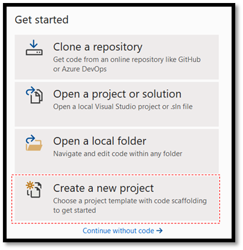

2. In the search bar, type .NET, select C# as your language and console as your platform and then choose the C# Console App (.NET Core) project template.

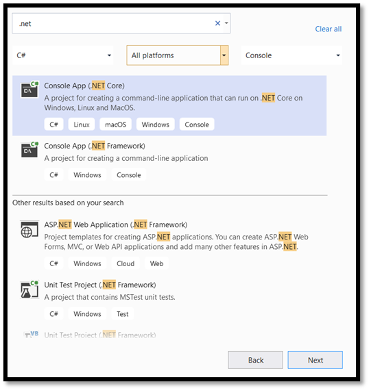

3. In the configuration window:

* Name your project. Here, we've called it **MLNETTraining**.
* Choose the location for your project. 
* Make sure `Place solution and project in the same directory` is unchecked.
* Press `create` to create your project.

## Set up Model Builder

Now, you will add Model Builder to our project.

1. Right-click on the **MLNETTraining** project in Solution Explorer and select `Add > Machine Learning`.
 
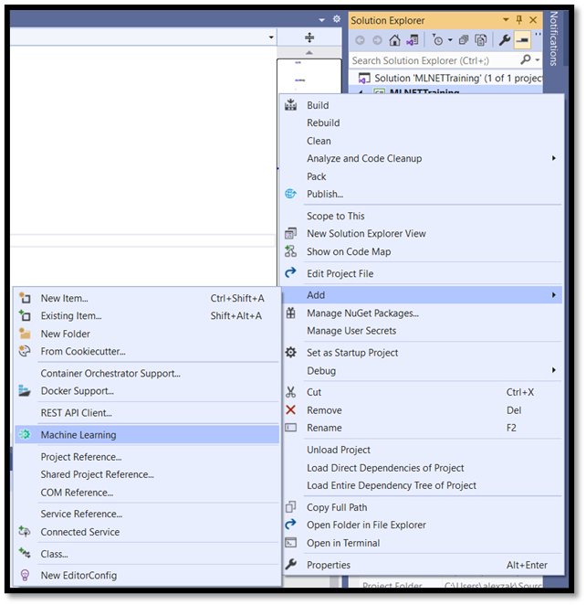

This way, you open ML.NET Model Builder in a new docked tool window in Visual Studio. Model Builder will guide you through the process of building a machine learning model.

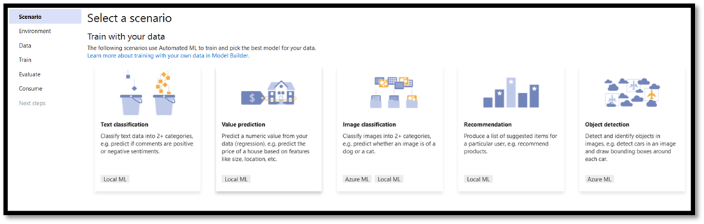

The first step is to choose the relevant scenario. Not all scenarios support ONNX format. 

If the training environment is Azure cloud, the generated models are in ONNX format and can be easily consumed by Windows ML app without conversion. However, if you decide to train your machine learning model locally on your machine, the generated model will be in ML.NET format. 

* Local CPU training is supported for all scenarios except Object Detection.
* Local GPU training is supported for Image Classification.
* Azure training is supported for Image Classification and Object Detection.

In this tutorial, you will train image classification model in Azure training environment. The output model will be in ONNX format. Azure account is required to complete the training. 

2. Choose the Image Classification Scenario.

3. Select Set up workspace to set up your Azure training environment. 
 
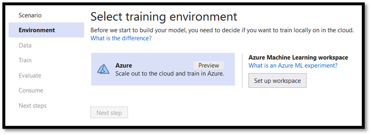

On the upper right corner, sign into the account associated with your Azure subscription. In the menu below:
* Choose the relevant subscription.
* Select and create a new Machine Learning Workspace. 
* Select or create a new Compute resource.
* Give the name to your workspace – ImageClassificationMLNET.

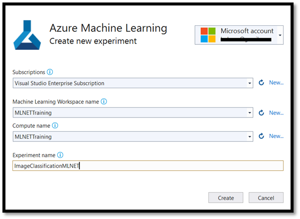

> [!IMPORTANT]
> If you aren't able to create the Machine Learning workspace from Model Builder, follow these steps to create a workspace manually from your Azure Portal. Otherwise, you can skip to step 4.

At your Azure account, select Create a resource:

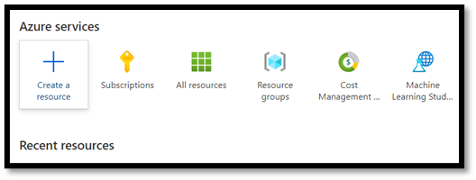
 
In the search bar, look for a Machine Learning.
 
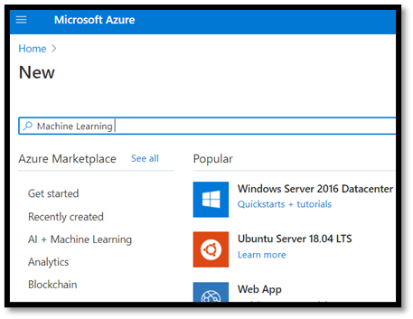

Press Create to create a new Machine Learning workspace.

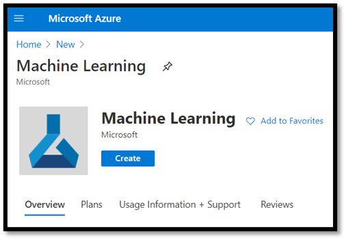
 
To create a new workspace, you will need to provide your subscription name, select or create a new resource group, give a name to the workspace and define all the required parameters such as region, storage account, etc. 

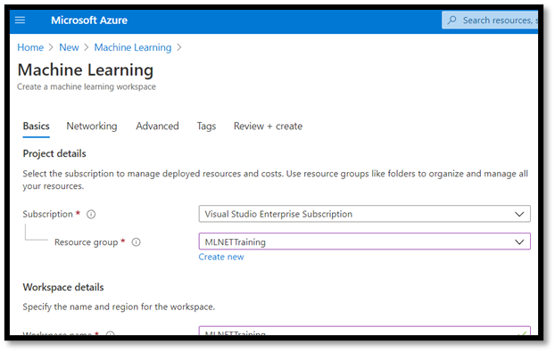

Once you've established your workspace and created a new training environment in ML.NET, you can move to the next step.

Wait until the deployment of Machine Learning Services is complete. 

The next step is to add the data to Model Builder.

4. Navigate to the location of the image dataset and select the training folder with the relevant food categories. In this tutorial you will train the model to recognize desert, soup and fruit, so you need only these categories in our dataset folder. 

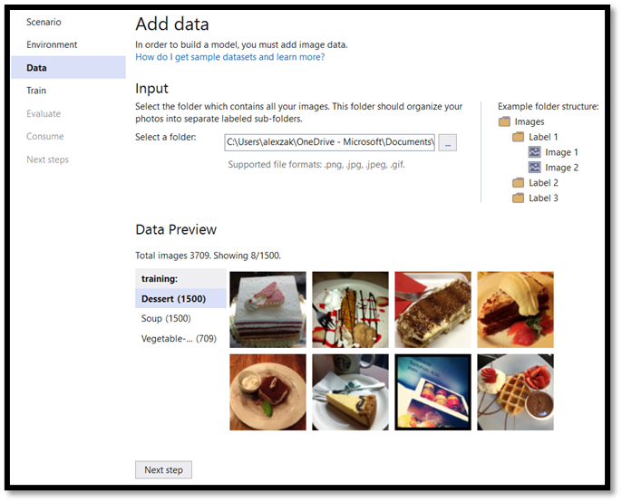

Now, you are ready to move to the training part!

## Train your Model

Model Builder evaluates many models with varying algorithms and settings to give you the best performing model.

1. Select next and then Start Training to start the training process. The ML.Net model builder will start by uploading data to Azure, prepare the workspace and then initiate the training process. 

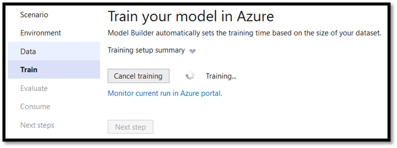

Once training is done, you will see a summary of the training results.

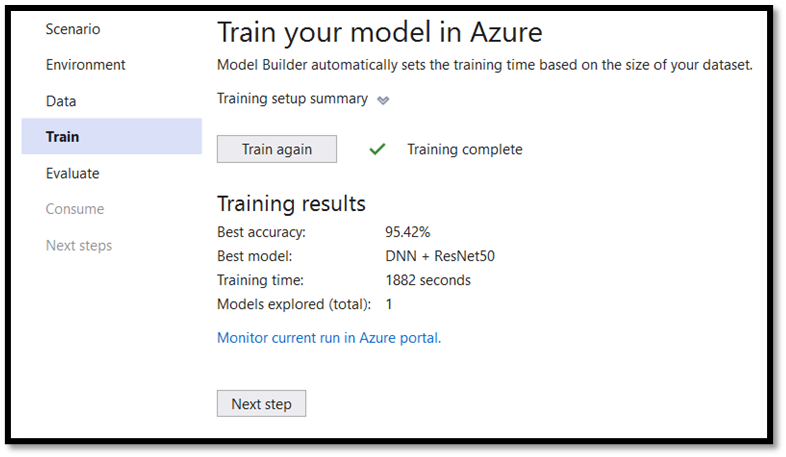
 
Best accuracy - shows you the accuracy of the best model that Model Builder found. Higher accuracy means the model predicted more correctly on test data. In our case, the model can predict the correct result with 95.42% of confidence.

## Evaluate the results

1. Move the next step to evaluate the training results.

2. Select the image from the evaluation folder of the dataset and explore the prediction. 

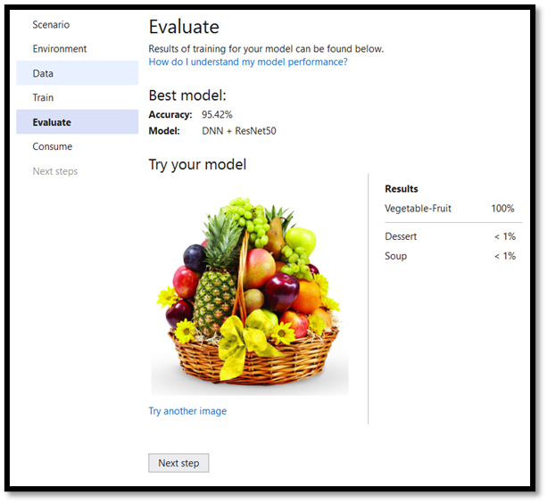

## Add the model to the solution

ML.NET Model Builder can automatically add both the machine learning model and the projects for training and consuming the model to your solution. 

1. Navigate to the consume part of the training process and sell Add to solution. This will add the generated model to your solution folder. 

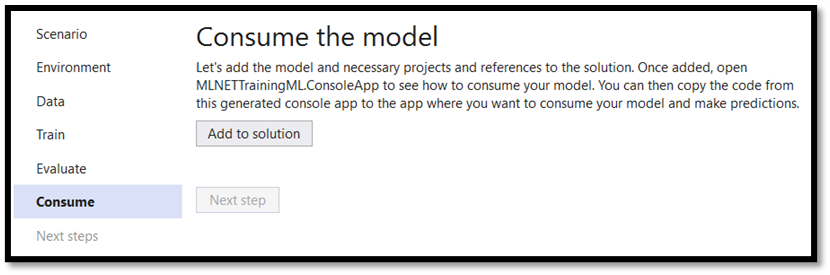 

In the Solution Explorer, you should see the code files that were generated by Model Builder, including the model – bestModel.onnx in ONNX format. 

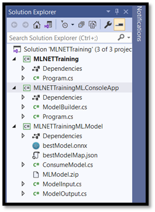

The model trained in Azure cloud environment, so the generated model is in ONNX format.

### Explore your model

1. Right-click on the bestModel.onnx will and select Open Containing Folder. 

2. Open your model file with Netron program.

3. Press on the input1 node to open the model properties.

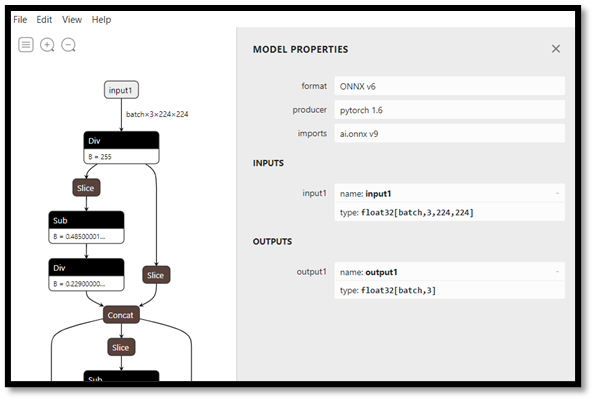
 
As you can see, the model requires 32-bit float tensor (multi-dimensional array) object as an input and returns Tensor float as an output. The way the model was built, it does not return the string value of a predicted label but an array of three numbers, each represents the relevant label of the food type. You will need to extract these values to show the correct prediction with Windows ML app.

| | | |
| -- | -- | -- |
| 0 | 1 | 2 |
| dessert | soup | Vegetable-Fruit |

## Next Steps

Now that you've trained your Machine Learning model, you're ready to [deploy it in a UWP app with Windows Machine Learning](mlnet-deploy-model.md)
