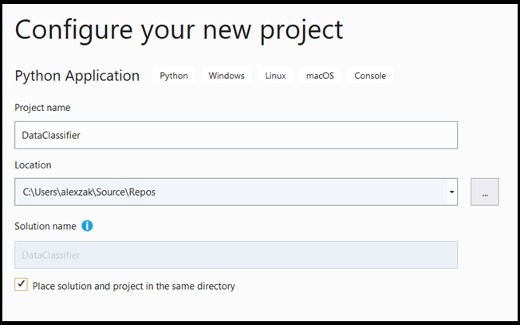
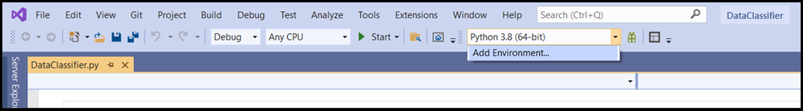
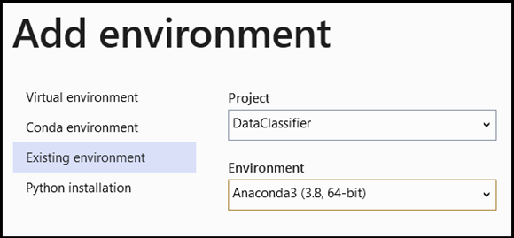
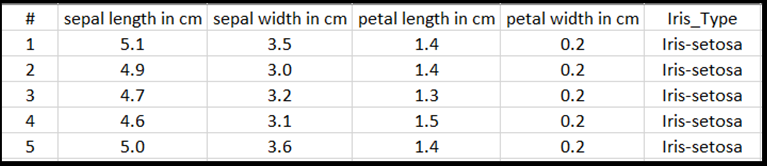
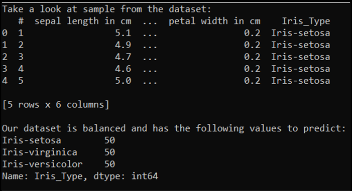
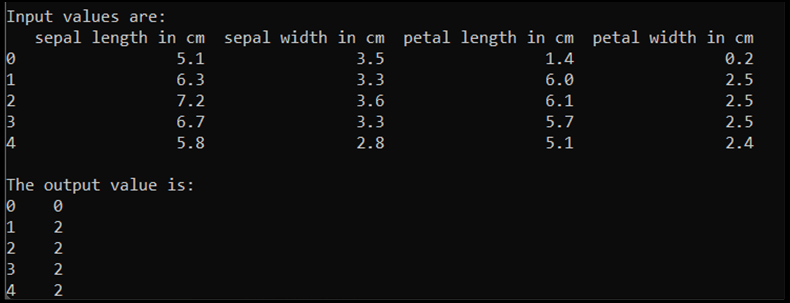
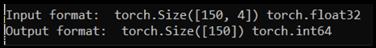

# Prepare the data for analysis

In the [previous stage of this tutorial](pytorch-installation.md), we installed PyTorch on your machine. Now, we'll use it to set up our code with the data we'll use to make our model.

## Open a new project within Visual Studio. 

1. Open Visual Studio and choose `create a new project`. 


2. In the search bar, type `Python` and select `Python Application `as your project template. 


3. In the configuration window: 

* Name your project. Here, we call it **DataClassifier**.
* Choose the location of your project.  
* If you're using VS2019, ensure `Create directory for solution` is checked. 
* If you're using VS2017, ensure `Place solution and project in the same directory` is unchecked.



Press `create` to create your project.

## Create a Python interpreter  

Now, you need to define a new Python interpreter. This must include the PyTorch package you've recently installed.  

1. Navigate to interpreter selection, and select `Add Environment`: 



2. In the `Add Environment` window, select `Existing environment`, and choose `Anaconda3 (3.6, 64-bit)`. This includes the PyTorch package. 



To test the new Python interpreter and PyTorch package, enter the following code to the `DataClassifier.py` file: 

```
from __future__ import print_function 

import torch 

x=torch.rand(2, 3) 

print(x) 
```

The output should be a random 5x3 tensor similar to the below.


> [!NOTE]
> Interested in learning more? Visit the [PyTorch official website](https://pytorch.org/).

## Understanding the data

We will train the model on the Fisher's Iris flower dataset. This famous dataset includes 50 records for each of three Iris species: Iris setosa, Iris virginica, and Iris versicolor.  

Several versions of the dataset have been published. You can find Iris dataset at the [UCI Machine Learning Repository](https://archive.ics.uci.edu/ml/datasets/Iris), import the dataset directly from the [Python Scikit-learn library](https://scikit-learn.org/stable/auto_examples/datasets/plot_iris_dataset.html) or use any other version previously published. To learn about Iris flower data set, visit [its Wikipedia page](https://en.wikipedia.org/wiki/Iris_flower_data_set).  

In this tutorial, to showcase how to train the model with the tabular type of input, you will use the Iris dataset exported to the Excel file.  

Each line of the excel table will show four features of Irises: sepal length in cm, sepal width in cm, petal length in cm, and petal width in cm. These features will serve as your input. The last column includes the Iris type related to these parameters and will represent the regression output. In total, the dataset includes 150 inputs of four features, each of them matched to the relevant Iris type.  



Regression analysis looks at the relationship between input variables and the outcome. Based on the input, the model will learn to predict the correct type of output - one of the three Iris types: Iris-setosa, Iris-versicolor, Iris-virginica. 

> [!IMPORTANT]
> If you decide to use any other dataset to create your own model, you will need to specify your model input variables and output according to your scenario.  

## Load the dataset. 

1. Download the Iris dataset in Excel format. [You can find it here](https://github.com/microsoft/Windows-Machine-Learning/blob/master/Samples/Tutorial%20Samples/PyTorch%20Data%20Analysis/PyTorch%20Training%20-%20Data%20Analysis/Iris_dataset.xlsx).

2. In the `DataClassifier.py` file in the **Solution Explorer Files** folder, add the following import statement to get access to all the packages that we'll need.

```py
import torch 
import pandas as pd 
import torch.nn as nn 
from torch.utils.data import random_split, DataLoader, TensorDataset 
import torch.nn.functional as F 
import numpy as np 
import torch.optim as optim 
from torch.optim import Adam 
```

As you can see, you will be using pandas (Python data analysis) package to load and manipulate data and torch.nn package that contains modules and extensible classes for building neural networks. 

3. Load the data into memory and verify the number of classes. We expect to see 50 items of each Iris type. Be sure to specify the location of the dataset on your PC. 

Add the following code to the `DataClassifier.py` file.

```py
# Loading the Data
df = pd.read_excel(r'C:…\Iris_dataset.xlsx') 
print('Take a look at sample from the dataset:') 
print(df.head()) 

# Let's verify if our data is balanced and what types of species we have  
print('\nOur dataset is balanced and has the following values to predict:') 
print(df['Iris_Type'].value_counts()) 
```

When we run this code, the expected output is as follows: 



To be able to use the dataset and train the model, we need to define input and output. The input includes 150 lines of features, and the output is the Iris type column. The neural network we'll use requires numeric variables, so you'll convert the output variable to a numeric format. 

4. Create a new column in the dataset which will represent the output in a numeric format and define a regression input and output.

Add the following code to the `DataClassifier.py` file.

```py
# Convert Iris species into numeric types: Iris-setosa=0, Iris-versicolor=1, Iris-virginica=2.  
labels = {'Iris-setosa':0, 'Iris-versicolor':1, 'Iris-virginica':2} 
df['IrisType_num'] = df['Iris_Type']   # Create a new column "IrisType_num" 
df.IrisType_num = [labels[item] for item in df.IrisType_num]  # Convert the values to numeric ones 

# Define input and output datasets 
input = df.iloc[:, 1:-2]            # We drop the first column and the two last ones. 
print('\nInput values are:') 
print(input.head())   
output = df.loc[:, 'IrisType_num']   # Output Y is the last column  
print('\nThe output value is:') 
print(output.head()) 
```

When we run this code, the expected output is as follows: 



To train the model, we need to convert the model input and output to the Tensor format: 

5. Convert to Tensor: 

Add the following code to the `DataClassifier.py` file.

```py
# Convert Input and Output data to Tensors and create a TensorDataset 
input = torch.Tensor(input.to_numpy())      # Create tensor of type torch.float32 
print('\nInput format: ', input.shape, input.dtype)     # Input format: torch.Size([150, 4]) torch.float32 
output = torch.tensor(output.to_numpy())        # Create tensor type torch.int64  
print('Output format: ', output.shape, output.dtype)  # Output format: torch.Size([150]) torch.int64 
data = TensorDataset(input, output)    # Create a torch.utils.data.TensorDataset object for further data manipulation 
```

If we run the code, the expected output will show the input and output format, as follow: 



There are 150 input values. About 60% will be the model training data. You will keep 20% for validation and 30% for a test.  

In this tutorial, the batch size for a training dataset is defined as 10. There are 95 items in the training set, which means that on average, there are 9 full batches to iterate through the training set once (one epoch). You will keep the batch size of the validation and test sets as 1. 

6. Split the data to train, validate and test sets: 

Add the following code to the `DataClassifier.py` file.

```py
# Split to Train, Validate and Test sets using random_split 
train_batch_size = 10        
number_rows = len(input)    # The size of our dataset or the number of rows in excel table.  
test_split = int(number_rows*0.3)  
validate_split = int(number_rows*0.2) 
train_split = number_rows - test_split - validate_split     
train_set, validate_set, test_set = random_split( 
    data, [train_split, validate_split, test_split])    
 
# Create Dataloader to read the data within batch sizes and put into memory. 
train_loader = DataLoader(train_set, batch_size = train_batch_size, shuffle = True) 
validate_loader = DataLoader(validate_set, batch_size = 1) 
test_loader = DataLoader(test_set, batch_size = 1)
```

## Next Steps

With the data ready to go, it's time to [train our PyTorch model](pytorch-analysis-train-model.md)