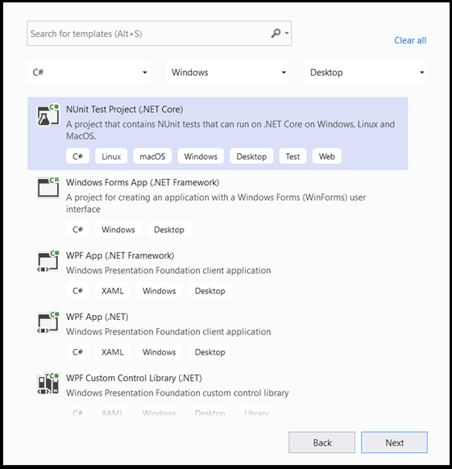
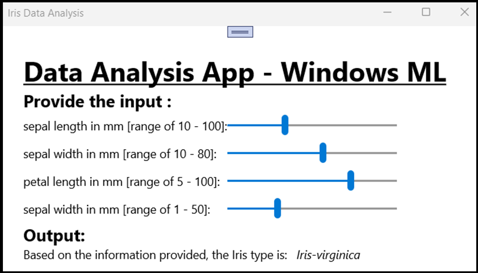

# Deploy you data analysis model in Windows app with Windows ML APIs

[In the previous part of this tutorial](pytorch-analysis-convert-model.md), you learned how to build and export a model in ONNX format. Now, we'll show you how to embed your exported model into a Windows application, and run it locally on a device by calling Windows ML APIs.  

By the time we're done, you'll have a working data analysis app.

## About the sample app 

In this step of the tutorial, you'll create an app that can analyze tabular data of Irises. The app will allow you to add the excel file with the required input information or manually enter the input parameters – the length and width of Iris’s sepal and petal in cm. These features will be processed by a locally stored neural network ONNX model you built and trained in the previous part. Based on the model output, the app will display the correct Iris type. 

Here, we'll walk you through that process.

> [!NOTE]
> If you choose to use the predefined code sample, you can clone [the solution file](https://github.com/microsoft/Windows-Machine-Learning/tree/master/Samples/Tutorial%20Samples/PyTorch%20Data%20Analysis/Windows%20ML%20code%20-%20Data%20Analysis). Clone the repository, navigate to this sample, and open the `Iris Data Analysis.csproj` file with Visual Studio.Skip to the **Launch the Application** part of this page to see it in use.

Below, we'll guide you how to create your app and add Windows ML code.  

## Create a Windows ML Desktop (C#) app  

To make a working Windows ML app, you'll need to do the following:

* Load a machine learning model. 
* Bind the model's inputs and outputs. 
* Evaluate the model and display meaningful results. 

You'll also need to create a basic UI, to provide a better user experience.

### Open a new project within Visual Studio 

1. Let's get started. Open Visual Studio and choose `Create a new project`.


2. In the search bar, choose `C#` as your language, `Windows` as your target platform, and `Dektop` as your project type. Select `NUnit Test Project (.NET Core)` as your project type, and select `next` to open a configuration window for the project.  



3. In the configuration window, do the following:

* Name your project. Here, we call it **Iris Data Analysis**.
* Choose the location of your project.  
* If you're using VS2019, ensure `Create directory for solution` is checked. 
* If you're using VS2017, ensure `Place solution and project in the same directory` is unchecked.

Press `create` to create your project. The minimum target version window may pop up. Be sure your minimum version is set to **Windows 10, version 1809 (10.0; build 17763)** or higher.

4. After the project is created, navigate to the project folder, open the **assets** folder `[….\DataClassifier\Assets]`, and copy your `Network.onnx` file to this location.  

### Explore project solution 

Let's explore your project solution.

Visual Studio automatically created several cs-code files inside the Solution Explorer. `MainPage.xaml` contains the XAML code for your GUI, and `MainPage.xaml.cs` contains your application code. If you've created a UWP app before, these files should be very familiar to you.

While we've added our `Network.onnx` file to the assets folder, we need to properly add it to this project.

1. Right-click on the Assets folder in the Solution Explorer and, select `Add > Existing Item`.  
2. Navigate to the Assets folder inside `Iris Data Analysis [….\Iris Data Analysis \Assets]`, find the `Network.onnx model` you previously copied there, and select `Add`.
3. To ensure the model builds when you compile your application, right-click on the `Network.onnx` file and select `Properties`. Set the `Build Action` to `Content`.


You'll also need to create a new cs-code class file to accommodate some extra machine learning code, which includes classes and methods that will call Windows ML APIs.

4. Right-click on the solution name in Visual Studio, and choose `add` and `new item`. In the open window, select `Class` and give it a name - here, we use `IrisModel.cs`. A new class file will appeal under your project.

.


## Create Machine Learning code

In this step, we'll create all the classes and methods that will call the Windows Machine Learning APIs. These will let you load, bind and evaluate an ONNX machine learning model in your project.

1. Double click on the `IrisModel.cs` file.

2. Replace the *using* statements with the following, to get access to all the APIs that you'll need.

```csharp
using System;
using System.Linq;
using System.Threading.Tasks;
using Windows.AI.MachineLearning;
using Windows.Storage;
```

### Initialize machine learning classes

We'll need to add several classes to `IrisModel.cs` to help you interact with Windows Machine Learning APIs.

To get access to the trained machine learning model, we'll use the `LearningModel` class. This class is part of the `Windows.AI.MachineLearning` namespace, and represents a trained machine learning model. Once instantiated, the `LearningModel` is the main object you use to interact with Windows ML APIs.

To evaluate the learning model, you'll have to create an evaluation session. To do so, you use the `LearningModelSession` class. This class is used to evaluate machine learning models, and binds the model to a device that then runs and evaluates the model. When you create a session with this API, you can also select a device to execute your model (the default is your CPU). 

Additionally, you'll need to specify the labels of the output of your machine learning models. You can connect those labels to the model's predicted output later.

> [!NOTE]
> To learn more about `LearningModel` and `LearningModelSession` classes, please review the [LearningModel class documentation](/uwp/api/windows.ai.machinelearning.learningmodel?preserve-view=true&view=winrt-19041) and the [LearningModelSession class documentation](/uwp/api/windows.ai.machinelearning.learningmodelsession?preserve-view=true&view=winrt-19041). 

3. Copy the following code to the `IrisModel.cs` file.

```csharp
class IrisModel
    {
        private LearningModel _learning_model;
        private LearningModelSession _session;
        private String[] _labels = { "Iris-setosa", "Iris-versicolor", "Iris-virginica"};
```

### Load the Model 

Next, you'll need to load the machine learning model and create a session, which you'll do with the classes you just defined. To load the model, you'll use several static methods of the `LearningModel` class - in our case, we'll use [LoadFromStorageFileAsync](/uwp/api/windows.ai.machinelearning.learningmodel.loadfromstoragefileasync?preserve-view=true&view=winrt-19041), which lets you load an ONNX model from an `ISorageFile` asynchronously.

> [!NOTE]
> To learn more about additional ways of loading the model, please review the [Load a model documentation](../load-a-model.md).

1.  Copy the following code to the `IrisModel.cs` file.

```csharp
public async Task Initialize()
{
    // Load and create the model and session
    var modelFile = await StorageFile.GetFileFromApplicationUriAsync(new Uri($"ms-appx:///Assets//Network.onnx"));
    _learning_model = await LearningModel.LoadFromStorageFileAsync(modelFile);
    _session = new LearningModelSession(_learning_model);
}
```

### Define the model input tensor

Now, we'll define the correct input based on your model requirements. The network model you built in the previous part has four input values. Every input value represents the possible sizes of four features of irises: sepal length in cm, sepal width in cm, petal length in cm, and petal width in cm. Based on this input, the model will return the iris type that best fits those parameters. You'll need to limit the size of input values to the valid logical values - for this tutorial, we'll use the following:

* sepal length - 1cm to 100cm
* sepal width – 1cm to 8cm
* petal length – 0.5cm to 10cm
* petal width – 0.1cm to 5cm

1.  Copy the following code to the `IrisModel.cs` file.

```csharp
private float _sepal_length = 1.0f;
public float Sepal_Length
{
    get
    {
        return _sepal_length;
    }
    set
    {
        // validate range [1,10]
        if (value >= 1 && value <= 10)
        {
            _sepal_length = value;
        }
    }
}

private float _sepal_width = 1.0f;
public float Sepal_Width
{
    get
    {
        return _sepal_width;
    }
    set
    {
        // validate range [1, 8]
        if (value >= 1 && value <= 8)
        {
            _sepal_width = value;
        }
    }
}

private float _petal_length = 0.5f;
public float Petal_Length
{
    get
    {
        return _petal_length;
    }
    set
    {
        // validate range [0.5, 10]
        if (value >= 0.5 && value <= 10)
        {
            _petal_length = value;
        }
    }
}

private float _petal_width = 0.1f;
public float Petal_Width
{
    get
    {
        return _petal_width;
    }
    set
    {
        // validate range [0.1, 5]
        if (value >= 0.1 && value <= 5)
        {
            _petal_width = value;
        }
    }
}
```

Windows ML APIs accept input values of the four descriptive classes supported by ONNX models: tensors, sequences, maps, and images. In this case, the model requires a 32-bit tensor float object in a shape of float32[batch_size,4]. Since the batch size is 1, the input tensor shape is [1x4].

To create a tensor input, you'll use the [TensorFloat](/uwp/api/windows.ai.machinelearning.tensorfloat?view=winrt-19041) class.
 
The `TensorFloat` class is part of the `Windows.AI.MachineLearning` namespace, and is used to define a 32-bit float tensor object - a tensor of 32-bit floating point values. This class contains several useful methods to build a tensor. In your case, you'll use the [CreateFromArray](/uwp/api/windows.ai.machinelearning.tensorfloat.createfromarray?view=winrt-19041#Windows_AI_MachineLearning_TensorFloat_CreateFromArray_Windows_Foundation_Collections_IIterable_System_Int64__System_Single___) method to build a tensor input in the exact size your model requires. We'll add that call within the evaluation method.

## Bind and Evaluate the model

Now that you've defined the model input tensor and instantiated the trained model and session, it's time to create a method to bind and evaluate the trained machine learning model.

This method is the key part of a machine learning app. It includes the tensorization of the input values and binding of the model input. **You'll use this model later in your application code to evaluate your model.**

To bind input and output, you use the `LearningModelBinding` class. A machine learning model has input and output features, which pass information into and out of the model. Be aware that required features must be supported by the Windows ML APIs. The `LearningModelBinding` class is applied on a `LearningModelSession` to bind values to named input and output features.

The `LearningModelBinding` class has several predefined methods you can use to bind values to those named features. Here, you'll use the `Bind` method to bind values to your model.

To evaluate your model and recieve results from it, you call the relevent predefined evauation methods from `LearningModelSession` - in your case, the `Evaluate` method. This method will provide the functionality you need, evaluating the machine learning model using the feature values supplied by the `LearningModelBinding` class.

> [!NOTE]
> To learn about another evaluate methods to run the model, please check which methods can be implemented on the LearningModelSession by reviewing the [LearningModelSession Class documentation](/uwp/api/windows.ai.machinelearning.learningmodelsession?preserve-view=true&view=winrt-19041). 

### Extract and display the results

The model returns the predicted values in tensor format as a Tensor float output. You'll now need to extract the model output and display the right results. To do this, you'll convert the tensor format to a vector by running the `GetAsVectorView()` function on the predicated output.

The model returns three probability values, each representing one specific iris type. You'll need to return the label with the highest probability.

1.  Copy the following code to the `IrisModel.cs` file.

```csharp
internal String Evaluate()
{
    // input tensor shape is [1x4]
    long[] shape = new long[2];
    shape[0] = 1;
    shape[1] = 4;

    // set up the input tensor
    float[] input_data = new float[4];
    input_data[0] = _sepal_length;
    input_data[1] = _sepal_width;
    input_data[2] = _petal_length;
    input_data[3] = _petal_width;
    TensorFloat tensor_float = TensorFloat.CreateFromArray(shape, input_data);

    // bind the tensor to "input"
    var binding = new LearningModelBinding(_session);
    binding.Bind("input", tensor_float);

    // evaluate
    var results = _session.Evaluate(binding, "");

    // get the results
    TensorFloat prediction = (TensorFloat)results.Outputs.First().Value;
    var prediction_data = prediction.GetAsVectorView();

    // find the highest predicted value
    int max_index = 0;
    float max_value = 0;
    for (int i = 0; i < prediction_data.Count; i++)
    {
        var val = prediction_data.ElementAt(i);
        if (val > max_value)
        {
            max_value = val;
            max_index = i;
        }
    }

    // return the label corresponding to the highest predicted value
    return _labels.ElementAt(max_index);
}
```

You've now completed the machine learning part of your code. Now, you can easily integrate your model with Windows application. In the last part of this tutorial, we've provided a basic Windows GUI and control code to test the model, using the methods you've already created.

### Create the application GUI

1. To create a GUI app code for your app, double-click on the `MainPage.xaml` code file and open a predefined template for your GUI. 

2. Copy-paste the below code to `MainPage.xaml`, under the `“Background="{ThemeResource ApplicationPageBackgroundThemeBrush}" " Height="939">` line.  

```xaml
    <Grid Margin="30,30,30,30">
        <Grid.RowDefinitions>
            <RowDefinition Height="Auto"/>
            <RowDefinition Height="Auto"/>
            <RowDefinition Height="Auto"/>
            <RowDefinition Height="Auto"/>
            <RowDefinition Height="Auto"/>
        </Grid.RowDefinitions>
        <TextBlock x:Name="title" HorizontalAlignment="Left" Text="Data Analysis App - Windows ML" TextWrapping="Wrap" VerticalAlignment="Top" FontSize="32" TextDecorations="Underline" FontWeight="Bold"/>
        <TextBlock x:Name="subtitle" HorizontalAlignment="Left" Text="Provide the input :" TextWrapping="Wrap" VerticalAlignment="Top" FontSize="20" Grid.Row="1" FontWeight="Bold"/>
        <Grid Grid.Row="2">
            <Grid.RowDefinitions>
                <RowDefinition Height="Auto"/>
                <RowDefinition Height="Auto"/>
                <RowDefinition Height="Auto"/>
                <RowDefinition Height="Auto"/>
            </Grid.RowDefinitions>
            <Grid.ColumnDefinitions>
                <ColumnDefinition Width="Auto"/>
                <ColumnDefinition Width="Auto"/>
            </Grid.ColumnDefinitions>
            <TextBlock x:Name="sepal_length" Text="sepal length in mm [range of 10 - 100]:" VerticalAlignment="Center"/>
            <TextBlock x:Name="sepal_width" Text="sepal width in mm [range of 10 - 80]:" VerticalAlignment="Center" Grid.Row="1"/>
            <TextBlock x:Name="petal_length" Text="petal length in mm [range of 5 - 100]:" VerticalAlignment="Center" Grid.Row="2"/>
            <TextBlock x:Name="petal_width" Text="sepal width in mm [range of 1 - 50]:" VerticalAlignment="Center" Grid.Row="3"/>

            <Slider x:Name="sepal_length_input" Minimum="10" Maximum="100" Orientation="Horizontal" Grid.Column="1" Width="200" ValueChanged="sepal_length_input_ValueChanged"/>
            <Slider x:Name="sepal_width_input" Minimum="10" Maximum="80" Orientation="Horizontal" Grid.Row="1" Grid.Column="1" Width="200" ValueChanged="sepal_width_input_ValueChanged"/>
            <Slider x:Name="petal_length_input" Minimum="5" Maximum="100" Orientation="Horizontal" Grid.Row="2" Grid.Column="1" Width="200" ValueChanged="petal_length_input_ValueChanged"/>
            <Slider x:Name="petal_width_input" Minimum="1" Maximum="50" Orientation="Horizontal" Grid.Row="3" Grid.Column="1" Width="200" ValueChanged="petal_width_input_ValueChanged"/>
        </Grid>
        <TextBlock x:Name="output" Text="Output:" FontSize="20" FontWeight="Bold" Grid.Row="3"/>
        <Grid Grid.Row="4">
            <Grid.ColumnDefinitions>
                <ColumnDefinition Width="Auto"/>
                <ColumnDefinition Width="Auto"/>
            </Grid.ColumnDefinitions>
            <TextBlock x:Name="output_subtitle" Text="Based on the information provided, the Iris type is:"/>
            <TextBlock x:Name="model_output" Text="Model output" FontStyle="Italic"  Grid.Column="1" Margin="10,0,0,0"/>
        </Grid>
    </Grid>
```

### Create the application control

The application control code, `MainPage.xaml.cs`, includes the main method to run the app, and several steps to run your model and execute the output:

1. You'll instantiate a new object of the `IrisModel` class that you had created previously in this tutorial.
2. You'll call the `Evaluate()` method you built in the previous part on model. This method will be applied four times, one on each of the input parameters: sepal length, sepal width, petal length, and petal width.

The app will display the result based on the machine learning prediction algorithm.

1. To create an application control code, double-click the `MainPage.xaml.cs` code file and add the following code.

```csharp
using Windows.UI.Xaml.Controls;
using Windows.UI.Xaml.Controls.Primitives;
// The Blank Page item template is documented at https://go.microsoft.com/fwlink/?LinkId=402352&clcid=0x409

namespace Iris_Data_Analysis
{
    /// <summary>
    /// An empty page that can be used on its own or navigated to within a Frame.
    /// </summary>
    public sealed partial class MainPage : Page
    {
        private IrisModel _iris_model;

        public MainPage()
        {
            this.InitializeComponent();
            _iris_model = new IrisModel();
#pragma warning disable CS4014 // Because this call is not awaited, execution of the current method continues before the call is completed
            _iris_model.Initialize();
#pragma warning restore CS4014 // Because this call is not awaited, execution of the current method continues before the call is completed
        }

        private void sepal_length_input_ValueChanged(object sender, RangeBaseValueChangedEventArgs e)
        {
            if (_iris_model != null)
            {
                _iris_model.Sepal_Length = (float)sepal_length_input.Value / 10.0f;
                model_output.Text = _iris_model.Evaluate();
            }
        }

        private void sepal_width_input_ValueChanged(object sender, RangeBaseValueChangedEventArgs e)
        {
            if (_iris_model != null)
            {
                _iris_model.Sepal_Width = (float)sepal_width_input.Value / 10.0f;
                model_output.Text = _iris_model.Evaluate();
            }
        }

        private void petal_length_input_ValueChanged(object sender, RangeBaseValueChangedEventArgs e)
        {
            if (_iris_model != null)
            {
                _iris_model.Petal_Length = (float)petal_length_input.Value / 10.0f;
                model_output.Text = _iris_model.Evaluate();
            }
        }

        private void petal_width_input_ValueChanged(object sender, RangeBaseValueChangedEventArgs e)
        {
            if (_iris_model != null)
            {
                _iris_model.Petal_Width = (float)petal_width_input.Value / 10.0f;
                model_output.Text = _iris_model.Evaluate();
            }
        }
    }
}

```

## Launch the application 

Now you're ready to launch your application and see the results.

Enable developer mode and test your application from Visual Studio. Make sure the dropdown menus in the top toolbar are set to `Debug`. Change the Solution Platform to x64 to run the project on your local machine if your device is 64-bit, or x86 if it's 32-bit.

The app GUI includes four sliders to change the input of the required parameters. Any change in the input will generate a new output based on the prediction algorithm. The output is displayed below the input sliders.

You can see that the given the input of sepal length = 40mm, sepal width = 50, petal length = 75, and petal width = 15, the app generated input of Iris-versicolor type!



### Summary

You've just made your first Windows Machine Learning app, from model creation to successful execution.

### Additional Resources

To learn more about topics mentioned in this tutorial, visit the following resources:
*   Windows ML tools: Learn more tools like the [Windows ML Dashboard](../dashboard.md), [WinMLRunner](../winmlrunner.md), and the [mglen](../mlgen.md) Windows ML code generator. 
*   [ONNX model](../get-onnx-model.md): Learn more about the ONNX format.
*   [Windows ML performance and memory](../performance-memory.md): Learn more about how to manage app performance with Windows ML. 
*   [Windows Machine Learning API reference](../api-reference.md): Learn more about three areas of Windows ML APIs.
