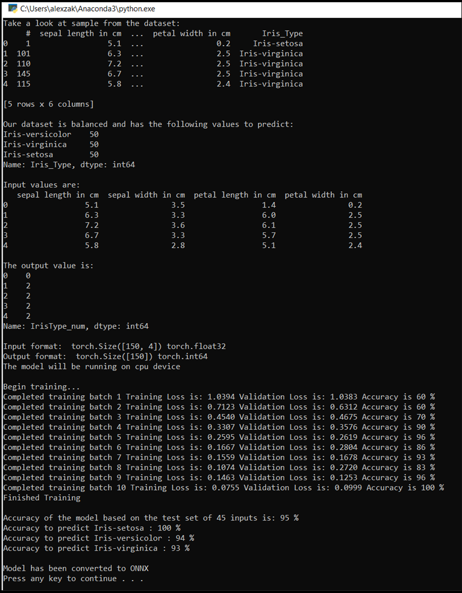

# Train your data analysis model with PyTorch 

In the [previous stage of this tutorial](pytorch-data.md), we acquired the dataset we'll use to train our data analysis model with PyTorch. Now, it's time to put that data to use.

To train the data analysis model with PyTorch, you need to complete the following steps:

1.	Load the data. If you've done the previous step of this tutorial, you've handled this already.
2.	Define a neural network.
3.	Define a loss function.
4.	Train the model on the training data.
5.	Test the network on the test data.

## Define a neural network

In this tutorial, you'll build a basic neural network model with three linear layers. The structure of the model is as follows: 

`Linear -> ReLU -> Linear -> ReLU -> Linear`

A Linear layer applies a linear transformation to the incoming data. You have to specify the number of input features and the number of output features which should correspond to the number of classes.  

A ReLU layer is an activation function to define all incoming features to be 0 or greater. Thus, when a ReLU layer is applied, any number less than 0 is changed to zero, while others are kept the same. We'll apply the activation layer on the two hidden layers, and no activation on the last linear layer. 

## Model parameters 

Model parameters depend on our goal and the training data. The input size depends on the number of features we feed the model – four in our case. The output size is three since there are three possible types of Irises.  

Having three linear layers, `(4,24) -> (24,24) -> (24,3)`, the network will have 744 weights (96+576+72). 

The learning rate (lr) sets the control of how much you are adjusting the weights of our network with respect to the loss gradient. The lower it is, the slower the training will be. You'll set lr to 0.01 in this tutorial. 

## How does the Network work? 

Here, we're building a feed-forward network. During the training process, the network will process the input through all the layers, compute the loss to understand how far the predicted label of the image is falling from the correct one, and propagate the gradients back into the network to update the weights of the layers. By iterating over a huge dataset of inputs, the network will “learn” to set its weights to achieve the best results.  

A *forward* function computes the value of the loss function, and a *backward* function computes the gradients of the learnable parameters. When you create our neural network with PyTorch, you only need to define the forward function. The backward function will be automatically defined. 

1. Copy the following code into the `DataClassifier.py` file in Visual Studio to define the model parameters and the neural network.

```py
# Define model parameters 
input_size = list(input.shape)[1]   # = 4. The input depends on how many features we initially feed the model. In our case, there are 4 features for every predict value  
learning_rate = 0.01 
output_size = len(labels)           # The output is prediction results for three types of Irises.  


# Define neural network 
class Network(nn.Module): 
   def __init__(self, input_size, output_size): 
       super(Network, self).__init__() 
        
       self.layer1 = nn.Linear(input_size, 24) 
       self.layer2 = nn.Linear(24, 24) 
       self.layer3 = nn.Linear(24, output_size) 


   def forward(self, x): 
       x1 = F.relu(self.layer1(x)) 
       x2 = F.relu(self.layer2(x1)) 
       x3 = self.layer3(x2) 
       return x3 
 
# Instantiate the model 
model = Network(input_size, output_size) 
```
You'll also need to define the execution device based on the available one on your PC. PyTorch does not have a dedicated library for GPU, but you can manually define the execution device. The device will be an Nvidia GPU if exists on your machine, or your CPU if one does not.

2. Copy the following code to define the execution device: 

```py
# Define your execution device 
device = torch.device("cuda:0" if torch.cuda.is_available() else "cpu") 
print("The model will be running on", device, "device\n") 
model.to(device)    # Convert model parameters and buffers to CPU or Cuda 
```

3. As the last step, define a function to save the model: 

```py
# Function to save the model 
def saveModel(): 
    path = "./NetModel.pth" 
    torch.save(model.state_dict(), path) 
```

> [!NOTE]
> Interested in learning more about neural network with PyTorch? Check out the [PyTorch documentation](https://pytorch.org/tutorials/beginner/blitz/neural_networks_tutorial.html#sphx-glr-beginner-blitz-neural-networks-tutorial-py).

## Define a loss function

A loss function computes a value that estimates how far away the output is from the target. The main objective is to reduce the loss function's value by changing the weight vector values through backpropagation in neural networks.

Loss value is different from model accuracy. The loss function represents how well our model behaves after each iteration of optimization on the training set. The accuracy of the model is calculated on the test data, and shows the percentage of predictions that are correct.

In PyTorch, the neural network package contains various loss functions that form the building blocks of deep neural networks. If you want to learn more of these specifics, get started with the above note. Here, we'll use the existing functions optimized for classification like this, and use a Classification Cross-Entropy loss function and an Adam optimizer. In the optimizer, learning rate (lr) sets the control of how much you are adjusting the weights of our network with respect the loss gradient. You'll set it as 0.001 here - the lower it is, the slower the training will be.

1. Copy the following code into the `DataClassifier.py` file in Visual Studio to define the loss function and an optimizer.

```py
# Define the loss function with Classification Cross-Entropy loss and an optimizer with Adam optimizer
loss_fn = nn.CrossEntropyLoss()
optimizer = Adam(model.parameters(), lr=0.001, weight_decay=0.0001)
```

## Train the model on the training data.

To train the model, you have to loop over our data iterator, feed the inputs to the network, and optimize. To validate the results, you simply compare the predicted labels to the actual labels in the validation dataset after every training epoch. 

The program will display the training loss, validation loss and the accuracy of the model for every epoch or for every complete iteration over the training set. It will save the model with the highest accuracy, and after 10 epochs, the program will display the final accuracy. 

1. Add the following code to the `DataClassifier.py` file

```py
# Training Function 
def train(num_epochs): 
    best_accuracy = 0.0 
     
    print("Begin training...") 
    for epoch in range(1, num_epochs+1): 
        running_train_loss = 0.0 
        running_accuracy = 0.0 
        running_vall_loss = 0.0 
        total = 0 
 
        # Training Loop 
        for data in train_loader: 
        #for data in enumerate(train_loader, 0): 
            inputs, outputs = data  # get the input and real species as outputs; data is a list of [inputs, outputs] 
            optimizer.zero_grad()   # zero the parameter gradients          
            predicted_outputs = model(inputs)   # predict output from the model 
            train_loss = loss_fn(predicted_outputs, outputs)   # calculate loss for the predicted output  
            train_loss.backward()   # backpropagate the loss 
            optimizer.step()        # adjust parameters based on the calculated gradients 
            running_train_loss +=train_loss.item()  # track the loss value 
 
        # Calculate training loss value 
        train_loss_value = running_train_loss/len(train_loader) 
 
        # Validation Loop 
        with torch.no_grad(): 
            model.eval() 
            for data in validate_loader: 
               inputs, outputs = data 
               predicted_outputs = model(inputs) 
               val_loss = loss_fn(predicted_outputs, outputs) 
             
               # The label with the highest value will be our prediction 
               _, predicted = torch.max(predicted_outputs, 1) 
               running_vall_loss += val_loss.item()  
               total += outputs.size(0) 
               running_accuracy += (predicted == outputs).sum().item() 
 
        # Calculate validation loss value 
        val_loss_value = running_vall_loss/len(validate_loader) 
                
        # Calculate accuracy as the number of correct predictions in the validation batch divided by the total number of predictions done.  
        accuracy = (100 * running_accuracy / total)     
 
        # Save the model if the accuracy is the best 
        if accuracy > best_accuracy: 
            saveModel() 
            best_accuracy = accuracy 
         
        # Print the statistics of the epoch 
        print('Completed training batch', epoch, 'Training Loss is: %.4f' %train_loss_value, 'Validation Loss is: %.4f' %val_loss_value, 'Accuracy is %d %%' % (accuracy))
```


## Test the model on the test data.

Now that we've trained the model, we can test the model with the test dataset. 

We'll add two test functions. The first tests the model you saved in the previous part. It will test the model with the test data set of 45 items, and print the accuracy of the model. The second is an optional function to test the model's confidence in predicting each of the three iris species, represented by the probability of successful classification of each species.

1. Add the following code to the `DataClassifier.py` file.

```py
# Function to test the model 
def test(): 
    # Load the model that we saved at the end of the training loop 
    model = Network(input_size, output_size) 
    path = "NetModel.pth" 
    model.load_state_dict(torch.load(path)) 
     
    running_accuracy = 0 
    total = 0 
 
    with torch.no_grad(): 
        for data in test_loader: 
            inputs, outputs = data 
            outputs = outputs.to(torch.float32) 
            predicted_outputs = model(inputs) 
            _, predicted = torch.max(predicted_outputs, 1) 
            total += outputs.size(0) 
            running_accuracy += (predicted == outputs).sum().item() 
 
        print('Accuracy of the model based on the test set of', test_split ,'inputs is: %d %%' % (100 * running_accuracy / total))    
 
 
# Optional: Function to test which species were easier to predict  
def test_species(): 
    # Load the model that we saved at the end of the training loop 
    model = Network(input_size, output_size) 
    path = "NetModel.pth" 
    model.load_state_dict(torch.load(path)) 
     
    labels_length = len(labels) # how many labels of Irises we have. = 3 in our database. 
    labels_correct = list(0. for i in range(labels_length)) # list to calculate correct labels [how many correct setosa, how many correct versicolor, how many correct virginica] 
    labels_total = list(0. for i in range(labels_length))   # list to keep the total # of labels per type [total setosa, total versicolor, total virginica] 
  
    with torch.no_grad(): 
        for data in test_loader: 
            inputs, outputs = data 
            predicted_outputs = model(inputs) 
            _, predicted = torch.max(predicted_outputs, 1) 
             
            label_correct_running = (predicted == outputs).squeeze() 
            label = outputs[0] 
            if label_correct_running.item():  
                labels_correct[label] += 1 
            labels_total[label] += 1  
  
    label_list = list(labels.keys()) 
    for i in range(output_size): 
        print('Accuracy to predict %5s : %2d %%' % (label_list[i], 100 * labels_correct[i] / labels_total[i])) 
```

Finally, let’s add the main code. This will will initiate model training, save the model, and display the results on the screen. We'll run only two iterations `[num_epochs = 25]` over the training set, so the training process won't take too long.

2. Add the following code to the `DataClassifier.py` file.

```py
if __name__ == "__main__": 
    num_epochs = 10
    train(num_epochs) 
    print('Finished Training\n') 
    test() 
    test_species() 
```
    
Let’s run the test! Make sure the dropdown menus in the top toolbar are set to `Debug`. Change the `Solution Platform` to `x64` to run the project on your local machine if your device is 64-bit, or `x86` if it's 32-bit.

3. To run the project, click the `Start Debugging` button on the toolbar, or press `F5`.

The console window will pop upm and you'll see see the process of training. As you defined, the loss value will be printed every epoch. The expectation is that the loss value decreases with every loop.

Once the training is complete, you should expect to see the output similar to the below. Your numbers won't be exactly the same - training depends on many factors, and won't always return identifical results - but they should look similar.



## Next Steps

Now that we have a classification model, the next step is to [convert the model to the ONNX format](pytorch-analysis-convert-model.md).
