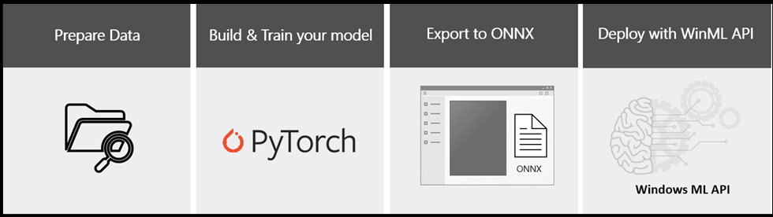

# Image Classification with PyTorch and Windows ML

This tutorial will show you how to train an image classification neural network model using PyTorch, export the model to the ONNX format, and deploy it in a Windows Machine Learning application running locally on your Windows device.  

Basic knowledge in Python and C# programming languages is required. Previous experience in machine learning is preferable but not required.

If you'd like to move straight on to installation, see [Install PyTorch](pytorch-installation.md).

If you've set up PyTorch already, start the model traning process by [getting the data](pytorch-data.md).

Once you're ready to go with the data, you can start to [train your model](pytorch-train-model.md), and then [convert it to the ONNX format](pytorch-convert-model.md).

If you have an ONNX model and want to learn how to create a WinML app from scratch, navigate to [deploy your model](pytorch-deploy-model.md).

> [!NOTE]
> If you want, you can download the predefined solutions for this tutorial. You can [download the PyTorch training solution here](https://github.com/microsoft/Windows-Machine-Learning/tree/master/Samples/Tutorial%20Samples/PyTorch%20Image%20Classification/PyTorchTraining%20-%20Image%20Classification), or [download the completed Windows ML app here](https://github.com/microsoft/Windows-Machine-Learning/tree/master/Samples/Tutorial%20Samples/PyTorch%20Image%20Classification/Windows%20ML%20code%20-%20classifierPyTorchModel). If you're using the PyTorch file, make sure you set up the relevant PyTorch interpreter before you run it.

## Scenario 

In this tutorial, we'll create a machine learning image classification application that can run on any Windows device. The model will be trained to recognize types of patterns, and will classify 10 labels of images from the chosen training set.  

## Prerequisites for PyTorch - model training:

PyTorch is supported on the following Windows distributions: 

* Windows 7 and greater. Windows 10 or greater recommended. 
* Windows Server 2008 r2 and greater 

To use Pytorch on Windows, you must have Python 3.x installed. Python 2.x is not supported. 

## Prerequisites for Windows ML app deployment

To create and deploy a WinML app, you'll need the following: 

*	Windows 10 version 1809 (build 17763) or higher. You can check your build version number by running `winver` via the Run command `(Windows logo key + R)`.
*	Windows SDK for build 17763 or higher. [You can get the SDK here.](https://developer.microsoft.com/windows/downloads/windows-10-sdk/)
*	Visual Studio 2017 version 15.7 or later. We recommend using Visual Studio 2019, and some screenshots in this tutorial may be different if you use VS2017 instead. [You can get Visual Studio here.](https://developer.microsoft.com/windows/downloads/)
*	Windows ML Code Generator (mlgen) Visual Studio extension. Download for [VS 2019](https://marketplace.visualstudio.com/items?itemName=WinML.mlgenv2) or for [VS 2017](https://marketplace.visualstudio.com/items?itemName=WinML.mlgen).
*	You'll also need to [enable Developer Mode on your PC](https://docs.microsoft.com/windows/apps/get-started/enable-your-device-for-development)

> [!NOTE]
> Windows ML APIs are built into the latest versions of Windows 10 (1809 or higher) and Windows Server 2019. If your target platform is older versions of Windows, you can [port your WinML app to the redistributable NuGet package (Windows 8.1 or higher)](../port-app-to-nuget.md). 

## Next Steps

We'll start by [installing PyTorch and configuring our environment](pytorch-installation.md)

> [!IMPORTANT]
> PyTorch, the PyTorch logo and any related marks are trademarks of Facebook, Inc.