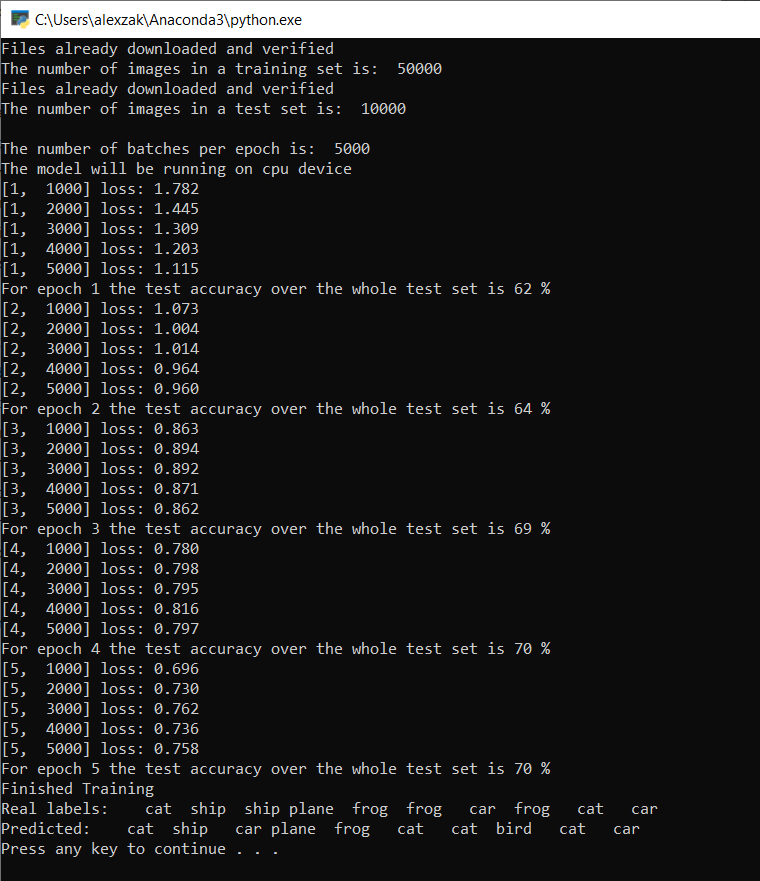
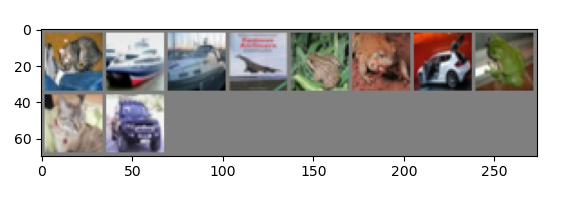
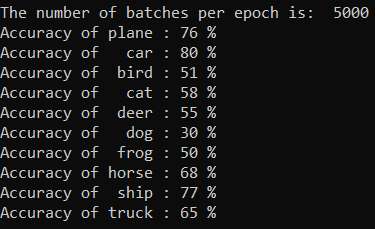

# Train your model with PyTorch 

In the [previous stage of this tutorial](pytorch-data.md), we acquired the dataset we'll use to train our image classifier with PyTorch. Now, it's time to put that data to use.

To train the image classifier with PyTorch, you need to complete the following steps:

1.	Load the data. If you've done the previous step of this tutorial, you've handled this already.
2.	Define a Convolution Neural Network.
3.	Define a loss function.
4.	Train the model on the training data.
5.	Test the network on the test data.

## Define a Convolution Neural Network.

To build a neural network with PyTorch, you'll use the `torch.nn` package. This package contains modules, extensible classes and all the required components to build neural networks.

Here, you'll build a basic **convolution neural network** (CNN) to classify the images from the CIFAR10 dataset. 

A CNN is a class of neural networks, defined as multilayered neural networks designed to detect complex features in data. They're most commonly used in computer vision applications. 

Our network will be structured with the following 14 layers: 

`Conv -> BatchNorm -> ReLU -> Conv -> BatchNorm -> ReLU -> MaxPool -> Conv -> BatchNorm -> ReLU -> Conv -> BatchNorm -> ReLU -> Linear`.

### The convolution layer

The convolution layer is a main layer of CNN which helps us to detect features in images. Each of the layers has number of channels to detect specific features in images, and a number of kernels to define the size of the detected feature. Therefore, a convolution layer with 64 channels and kernel size of 3 x 3 would detect 64 distinct features, each of size 3 x 3. When you define a convolution layer, you provide the number of in-channels, the number of out-channels, and the kernel size. The number of out-channels in the layer serves as the number of in-channels to the next layer.

For example: A Convolution layer with in-channels=3, out-channels=10, and kernel-size=6 will get the RGB image (3 channels) as an input, and it will apply 10 feature detectors to the images with the kernel size of 6x6. Smaller kernel sizes will reduce computational time and weight sharing.

### Other layers

The following other layers are involved in our network:

* The `ReLU` layer is an activation function to define all incoming features to be 0 or greater. When you apply this layer, any number less than 0 is changed to zero, while others are kept the same.
* the `BatchNorm2d` layer applies normalization on the inputs to have zero mean and unit variance and increase the network accuracy.
* The `MaxPool` layer will help us to ensure that the location of an object in an image will not affect the ability of the neural network to detect its specific features. 
* The `Linear` layer is final layers in our network, which computes the scores of each of the classes. In the CIFAR10 dataset, there are ten classes of labels. The label with the highest score will be the one model predicts. In the linear layer, you have to specify the number of input features and the number of output features which should correspond to the number of classes.

## How does a Neural Network work?

The CNN is a feed-forward network. During the training process, the network will process the input through all the layers, compute the loss to understand how far the predicted label of the image is falling from the correct one, and propagate the gradients back into the network to update the weights of the layers. By iterating over a huge dataset of inputs, the network will “learn” to set its weights to achieve the best results. 

A forward function computes the value of the loss function, and the backward function computes the gradients of the learnable parameters. When you create our neural network with PyTorch, you only need to define the forward function. The backward function will be automatically defined.

1. Copy the following code into the `PyTorchTraining.py` file in Visual Studio to define the CCN.

```py
import torch
import torch.nn as nn
import torchvision
import torch.nn.functional as F

# Define a convolution neural network
class Network(nn.Module):
    def __init__(self):
        super(Network, self).__init__()
        
        self.conv1 = nn.Conv2d(in_channels=3, out_channels=12, kernel_size=5, stride=1, padding=1)
        self.bn1 = nn.BatchNorm2d(12)
        self.conv2 = nn.Conv2d(in_channels=12, out_channels=12, kernel_size=5, stride=1, padding=1)
        self.bn2 = nn.BatchNorm2d(12)
        self.pool = nn.MaxPool2d(2,2)
        self.conv4 = nn.Conv2d(in_channels=12, out_channels=24, kernel_size=5, stride=1, padding=1)
        self.bn4 = nn.BatchNorm2d(24)
        self.conv5 = nn.Conv2d(in_channels=24, out_channels=24, kernel_size=5, stride=1, padding=1)
        self.bn5 = nn.BatchNorm2d(24)
        self.fc1 = nn.Linear(24*10*10, 10)

    def forward(self, input):
        output = F.relu(self.bn1(self.conv1(input)))      
        output = F.relu(self.bn2(self.conv2(output)))     
        output = self.pool(output)                        
        output = F.relu(self.bn4(self.conv4(output)))     
        output = F.relu(self.bn5(self.conv5(output)))     
        output = output.view(-1, 24*10*10)
        output = self.fc1(output)

        return output

# Instantiate a neural network model 
model = Network()
```

> [!NOTE]
> Interested in learning more about neural network with PyTorch? Check out the [PyTorch documentation](https://pytorch.org/tutorials/beginner/blitz/neural_networks_tutorial.html#sphx-glr-beginner-blitz-neural-networks-tutorial-py)

## Define a loss function

A loss function computes a value that estimates how far away the output is from the target. The main objective is to reduce the loss function's value by changing the weight vector values through backpropagation in neural networks.

Loss value is different from model accuracy. Loss function gives us the understanding of how well a model behaves after each iteration of optimization on the training set. The accuracy of the model is calculated on the test data and shows the percentage of the right prediction. 

In PyTorch, the neural network package contains various loss functions that form the building blocks of deep neural networks. In this tutorial, you will use a Classification loss function based on Define the loss function with Classification Cross-Entropy loss and an Adam Optimizer. Learning rate (lr) sets the control of how much you are adjusting the weights of our network with respect the loss gradient. You will set it as 0.001. The lower it is, the slower the training will be.

1. Copy the following code into the `PyTorchTraining.py` file in Visual Studio to define the loss function and an optimizer.

```py
from torch.optim import Adam
 
# Define the loss function with Classification Cross-Entropy loss and an optimizer with Adam optimizer
loss_fn = nn.CrossEntropyLoss()
optimizer = Adam(model.parameters(), lr=0.001, weight_decay=0.0001)
```

## Train the model on the training data.

To train the model, you have to loop over our data iterator, feed the inputs to the network, and optimize. PyTorch doesn’t have a dedicated library for GPU use, but you can manually define the execution device. The device will be an Nvidia GPU if exists on your machine, or your CPU if it does not.

1. Add the following code to the `PyTorchTraining.py` file

```py
from torch.autograd import Variable

# Function to save the model
def saveModel():
    path = "./myFirstModel.pth"
    torch.save(model.state_dict(), path)

# Function to test the model with the test dataset and print the accuracy for the test images
def testAccuracy():
    
    model.eval()
    accuracy = 0.0
    total = 0.0
    
    with torch.no_grad():
        for data in test_loader:
            images, labels = data
            # run the model on the test set to predict labels
            outputs = model(images)
            # the label with the highest energy will be our prediction
            _, predicted = torch.max(outputs.data, 1)
            total += labels.size(0)
            accuracy += (predicted == labels).sum().item()
    
    # compute the accuracy over all test images
    accuracy = (100 * accuracy / total)
    return(accuracy)


# Training function. We simply have to loop over our data iterator and feed the inputs to the network and optimize.
def train(num_epochs):
    
    best_accuracy = 0.0

    # Define your execution device
    device = torch.device("cuda:0" if torch.cuda.is_available() else "cpu")
    print("The model will be running on", device, "device")
    # Convert model parameters and buffers to CPU or Cuda
    model.to(device)

    for epoch in range(num_epochs):  # loop over the dataset multiple times
        running_loss = 0.0
        running_acc = 0.0

        for i, (images, labels) in enumerate(train_loader, 0):
            
            # get the inputs
            images = Variable(images.to(device))
            labels = Variable(labels.to(device))

            # zero the parameter gradients
            optimizer.zero_grad()
            # predict classes using images from the training set
            outputs = model(images)
            # compute the loss based on model output and real labels
            loss = loss_fn(outputs, labels)
            # backpropagate the loss
            loss.backward()
            # adjust parameters based on the calculated gradients
            optimizer.step()

            # Let's print statistics for every 1,000 images
            running_loss += loss.item()     # extract the loss value
            if i % 1000 == 999:    
                # print every 1000 (twice per epoch) 
                print('[%d, %5d] loss: %.3f' %
                      (epoch + 1, i + 1, running_loss / 1000))
                # zero the loss
                running_loss = 0.0

        # Compute and print the average accuracy fo this epoch when tested over all 10000 test images
        accuracy = testAccuracy()
        print('For epoch', epoch+1,'the test accuracy over the whole test set is %d %%' % (accuracy))
        
        # we want to save the model if the accuracy is the best
        if accuracy > best_accuracy:
            saveModel()
            best_accuracy = accuracy
```

## Test the model on the test data.

Now, you can test the model with batch of images from our test set.

1. Add the following code to the `PyTorchTraining.py` file.

```py
import matplotlib.pyplot as plt
import numpy as np

# Function to show the images
def imageshow(img):
    img = img / 2 + 0.5     # unnormalize
    npimg = img.numpy()
    plt.imshow(np.transpose(npimg, (1, 2, 0)))
    plt.show()


# Function to test the model with a batch of images and show the labels predictions
def testBatch():
    # get batch of images from the test DataLoader  
    images, labels = next(iter(test_loader))

    # show all images as one image grid
    imageshow(torchvision.utils.make_grid(images))
   
    # Show the real labels on the screen 
    print('Real labels: ', ' '.join('%5s' % classes[labels[j]] 
                               for j in range(batch_size)))
  
    # Let's see what if the model identifiers the  labels of those example
    outputs = model(images)
    
    # We got the probability for every 10 labels. The highest (max) probability should be correct label
    _, predicted = torch.max(outputs, 1)
    
    # Let's show the predicted labels on the screen to compare with the real ones
    print('Predicted: ', ' '.join('%5s' % classes[predicted[j]] 
                              for j in range(batch_size)))
```

Finally, let’s add the main code. This will will initiate model training, save the model, and display the results on the screen. We'll run only two iterations `[train(2)]` over the training set, so the training process won't take too long.

2. Add the following code to the `PyTorchTraining.py` file.

```py
if __name__ == "__main__":
    
    # Let's build our model
    train(5)
    print('Finished Training')

    # Test which classes performed well
    testModelAccuracy()
    
    # Let's load the model we just created and test the accuracy per label
    model = Network()
    path = "myFirstModel.pth"
    model.load_state_dict(torch.load(path))

    # Test with batch of images
    testBatch()
```
    
Let’s run the test! Make sure the dropdown menus in the top toolbar are set to Debug. Change the Solution Platform to x64 to run the project on your local machine if your device is 64-bit, or x86 if it's 32-bit.

Choosing the epoch number (the number of complete passes through the training dataset) equal to two (`[train(2)]`) will result in iterating twice through the entire test dataset of 10,000 images. It will take around 20 minutes to complete the training on 8th Generation Intel CPU, and the model should achieve more or less 65% of success rate in the classification of ten labels. 

3. To run the project, click the Start Debugging button on the toolbar, or press F5.

The console window will pop up and will be able to see the process of training. 

As you defined, the loss value will be printed every 1,000 batches of images or five times for every iteration over the training set. You expect the loss value to decrease with every loop.

You'll also see the accuracy of the model after each iteration. Model accuracy is different from the loss value. Loss function gives us the understanding of how well a model behaves after each iteration of optimization on the training set. The accuracy of the model is calculated on the test data and shows the percentage of the right prediction. In our case it will tell us how many images from the 10,000-image test set our model was able to classify correctly after each training iteration. 

Once the training is complete, you should expect to see the output similar to the below. Your numbers won't be exactly the same - trianing depends on many factors, and won't always return identifical results - but they should look similar.


 
After running just 5 epochs, the model success rate is 70%. This is a good result for a basic model trained for short period of time!

Testing with the batch of images, the model got right 7 images from the batch of 10. Not bad at all and consistent with the model success rate. 


 
You can check which classes our model can predict the best. Simple add the run the code below:

4. **Optional** - add the following `testClassess` function into the `PyTorchTraining.py` file, add a call of this function - `testClassess()` inside the main function - `__name__ == "__main__"`.

```py
# Function to test what classes performed well
def testClassess():
    class_correct = list(0. for i in range(number_of_labels))
    class_total = list(0. for i in range(number_of_labels))
    with torch.no_grad():
        for data in test_loader:
            images, labels = data
            outputs = model(images)
            _, predicted = torch.max(outputs, 1)
            c = (predicted == labels).squeeze()
            for i in range(batch_size):
                label = labels[i]
                class_correct[label] += c[i].item()
                class_total[label] += 1

    for i in range(number_of_labels):
        print('Accuracy of %5s : %2d %%' % (
            classes[i], 100 * class_correct[i] / class_total[i]))
```

The output is as follows:



## Next Steps

Now that we have a classification model, the next step is to [convert the model to the ONNX format](pytorch-convert-model.md)
