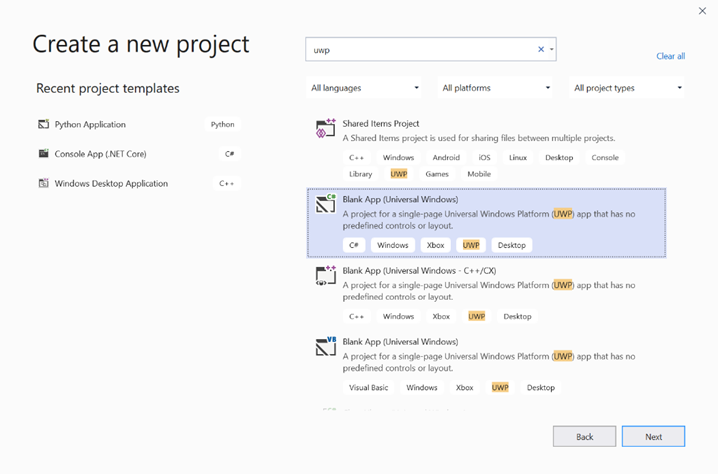
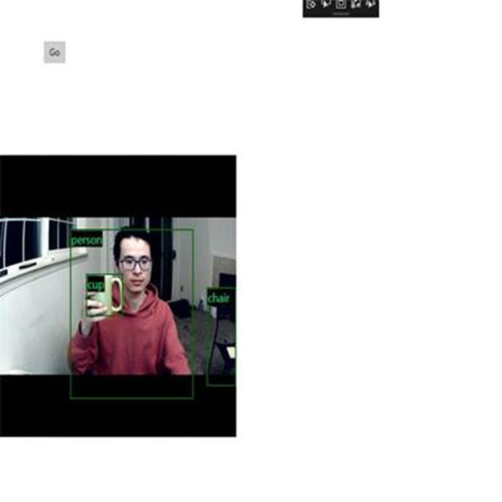

# Deploy your TensorFlow model in a Windows app with the Windows Machine Learning APIs

This final section will explain how to create a simple UWP app with a GUI to stream the webcam and detect objects by evaluating our YOLO model with Windows ML.

## Create a UWP app in Visual Studio

1. Open Visual Studio and select `Create a new project.` Search for UWP and select `Blank App (Universal Windows)`.


 
2. On the next page, configure your project settings by giving the project a Name and Location. Then select a target and minimum OS version of your app. To use Windows ML APIs you must use X, or you can choose the NuGet package to support down to X. If you chose to use the NuGet package, follow these instructions [link].

## Call Windows ML APIs to evaluate the model

Step 1: Use the Machine Learning Code Generator to generate wrapper classes for Windows ML APIs.

Step 2: Modify generated code in the generated .cs file. The final file looks like this:

```csharp
using System;
using System.Collections.Generic;
using System.Threading.Tasks;
using Windows.Media;
using Windows.Storage;
using Windows.Storage.Streams;
using Windows.AI.MachineLearning;
namespace yolodemo
{
    
    public sealed class YoloInput
    {
        public TensorFloat input_100; // shape(-1,3,416,416)
    }
    
    public sealed class YoloOutput
    {
        public TensorFloat concat_1600; // shape(-1,-1,-1)
    }
    
    public sealed class YoloModel
    {
        private LearningModel model;
        private LearningModelSession session;
        private LearningModelBinding binding;
        public static async Task<YoloModel> CreateFromStreamAsync(IRandomAccessStreamReference stream)
        {
            YoloModel learningModel = new YoloModel();
            learningModel.model = await LearningModel.LoadFromStreamAsync(stream);
            learningModel.session = new LearningModelSession(learningModel.model);
            learningModel.binding = new LearningModelBinding(learningModel.session);
            return learningModel;
        }
        public async Task<YoloOutput> EvaluateAsync(YoloInput input)
        {
            binding.Bind("input_1:0", input.input_100);
            var result = await session.EvaluateAsync(binding, "0");
            var output = new YoloOutput();
            output.concat_1600 = result.Outputs["concat_16:0"] as TensorFloat;
            return output;
        }
    }
}
```

## Evaluate each video frame to detect objects and draw bounding boxes.

1. Add the following libraries to mainPage.xaml.cs.

```csharp
using System.Threading.Tasks;
using Windows.Devices.Enumeration;
using Windows.Media;
using Windows.Media.Capture;
using Windows.Storage;
using Windows.UI;
using Windows.UI.Xaml.Media.Imaging;
using Windows.UI.Xaml.Shapes;
using Windows.AI.MachineLearning;
```

2. Add the following variables in `public sealed partial class MainPage : Page`.

```csharp
private MediaCapture _media_capture;
private LearningModel _model;
private LearningModelSession _session;
private LearningModelBinding _binding;
private readonly SolidColorBrush _fill_brush = new SolidColorBrush(Colors.Transparent);
private readonly SolidColorBrush _line_brush = new SolidColorBrush(Colors.DarkGreen);
private readonly double _line_thickness = 2.0;
        private readonly string[] _labels =
            {
                "<list of labels>"
        };
```

3. Create a structure for how the detection results are formatted.

```csharp
        internal struct DetectionResult
        {
            public string label;
            public List<float> bbox;
            public double prob;
        }
```

4. Create a Comparer object which compares two objects of type Box. This class will be used to draw bounding boxes around the detected objects.

```csharp
        class Comparer : IComparer<DetectionResult>
        {
            public int Compare(DetectionResult x, DetectionResult y)
            {
                return y.prob.CompareTo(x.prob);
            }
        }
```

5. Add the following method to initialize the device’s webcam stream and begin processing each frame to detect objects.

```csharp
        private async Task InitCameraAsync()
        {
            if (_media_capture == null || _media_capture.CameraStreamState == Windows.Media.Devices.CameraStreamState.Shutdown || _media_capture.CameraStreamState == Windows.Media.Devices.CameraStreamState.NotStreaming)
            {
                if (_media_capture != null)
                {
                    _media_capture.Dispose();
                }

                MediaCaptureInitializationSettings settings = new MediaCaptureInitializationSettings();
                var cameras = await DeviceInformation.FindAllAsync(DeviceClass.VideoCapture);
                var camera = cameras.FirstOrDefault();
                settings.VideoDeviceId = camera.Id;

                _media_capture = new MediaCapture();
                await _media_capture.InitializeAsync(settings);
                WebCam.Source = _media_capture;
            }

            if (_media_capture.CameraStreamState == Windows.Media.Devices.CameraStreamState.NotStreaming)
            {
                await _media_capture.StartPreviewAsync();
                WebCam.Visibility = Visibility.Visible;
            }

            ProcessFrame();
        }
```

6. Add the following method to process each frame. This method calls EvaluateFrame and DrawBoxes, which we will implement in a later step.

```csharp
        private async Task ProcessFrame()
        {
            var frame = new VideoFrame(Windows.Graphics.Imaging.BitmapPixelFormat.Bgra8, (int)WebCam.Width, (int)WebCam.Height);
            await _media_capture.GetPreviewFrameAsync(frame);
            var results = await EvaluateFrame(frame);
            await DrawBoxes(results.ToArray(), frame);
            ProcessFrame();
        }
```

7. Create a new Sigmoid float

```csharp 
        private float Sigmoid(float val)
        {
            var x = (float)Math.Exp(val);
            return x / (1.0f + x);
        }
```

8. Create a threshold for detecting objects correctly.

```csharp
        private float ComputeIOU(DetectionResult DRa, DetectionResult DRb)
        {
            float ay1 = DRa.bbox[0];
            float ax1 = DRa.bbox[1];
            float ay2 = DRa.bbox[2];
            float ax2 = DRa.bbox[3];
            float by1 = DRb.bbox[0];
            float bx1 = DRb.bbox[1];
            float by2 = DRb.bbox[2];
            float bx2 = DRb.bbox[3];

            Debug.Assert(ay1 < ay2);
            Debug.Assert(ax1 < ax2);
            Debug.Assert(by1 < by2);
            Debug.Assert(bx1 < bx2);
   
            // determine the coordinates of the intersection rectangle
            float x_left = Math.Max(ax1, bx1);
            float y_top = Math.Max(ay1, by1);
            float x_right = Math.Min(ax2, bx2);
            float y_bottom = Math.Min(ay2, by2);

            if (x_right < x_left || y_bottom < y_top)
                return 0;
            float intersection_area = (x_right - x_left) * (y_bottom - y_top);
            float bb1_area = (ax2 - ax1) * (ay2 - ay1);
            float bb2_area = (bx2 - bx1) * (by2 - by1);
            float iou = intersection_area / (bb1_area + bb2_area - intersection_area);

            Debug.Assert(iou >= 0 && iou <= 1);
            return iou;
        }
```

9. Implement the following list, to track the current objects detected in the frame.

```csharp
        private List<DetectionResult> NMS(IReadOnlyList<DetectionResult> detections, 
            float IOU_threshold = 0.45f, 
            float score_threshold=0.3f)
        {
            List<DetectionResult> final_detections = new List<DetectionResult>();
            for (int i = 0; i < detections.Count; i++)
            {
                int j = 0;
                for (j = 0; j < final_detections.Count; j++)
                {
                    if (ComputeIOU(final_detections[j], detections[i]) > IOU_threshold)
                    {
                        break;
                    }
                }
                if (j==final_detections.Count)
                {
                    final_detections.Add(detections[i]);
                }
            }
            return final_detections;
        }
```

10. Implement the following method.

```csharp
        private List<DetectionResult> ParseResult(float[] results)
        {
            int c_values = 84;
            int c_boxes = results.Length / c_values;
            float confidence_threshold = 0.5f;
            List<DetectionResult> detections = new List<DetectionResult>();
            this.OverlayCanvas.Children.Clear();
            for (int i_box = 0; i_box < c_boxes; i_box++)
            {
                float max_prob = 0.0f;
                int label_index = -1;
                for (int j_confidence = 4; j_confidence < c_values; j_confidence++)
                {
                    int index = i_box * c_values + j_confidence;
                    if (results[index] > max_prob)
                    {
                        max_prob = results[index];
                        label_index = j_confidence - 4;
                    }
                }
                if (max_prob > confidence_threshold)
                {
                    List<float> bbox = new List<float>();
                    bbox.Add(results[i_box * c_values + 0]);
                    bbox.Add(results[i_box * c_values + 1]);
                    bbox.Add(results[i_box * c_values + 2]);
                    bbox.Add(results[i_box * c_values + 3]);

                    detections.Add(new DetectionResult()
                    {
                        label = _labels[label_index],
                        bbox = bbox,
                        prob = max_prob
                    });
                }
            }
            return detections;
        }
```
        
11. Add the following method, to draw the boxes around the objects detected in the frame.

```csharp
private async Task DrawBoxes(float[] results, VideoFrame frame)
        {
            List<DetectionResult> detections = ParseResult(results);
            Comparer cp = new Comparer();
            detections.Sort(cp);
            IReadOnlyList<DetectionResult> final_detetions = NMS(detections);

            for (int i=0; i < final_detetions.Count; ++i)
            {
                int top = (int)(final_detetions[i].bbox[0] * WebCam.Height);
                int left = (int)(final_detetions[i].bbox[1] * WebCam.Width);
                int bottom = (int)(final_detetions[i].bbox[2] * WebCam.Height);
                int right = (int)(final_detetions[i].bbox[3] * WebCam.Width);

                var brush = new ImageBrush();
                var bitmap_source = new SoftwareBitmapSource();
                await bitmap_source.SetBitmapAsync(frame.SoftwareBitmap);

                brush.ImageSource = bitmap_source;
                // brush.Stretch = Stretch.Fill;

                this.OverlayCanvas.Background = brush;

                var r = new Rectangle();
                r.Tag = i;
                r.Width = right - left;
                r.Height = bottom - top;
                r.Fill = this._fill_brush;
                r.Stroke = this._line_brush;
                r.StrokeThickness = this._line_thickness;
                r.Margin = new Thickness(left, top, 0, 0);

                this.OverlayCanvas.Children.Add(r);
                // Default configuration for border
                // Render text label
                

                var border = new Border();
                var backgroundColorBrush = new SolidColorBrush(Colors.Black);
                var foregroundColorBrush = new SolidColorBrush(Colors.SpringGreen);
                var textBlock = new TextBlock();
                textBlock.Foreground = foregroundColorBrush;
                textBlock.FontSize = 18;

                textBlock.Text = final_detetions[i].label;
                // Hide
                textBlock.Visibility = Visibility.Collapsed;
                border.Background = backgroundColorBrush;
                border.Child = textBlock;

                Canvas.SetLeft(border, final_detetions[i].bbox[1] * 416 + 2);
                Canvas.SetTop(border, final_detetions[i].bbox[0] * 416 + 2);
                textBlock.Visibility = Visibility.Visible;
                // Add to canvas
                this.OverlayCanvas.Children.Add(border);
            }
        }
```

12. Now that we've handled the necessary infrastucture, it's time to incorporate the evaluation itself. This method evaluates the model against the current frame to detect objects.

```csharp
        private async Task<List<float>> EvaluateFrame(VideoFrame frame)
        {
            _binding.Clear();
            _binding.Bind("input_1:0", frame);
            var results = await _session.EvaluateAsync(_binding, "");
            Debug.Print("output done\n");

            TensorFloat result = results.Outputs["Identity:0"] as TensorFloat;
            var shape = result.Shape;
            var data = result.GetAsVectorView();
            
            return data.ToList<float>();
        }
```

13. Our app needs to start somehow. Add a method which begins the webcam stream and model evaluation when the user presses the `Go` button. 

```csharp
        private void button_go_Click(object sender, RoutedEventArgs e)
        {
            InitModelAsync();
            InitCameraAsync();
        }
```

14. Add a method to call Windows ML APIs to evaluate the model. First the model is loaded from storage, and then a session is created and bound to memory.

```csharp
        private async Task InitModelAsync()
        {
            var model_file = await StorageFile.GetFileFromApplicationUriAsync(new Uri("ms-appx:///Assets//Yolo.onnx"));
            _model = await LearningModel.LoadFromStorageFileAsync(model_file);
            var device = new LearningModelDevice(LearningModelDeviceKind.Cpu);
            _session = new LearningModelSession(_model, device);
            _binding = new LearningModelBinding(_session);
        }
```

## Launch the application

You have now successfully created a real-time object detection application! Select the `Run` button on the top bar of Visual Studio to launch the app. The app should look like this.




### Additional Resources

To learn more about topics mentioned in this tutorial, visit the following resources:
*   Windows ML tools: Learn more tools like the [Windows ML Dashboard](../dashboard.md), [WinMLRunner](../winmlrunner.md), and the [mglen](../mlgen.md) Windows ML code generator. 
*   [ONNX model](../get-onnx-model.md): Learn more about the ONNX format.
*   [Windows ML performance and memory](../performance-memory.md): Learn more how to manage app performance with Windows ML. 
*   [Windows Machine Learning API reference](../api-reference.md): Learn more about three areas of Windows ML APIs.
