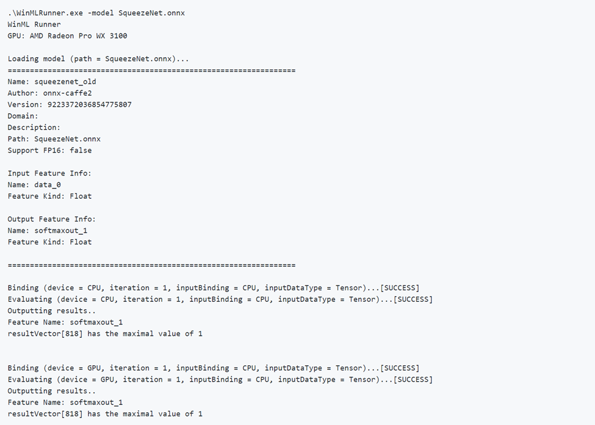
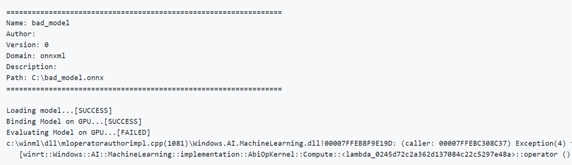
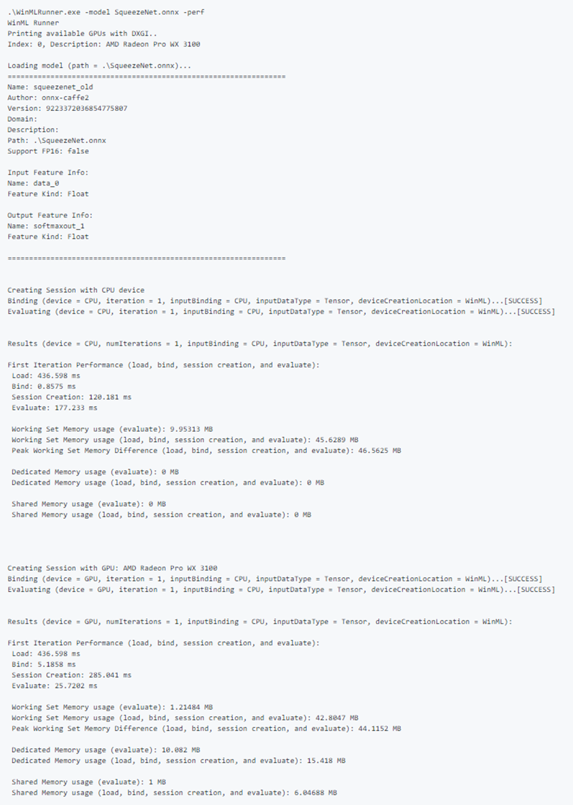

# WinMLRunner

WinMLRunner is a tool to test if a model runs successfully when evaluated with the Windows ML APIs. You can also capture evaluation time and memory usage on the GPU and/or CPU. Models in .onnx or .pb format can be evaluated where the input and output variables are tensors or images. There are 2 ways you can use WinMLRunner:

* [Download the command-line python tool](https://github.com/Microsoft/Windows-Machine-Learning/releases).
* Use within the **WinML Dashboard**. For more information see [the WinML Dashboard documentation](dashboard.md)

## Run a Model

First, open the downloaded Python tool. Navigate to the folder containing WinMLRunner.exe, and run the executable as shown below. Make sure to replace the installation location with what matches yours:
 
```
.\WinMLRunner.exe -model SqueezeNet.onnx
```

You can also run a folder of models, with a command such as the following.

```
WinMLRunner.exe -folder c:\data -perf -iterations 3 -CPU`\
```

### Running a good model

Below is an example of running a model successfully. Notice how first the model loads and outputs model metadata. Then the model runs on the CPU and GPU separately, outputting the binding success, evaluation success, and model output.



### Running a bad model

Below is an example of running a model with incorrect parameters. Notice the FAILED output when evaluating on GPU.



## Device selection and optimization

By default, the model runs on the CPU and GPU separately, but you can specify a device with a -CPU or -GPU flag. Here is an example of running a model 3 times using only the CPU:

```
WinMLRunner.exe -model c:\data\concat.onnx -iterations 3 -CPU
```

## Log performance data

Use the -perf flag to capture performance data. Here is an example of running all the models in the data folder on the CPU and GPU separately 3 times and capturing performance data:

```
WinMLRunner.exe -folder c:\data iterations 3 -perf
```

### Performance measurements

The following performance measurements will be output to the command-line and .csv file for each load, bind, and evaluate operation:

* **Wall-clock time (ms):** the elapsed real time between the beginning and end of an operation.
* **GPU time (ms):** time for an operation to be passed from CPU to GPU and execute on the GPU (note: Load() is not executed on the GPU).
* **CPU time (ms):** time for an operation to execute on the CPU.
* **Dedicated and Shared Memory Usage (MB):** Average kernel and user-level memory usage (in MB) during evaluate on the CPU or GPU.
* **Working Set Memory (MB):** The amount of DRAM memory that the process on the CPU required during evaluation. Dedicated Memory (MB) - The amount of memory that was used on the VRAM of the dedicated GPU.
* **Shared Memory (MB):** The amount of memory that was used on the DRAM by the GPU.

### Sample performance output:
 


## Test sample inputs

Run a model on the CPU and GPU separately, and by binding the input to the CPU and the GPU separately (4 total runs):

```
WinMLRunner.exe -model c:\data\SqueezeNet.onnx -CPU -GPU -CPUBoundInput -GPUBoundInput
```

Run a model on the CPU with the input bound to the GPU and loaded as an RGB image:

```
WinMLRunner.exe -model c:\data\SqueezeNet.onnx -CPU -GPUBoundInput -RGB
```

## Capturing Trace Logs

If you want to capture trace logs using the tool, you can use logman commands in conjunction with the debug flag:

```
logman start winml -ets -o winmllog.etl -nb 128 640 -bs 128logman update trace  winml -p {BCAD6AEE-C08D-4F66-828C-4C43461A033D} 0xffffffffffffffff 0xff -ets         WinMLRunner.exe -model C:\Repos\Windows-Machine-Learning\SharedContent\models\SqueezeNet.onnx -debuglogman stop winml -ets
```

The winmllog.etl file will appear in the same directory as the WinMLRunner.exe.

### Reading the Trace Logs

Using the traceprt.exe, run the following command from the command-line.

```
tracerpt.exe winmllog.etl -o logdump.csv -of CSV
```
Next, open the `logdump.csv` file.

Alternately, you can use the Windows Performance Analyzer (from Visual Studio). Launch the Windows Performance Analyzer, and open `winmllog.etl`.


 
Note that -CPU, -GPU, -GPUHighPerformance, -GPUMinPower -BGR, -RGB, -tensor, -CPUBoundInput, -GPUBoundInput are not mutually exclusive (i.e. you can combine as many as you want to run the model with different configurations).

## Dynamic DLL Loading

If you want to run WinMLRunner with another version of WinML (e.g. comparing the performance with an older version or testing a newer version), simply place the windows.ai.machinelearning.dll and directml.dll files in the same folder as WinMLRunner.exe. WinMLRunner will look for for these DLLs first and fall back to C:/Windows/System32 if it doesn't find them.

## Known issues
* Sequence/Map inputs are not supported yet (the model is just skipped, so it doesn't block other models in a folder);
* We cannot reliably run multiple models with the -folder argument with real data. Since we can only specify 1 input, the size of the input would mismatch with most of the models. Right now, using the -folder argument only works well with garbage data;
* Generating garbage input as Gray or YUV is not currently supported. Ideally, WinMLRunner's garbage data pipeline should support all inputs types that we can give to winml.

