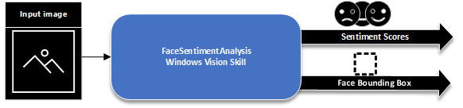

# Tutorial: Create your own Windows Vision Skill (C#)

> [!NOTE]
> The Microsoft.AI.Skills.SkillInterfacePreview namespace has been deprecated as it is legacy and is no longer maintained. It has been replaced by non-monikored package offering the same functionalities and more with improve performance and reliability: [Microsoft.AI.Skills.SkillInterface](https://www.nuget.org/packages/Microsoft.AI.Skills.SkillInterface/). This documentation is scheduled to be updated to reflect the new functionality.

If you already have a custom vision solution, this tutorial shows how to wrap the solution in a Windows Vision Skill by extending the Microsoft.AI.Skills.SkillInterfacePreview base API.

Let's build a face sentiment analyzer skill that leverages the following:

- The [Windows.Media.FaceAnalysis](/uwp/api/windows.media.faceanalysis) and [Windows.AI.MachineLearning](/uwp/api/windows.ai.machinelearning) APIs
- A machine learning model in ONNX format that infers sentiment from face images

This skill takes:

- An input image

And it outputs:

- A tensor of single precision score values in the range [0,1] for each sentiment it evaluates
- A tensor of float values in the range [0,1] defining a face bounding box relative coordinates: left (x,y), top (x,y), right (x,y), and bottom (x,y)



The full source code for the C# and C++/WinRT versions of this example is available on the sample GitHub repository:

- [C# example skill](https://github.com/microsoft/WindowsVisionSkillsPreview/tree/master/samples/SentimentAnalyzerCustomSkill/cs)
- [C++/WinRT example skill](https://github.com/microsoft/WindowsVisionSkillsPreview/tree/master/samples/SentimentAnalyzerCustomSkill/cpp)

This tutorial will walk you through:

1. [Implementing the main interfaces](#CreateMainClasses) required for a Windows Vision Skill
2. [Creating a .nuspec](#CreateNuspec) to produce a NuGet package
3. [Obfuscating and deobfuscating](#Obfuscation) files to conceal their content

## Prerequisites

- [Visual Studio 2019](https://visualstudio.microsoft.com/downloads/) (or Visual Studio 2017, version 15.7.4 or later)
- Windows 10, version 1809 or later
- The [Windows 10 SDK](https://developer.microsoft.com/windows/downloads/windows-10-sdk), version 1809 or later
- The [Microsoft.AI.Skills.SkillInterfacePreview NuGet package](https://www.nuget.org/packages/Microsoft.AI.Skills.SkillInterfacePreview/)

## 1. Create and implement the main skill classes <a name="CreateMainClasses"></a>

First, we need to implement the main skill classes (see [Important API concepts](important-api-concepts.md) for more information):

- [ISkillDescriptor](#ISkillDescriptor)
- [ISkillBinding](#ISkillBinding)
- [ISkill](#ISkill)

Open up your custom vision solution in Visual Studio.

### a. ISkillDescriptor <a name="ISkillDescriptor"></a>

Create and implement a skill descriptor class inherited from [ISkillDescriptor][ISkillDescriptor] that provides information on the skill, provides a list of supported execution devices (CPU, GPU, and so on), and acts as a factory object for the skill.

1. Import the Microsoft.AI.Skills.SkillInterfacePreview namespace and derive your class from the [ISkillDescriptor][ISkillDescriptor] interface.

    ```csharp
    ...
    using Microsoft.AI.Skills.SkillInterfacePreview;
    ...

    public sealed class FaceSentimentAnalyzerDescriptor : ISkillDescriptor
    {
        ...
    }
    ```

2. Create two member variables that will hold the descriptions of the inputs and outputs required by the skill. Then, in the descriptor's constructor, fill them accordingly with input and output feature descriptors. Additionally, create the *SkillInformation* object that provides all the necessary description properties of your skill.

    ```csharp
    ...
    // Member variables to hold input and output descriptions
    private List<ISkillFeatureDescriptor> m_inputSkillDesc;
    private List<ISkillFeatureDescriptor> m_outputSkillDesc;

    // Properties required by the interface
    public IReadOnlyList<ISkillFeatureDescriptor> InputFeatureDescriptors => m_inputSkillDesc;
    public IReadOnlyDictionary<string, string> Metadata => null;
    public IReadOnlyList<ISkillFeatureDescriptor> OutputFeatureDescriptors => m_outputSkillDesc;

    // Constructor
    public FaceSentimentAnalyzerDescriptor()
    {
        Information = SkillInformation.Create(
                "FaceSentimentAnalyzer", // Name
                "Finds a face in the image and infers its predominant sentiment from a set of 8 possible labels", // Description
                new Guid(0xf8d275ce, 0xc244, 0x4e71, 0x8a, 0x39, 0x57, 0x33, 0x5d, 0x29, 0x13, 0x88), // Id
                new Windows.ApplicationModel.PackageVersion() { Major = 0, Minor = 0, Build = 0, Revision = 8 }, // Version
                "Contoso Developer", // Author
                "Contoso Publishing" // Publisher
            );

        // Describe input feature
        m_inputSkillDesc = new List<ISkillFeatureDescriptor>();
        m_inputSkillDesc.Add(
            new SkillFeatureImageDescriptor(
                "InputImage", // skill input feature name
                "the input image onto which the sentiment analysis runs",
                true, // isRequired (since this is an input, it is required to be bound before the evaluation occurs)
                -1, // width
                -1, // height
                -1, // maxDimension
                BitmapPixelFormat.Nv12,
                BitmapAlphaMode.Ignore)
        );

        // Describe first output feature
        m_outputSkillDesc = new List<ISkillFeatureDescriptor>();
        m_outputSkillDesc.Add(
            new SkillFeatureTensorDescriptor(
                "FaceRectangle", // skill output feature name
                "a face bounding box in relative coordinates (left, top, right, bottom)",
                false, // isRequired (since this is an output, it automatically get populated after the evaluation occurs)
                new List<long>() { 4 }, // tensor shape
                SkillElementKind.Float)
            );

        // Describe second output feature
        m_outputSkillDesc.Add(
            new SkillFeatureTensorDescriptor(
                FaceSentimentScores, // skill output feature name
                "the prediction score for each class",
                false, // isRequired (since this is an output, it automatically get populated after the evaluation occurs)
                new List<long>() { 1, 8 }, // tensor shape
                SkillElementKind.Float)
            );
    }

    ```

3. Implement the required method that looks for available supported execution devices to execute the skill on and returns them to the consumer. In our case we return the CPU and all DirectX devices supporting D3D version 12 or above.

    ```csharp
    public IAsyncOperation<IReadOnlyList<ISkillExecutionDevice>> GetSupportedExecutionDevicesAsync()
    {
        return AsyncInfo.Run(async (token) =>
        {
            return await Task.Run(() =>
            {
                var result = new List<ISkillExecutionDevice>();

                // Add CPU as supported device
                result.Add(SkillExecutionDeviceCPU.Create());

                // Retrieve a list of DirectX devices available on the system and filter them by keeping only the ones that support DX12+ feature level
                var devices = SkillExecutionDeviceDirectX.GetAvailableDirectXExecutionDevices();
                var compatibleDevices = devices.Where((device) => (device as SkillExecutionDeviceDirectX).MaxSupportedFeatureLevel >= D3DFeatureLevelKind.D3D_FEATURE_LEVEL_12_0);
                result.AddRange(compatibleDevices);

                return result as IReadOnlyList<ISkillExecutionDevice>;
            });
        });

    ```

4. Implement the required methods for instantiating your skill.

    - One of them selects the best available device:

        ```csharp
        public IAsyncOperation<ISkill> CreateSkillAsync()
        {
            return AsyncInfo.Run(async (token) =>
            {
                // Retrieve the available execution devices
                var supportedDevices = await GetSupportedExecutionDevicesAsync();
                ISkillExecutionDevice deviceToUse = supportedDevices.First();

                // Either use the first device returned (CPU) or the highest performing GPU
                int powerIndex = int.MaxValue;
                foreach (var device in supportedDevices)
                {
                    if (device.ExecutionDeviceKind == SkillExecutionDeviceKind.Gpu)
                    {
                        var directXDevice = device as SkillExecutionDeviceDirectX;
                        if (directXDevice.HighPerformanceIndex < powerIndex)
                        {
                            deviceToUse = device;
                            powerIndex = directXDevice.HighPerformanceIndex;
                        }
                    }
                }
                return await CreateSkillAsync(deviceToUse);
            });
        }
        ```

    - The other uses the specified execution device:

        ```csharp
        public IAsyncOperation<ISkill> CreateSkillAsync(ISkillExecutionDevice executionDevice)
        {
            return AsyncInfo.Run(async (token) =>
            {
                // Create a skill instance with the executionDevice supplied
                var skillInstance = await FaceSentimentAnalyzerSkill.CreateAsync(this, executionDevice);

                return skillInstance as ISkill;
            });
        }
        ```

### b. **ISkillBinding** <a name="ISkillBinding"></a>

Create and implement a skill binding class inherited from [ISkillBinding][ISkillBinding] interface that contains input and output variables consumed and produced by the skill.

1. Import the Microsoft.AI.Skills.SkillInterfacePreview namespace and derive your class from the [ISkillBinding][ISkillBinding] interface and its required collection type.

    ```csharp
    ...
    using Microsoft.AI.Skills.SkillInterfacePreview;
    ...

    public sealed class FaceSentimentAnalyzerBinding : IReadOnlyDictionary<string, ISkillFeature>, ISkillBinding
    {
        ...

    ```

2. First Create two member variables:

    - One is a helper class [VisionSkillBindingHelper][VisionSkillBindingHelper] provided in the base interface to hold an input image feature named "InputImage".

    ```csharp
    private VisionSkillBindingHelper m_bindingHelper = null;
    ```

    - The other holds the LearningModelBinding used to pass to our LearningModelSession specified as argument to our constructor later on in the skill class.

    ```csharp
    // WinML related member variables
    internal LearningModelBinding m_winmlBinding = null;
    ```

    Declare the required properties:

    ```csharp
    // ISkillBinding
    public ISkillExecutionDevice Device => m_bindingHelper.Device;

    // IReadOnlyDictionary
    public bool ContainsKey(string key) => m_bindingHelper.ContainsKey(key);
    public bool TryGetValue(string key, out ISkillFeature value) => m_bindingHelper.TryGetValue(key, out value);
    public ISkillFeature this[string key] => m_bindingHelper[key];
    public IEnumerable<string> Keys => m_bindingHelper.Keys;
    public IEnumerable<ISkillFeature> Values => m_bindingHelper.Values;
    public int Count => m_bindingHelper.Count;
    public IEnumerator<KeyValuePair<string, ISkillFeature>> GetEnumerator() => m_bindingHelper.AsEnumerable().GetEnumerator();
    IEnumerator IEnumerable.GetEnumerator() => m_bindingHelper.AsEnumerable().GetEnumerator();
    ```

    And implement the constructor. Note that the constructor is *internal*; in our paradigm, ISkillBinding instances are created by the skill and therefore should not expose a standalone constructor:

    ```csharp
     // Constructor
    internal FaceSentimentAnalyzerBinding(
        ISkillDescriptor descriptor,
        ISkillExecutionDevice device,
        LearningModelSession session)
    {
        m_bindingHelper = new VisionSkillBindingHelper(descriptor, device);

        // Create WinML binding
        m_winmlBinding = new LearningModelBinding(session);
    }
    ```

3. Create an enum that facilitates reading the sentiment types output by the skill

    ```csharp
    /// Defines the set of possible emotion label scored by this skill
    public enum SentimentType
    {
        neutral = 0,
        happiness,
        surprise,
        sadness,
        anger,
        disgust,
        fear,
        contempt
    };
    ```

4. Implement optional additional methods that ease get and set operations onto the binding

    ```csharp
    /// Returns whether or not a face is found given the bound outputs
    public bool IsFaceFound
    {
        get
        {
            ISkillFeature feature = null;
            if (m_bindingHelper.TryGetValue(FaceSentimentAnalyzerConst.SKILL_OUTPUTNAME_FACERECTANGLE, out feature))
            {
                var faceRect = (feature.FeatureValue as SkillFeatureTensorFloatValue).GetAsVectorView();
                return !(faceRect[0] == 0.0f &&
                    faceRect[1] == 0.0f &&
                    faceRect[2] == 0.0f &&
                    faceRect[3] == 0.0f);
            }
            else
            {
                return false;
            }
        }
    }

    /// Returns the sentiment with the highest score
    public SentimentType PredominantSentiment
    {
        get
        {
            SentimentType predominantSentiment = SentimentType.neutral;
            ISkillFeature feature = null;
            if (m_bindingHelper.TryGetValue(FaceSentimentAnalyzerConst.SKILL_OUTPUTNAME_FACESENTIMENTSCORES, out feature))
            {
                var faceSentimentScores = (feature.FeatureValue as SkillFeatureTensorFloatValue).GetAsVectorView();

                float maxScore = float.MinValue;
                for (int i = 0; i < faceSentimentScores.Count; i++)
                {
                    if (faceSentimentScores[i] > maxScore)
                    {
                        predominantSentiment = (SentimentType)i;
                        maxScore = faceSentimentScores[i];
                    }
                }
            }

            return predominantSentiment;
        }
    }

    /// Returns the face rectangle
    public IReadOnlyList<float> FaceRectangle
    {
        get
        {
            ISkillFeature feature = null;
            if (m_bindingHelper.TryGetValue(FaceSentimentAnalyzerConst.SKILL_OUTPUTNAME_FACERECTANGLE, out feature))
            {
                return (feature.FeatureValue as SkillFeatureTensorFloatValue).GetAsVectorView();
            }
            else
            {
                return null;
            }
        }
    }
    ```

### c. **ISkill** <a name="ISkill"></a>

Create and implement a skill class inherited from [ISkill][ISkill] interface that executes the skill logic and produces output given a set of input. It also acts as a factory object for the ISkillBinding derivative.

1. Import the Microsoft.AI.Skills.SkillInterfacePreview namespace and derive your class from the [ISkill][ISkill] interface.

    ```csharp
    ...
    using Microsoft.AI.Skills.SkillInterfacePreview;
    ...

    public sealed class FaceSentimentAnalyzerSkill : ISkill
    {
        ...
    ```

2. First Create two member variables:

    - One to hold a FaceDetector to find a face on the input image.

    ```csharp
    private FaceDetector m_faceDetector = null;
    ```

    - Another to hold the LearningModelSession used to evaluate the sentiment analysis model:

    ```csharp
    private LearningModelSession m_winmlSession = null;
    ```

    Declare the required properties:

    ```csharp
    public ISkillDescriptor SkillDescriptor { get; private set; }
    public ISkillExecutionDevice Device { get; private set; }
    ```

    And implement the constructor and static factory method. Note that the constructor is *private* and the factory method is *internal*; in our paradigm, ISkill instances are created by the skill descriptor and therefore should not expose a standalone constructor:

    ```csharp
     // Constructor
    private FaceSentimentAnalyzerSkill(
            ISkillDescriptor description,
            ISkillExecutionDevice device)
    {
        SkillDescriptor = description;
        Device = device;
    }

    // ISkill Factory method
    internal static IAsyncOperation<FaceSentimentAnalyzerSkill> CreateAsync(
        ISkillDescriptor descriptor,
        ISkillExecutionDevice device)
    {
        return AsyncInfo.Run(async (token) =>
        {
            // Create instance
            var skillInstance = new FaceSentimentAnalyzerSkill(descriptor, device);

            // Instantiate the FaceDetector
            skillInstance.m_faceDetector = await FaceDetector.CreateAsync();

            // Load ONNX model and instantiate LearningModel
            var modelFile = await StorageFile.GetFileFromApplicationUriAsync(new Uri($"ms-appx:///Contoso.FaceSentimentAnalyzer/emotion_ferplus.onnx"));
            var winmlModel = LearningModel.LoadFromFilePath(modelFile.Path);

            // Create LearningModelSession
            skillInstance.m_winmlSession = new LearningModelSession(winmlModel, GetWinMLDevice(device));

            return skillInstance;
        });
    }
    ```

3. Then implement the ISkillBinding factory method:

    ```csharp
    // ISkillBinding Factory method
    public IAsyncOperation<ISkillBinding> CreateSkillBindingAsync()
    {
        return AsyncInfo.Run((token) =>
        {
            var completedTask = new TaskCompletionSource<ISkillBinding>();
            completedTask.SetResult(new FaceSentimentAnalyzerBinding(SkillDescriptor, Device, m_winmlSession));
            return completedTask.Task;
        });
    }
    ```

4. All that remains to be implemented now is the core logic of the skill via the EvaluateAsync() method declared in the base interface. We first do some sanity check and retrieve the output features to populate.

    ```csharp
    // Skill core logic
    public IAsyncAction EvaluateAsync(ISkillBinding binding)
    {
        FaceSentimentAnalyzerBinding bindingObj = binding as FaceSentimentAnalyzerBinding;
        if (bindingObj == null)
        {
            throw new ArgumentException("Invalid ISkillBinding parameter: This skill handles evaluation of FaceSentimentAnalyzerBinding instances only");
        }

        return AsyncInfo.Run(async (token) =>
        {
            // Retrieve input frame from the binding object
            VideoFrame inputFrame = (binding[FaceSentimentAnalyzerConst.SKILL_INPUTNAME_IMAGE].FeatureValue as SkillFeatureImageValue).VideoFrame;
            SoftwareBitmap softwareBitmapInput = inputFrame.SoftwareBitmap;

            // Retrieve a SoftwareBitmap to run face detection
            if (softwareBitmapInput == null)
            {
                if (inputFrame.Direct3DSurface == null)
                {
                    throw (new ArgumentNullException("An invalid input frame has been bound"));
                }
                softwareBitmapInput = await SoftwareBitmap.CreateCopyFromSurfaceAsync(inputFrame.Direct3DSurface);
            }

            // Retrieve face rectangle output feature from the binding object
            var faceRectangleFeature = binding[FaceSentimentAnalyzerConst.SKILL_OUTPUTNAME_FACERECTANGLE];

            // Retrieve face sentiment scores output feature from the binding object
            var faceSentimentScores = binding[FaceSentimentAnalyzerConst.SKILL_OUTPUTNAME_FACESENTIMENTSCORES];
            ...
    ```

    Then this particular skill proceeds in 2 steps:

    - **Step 1**: Run FaceDetector against the image and retrieve the face bounding box.

    ```csharp
            ...
            // Run face detection and retrieve face detection result
            var faceDetectionResult = await m_faceDetector.DetectFacesAsync(softwareBitmapInput);
            ...
    ```

    - **Step 2**: If a face was detected, adjust the bounding box, normalize its coordinate for ease of use and proceed with sentiment analysis of that portion of the image using Windows.AI.MachineLearning. Once inference is done, then update the score of each possible sentiment returned as result.

    ```csharp
            ...
            // If a face is found, update face rectangle feature
            if (faceDetectionResult.Count > 0)
            {
                // Retrieve the face bound and enlarge it by a factor of 1.5x while also ensuring clamping to frame dimensions
                BitmapBounds faceBound = faceDetectionResult[0].FaceBox;
                var additionalOffset = faceBound.Width / 2;
                faceBound.X = Math.Max(0, faceBound.X - additionalOffset);
                faceBound.Y = Math.Max(0, faceBound.Y - additionalOffset);
                faceBound.Width = (uint)Math.Min(faceBound.Width + 2 * additionalOffset, softwareBitmapInput.PixelWidth - faceBound.X);
                faceBound.Height = (uint)Math.Min(faceBound.Height + 2 * additionalOffset, softwareBitmapInput.PixelHeight - faceBound.Y);

                // Set the face rectangle SkillFeatureValue in the skill binding object
                // note that values are in normalized coordinates between [0, 1] for ease of use
                await faceRectangleFeature.SetFeatureValueAsync(
                    new List<float>()
                    {
                            (float)faceBound.X / softwareBitmapInput.PixelWidth, // left
                            (float)faceBound.Y / softwareBitmapInput.PixelHeight, // top
                            (float)(faceBound.X + faceBound.Width) / softwareBitmapInput.PixelWidth, // right
                            (float)(faceBound.Y + faceBound.Height) / softwareBitmapInput.PixelHeight // bottom
                    });

                // Bind the WinML input frame with the adequate face bounds specified as metadata
                bindingObj.m_winmlBinding.Bind(
                    "Input3", // WinML input feature name defined in ONNX protobuf
                    inputFrame, // VideoFrame
                    new PropertySet() // VideoFrame bounds
                    {
                        { "BitmapBounds",
                            PropertyValue.CreateUInt32Array(new uint[]{ faceBound.X, faceBound.Y, faceBound.Width, faceBound.Height })
                        }
                    });

                // Run WinML evaluation
                var winMLEvaluationResult = await m_winmlSession.EvaluateAsync(bindingObj.m_winmlBinding, "");

                // Retrieve result using the WinML output feature name defined in ONNX protobuf
                var winMLModelResult = (winMLEvaluationResult.Outputs["Plus692_Output_0"] as TensorFloat).GetAsVectorView();

                // Set the SkillFeatureValue in the skill binding object related to the face sentiment scores for each possible SentimentType
                // note that we SoftMax the output of WinML to give a score normalized between [0, 1] for ease of use
                var predictionScores = SoftMax(winMLModelResult);
                await faceSentimentScores.SetFeatureValueAsync(predictionScores);
            }
            else // if no face found, reset output SkillFeatureValues with 0s
            {
                await faceRectangleFeature.SetFeatureValueAsync(FaceSentimentAnalyzerConst.ZeroFaceRectangleCoordinates);
                await faceSentimentScores.SetFeatureValueAsync(FaceSentimentAnalyzerConst.ZeroFaceSentimentScores);
            }
        });
    }
    ```

## 2. Package your skill to NuGet  <a name="CreateNuspec"></a>

All is left is to compile your skill and create a NuGet package out of your skill so that an application can ingest it.

([*Learn more about NuGet packages here*](/nuget/what-is-nuget))

To create a NuGet package, you need to write a *.nuspec* file like the one below [see original file in Git repo](https://github.com/microsoft/WindowsVisionSkillsPreview/blob/master/samples/SentimentAnalyzerCustomSkill/build/Contoso.FaceSentimentAnalyzer_CS.nuspec). This file is composed of two main sections:

- **metadata**: This portion contains name, description, author and owner, license and dependencies. Note that in our case, we depend on the Microsoft.AI.Skills.SkillInterfacePreview NuGet package. This NuGet package also links to a license and triggers a request for its approval before ingestion.

- **files**: This portion points to your compiled bits and assets. Note that the target location points to the framework version uap10.0.17763. This ensures that apps ingesting your package that target an earlier version than 10.0.17763 (the minimum OS version this skill requires) will receive an error message.

```xml
<?xml version="1.0" encoding="utf-8"?>
<package xmlns="http://schemas.microsoft.com/packaging/2010/07/nuspec.xsd">
    <metadata>
        <!-- Required elements-->
        <id>Contoso.FaceSentimentAnalyzer_CS</id>
        <title>Contoso.FaceSentimentAnalyzer_CS</title>
        <version>0.0.0.5</version>
        <description>Face Sentiment Analyzer skill sample that extends the Microsoft.AI.Skills.SkillInterfacePreview APIs</description>
        <authors>Contoso</authors>
        <owners>Contoso</owners>
        <copyright>Copyright (c) Microsoft Corporation.  All rights reserved.</copyright>
        <requireLicenseAcceptance>true</requireLicenseAcceptance>
        <licenseUrl>https://github.com/Microsoft/WindowsVisionSkillsPreview/blob/master/license/doc/LICENSE_package.md</licenseUrl>
        <projectUrl>https://github.com/Microsoft/WindowsVisionSkillsPreview</projectUrl>
        <iconUrl>https://github.com/Microsoft/WindowsVisionSkillsPreview/blob/master/doc/Logo.png?raw=true</iconUrl>
        <releaseNotes>v0.0.0.5 release https://github.com/Microsoft/WindowsVisionSkillsPreview/releases</releaseNotes>
        <dependencies>
            <dependency id="Microsoft.AI.Skills.SkillInterfacePreview" version="0.5.2.12" />
        </dependencies>
        <tags>ComputerVision AI VisionSkill</tags>
    </metadata>

    <files>
        <!-- WinMD, Intellisense and resource files-->
        <file src="..\common\emotion_ferplus.onnx" target="lib\uap10.0.17763\Contoso.FaceSentimentAnalyzer" />
        <file src="..\cs\FaceSentimentAnalyzer\bin\Release\Contoso.FaceSentimentAnalyzer.winmd" target="lib\uap10.0.17763" />
        <file src="..\cs\FaceSentimentAnalyzer\bin\Release\Contoso.FaceSentimentAnalyzer.pri" target="lib\uap10.0.17763" />
        <file src="..\common\Contoso.FaceSentimentAnalyzer.xml" target="lib\uap10.0.17763" />
    </files>
</package>
```

Then you need to pack your *.nuspec* using nuget.exe ([download from official site](https://www.nuget.org/downloads)) to produce a *.nupkg* NuGet package file.
Open a command line and navigate to the location of nuget.exe, then call:

```cmd
> .\nuget.exe pack <path to your .nuspec>
```

To test your package locally, you can then put this *.nupkg* file in a folder that you set as a NuGet feed in Visual Studio ([See how-to here](https://github.com/microsoft/WindowsVisionSkillsPreview/tree/master/samples/SentimentAnalyzerCustomSkill/README.md#PrivateNuGetFeed)).

Hooray, you've created your first Windows Vision Skill! You can upload the packaged skill to [NuGet.org](https://www.nuget.org/).

## 3. One more thing.. obfuscating and deobfuscating asset files to conceal your intellectual property<a name="Obfuscation"></a>

To deter your consumer from tampering with or accessing your skill assets (model files, images, etc.), you can obfuscate files as a pre-build step and deobfuscate files at runtime. The [example in our sample GitHub](https://github.com/microsoft/WindowsVisionSkillsPreview/tree/master/samples/SentimentAnalyzerCustomSkill/cpp/Skill/FaceSentimentAnalyzer) contains implementation of helper classes that leverage [Windows.Security.Cryptography](/uwp/api/Windows.Security.Cryptography) to [obfuscate](https://github.com/microsoft/WindowsVisionSkillsPreview/tree/master/samples/SentimentAnalyzerCustomSkill/cpp/Skill/Obfuscator) files at compile time and [deobfuscate](https://github.com/microsoft/WindowsVisionSkillsPreview/tree/master/samples/SentimentAnalyzerCustomSkill/cpp/Skill/Deobfuscator) them at runtime. Note that this part is shown only in the C++/WinRT version of the example skill to keep the C# version simpler.  

- Obfuscation is a pre-build event that you can set your project to execute all the time or execute once and use the output as an asset directly. In this example, we use a dedicated compiled tool (Obfuscator.exe). You have to make sure you compile this tool first before you invoke it as a pre-build event of your skill compile time. Note that since it executes on your development machine at compile time, you can compile it once using any target and platform supported (i.e. in this case *Debug/Win32*).

    You can set this pre-build event in Visual Studio by:

- C++ project: **right click your skill project** -> uncollapse **Build Event** -> select **Pre-Build Event** -> enter the **Command Line**
- C# project: **right click your skill project** -> select **Build Event** -> enter the **Pre-Build event command Line**

    This command:
1: Copies the asset file locally
2: Encrypts the file to a *.crypt* file (can be any extension name you want) using the logic defined in  that requires a GUID key
3: Deletes the local file

> [!NOTE]
> We suggest you modify the encryption logic proposed in the sample to make it unique to your skill.

```cmd
copy $(ProjectDir)..\..\Common\emotion_ferplus.onnx $(ProjectDir) &amp;&amp; ^$(ProjectDir)..\Obfuscator\Win32\Debug\Obfuscator.exe $(ProjectDir)emotion_ferplus.onnx $(ProjectDir) emotion_ferplus.crypt 678BD455-4190-45D3-B5DA-41543283C092 &amp;&amp; ^del $(ProjectDir)emotion_ferplus.onnx
```

- Deobfuscation is exposed via a simple helper Windows Runtime Component ingested by the skill. It's decryption logic follows the encryption one defined in previous step.

    ```cpp
    // FaceSentimentAnalyzerSkill.cpp
    ...
    #include "winrt/DeobfuscationHelper.h"
    ...

    // ISkill Factory method
    Windows::Foundation::IAsyncOperation<winrt::Contoso::FaceSentimentAnalyzer::FaceSentimentAnalyzerSkill> FaceSentimentAnalyzerSkill::CreateAsync(
        ISkillDescriptor descriptor,
        ISkillExecutionDevice device)
    {
        ...

        // Load WinML model
        auto modelFile = Windows::Storage::StorageFile::GetFileFromApplicationUriAsync(Windows::Foundation::Uri(L"ms-appx:///Contoso.FaceSentimentAnalyzer/" + WINML_MODEL_FILENAME)).get();

        // Deobfuscate model file and retrieve LearningModel instance
        LearningModel learningModel = winrt::DeobfuscationHelper::Deobfuscator::DeobfuscateModelAsync(modelFile, descriptor.Id()).get();

        ...

    ```

[!INCLUDE [help](../includes/get-help-vision.md)]


