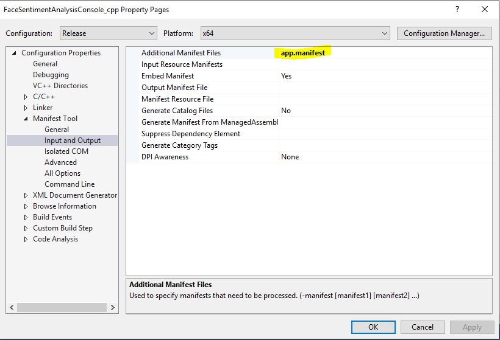

# Tutorial: Create a vision skill desktop application (C++)

> [!NOTE]
> Some information relates to pre-released product, which may be substantially modified before it's commercially released. Microsoft makes no warranties, express or implied, with respect to the information provided here.

> [!NOTE]
> If you are creating a Windows Vision Skill that needs to be used in a non-UWP app (i.e. a Win32 or .NET Core desktop application) you need to to make sure the Skill is aware of its runtime accordingly.

In this tutorial, you'll learn how to:

- Modify the Skill package to be aware of its runtime environment, specifically wheter it is running inside a UWP app container or not.
- Provide manifest and header files necessary for skill ingestion outside of a UWP app such as in a .Net Core 3.0 app or Win32 app.

---

## Prerequisites

- [Visual Studio 2019](https://visualstudio.microsoft.com/downloads/) (or Visual Studio 2017, version 15.7.4 or later)
- Windows 10, version 1809 or later
- [Windows 10 SDK](https://developer.microsoft.com/windows/downloads/windows-10-sdk), version 1809 or later

---

1. Make sure that the skill is UWP container aware at runtime:

- Detecting the UWP app container runtime environment from inside the skill:

Example code:

```cpp
// helper function to determine if the skill is being called from a UWP app container or not.
bool IsUWPContainer()
{
    HANDLE hProcessToken = INVALID_HANDLE_VALUE;
    HANDLE hProcess;
    hProcess = GetCurrentProcess();

    if (!OpenProcessToken(hProcess, TOKEN_QUERY, &hProcessToken))
    {
        throw winrt::hresult(HRESULT_FROM_WIN32(GetLastError()));
    }

    BOOL bIsAppContainer = false;
    DWORD dwLength;

    if (!GetTokenInformation(hProcessToken, TokenIsAppContainer, &bIsAppContainer, sizeof(bIsAppContainer), &dwLength))
    {
        // if we were denied token information we are definitely not in an app container.
        bIsAppContainer = false;
    }

    return bIsAppContainer;
}
```

- If the skill is invoked from a UWP app container or UWP packaged container, the file access is limited to app package paths. Hence, any model file or dependencies need to be packaged and loaded from the container paths.
However if the skill is invoked from a non-container environment like regular win32 cpp or .Net Core 3.0 desktop app, then the UWP app container environment is not available. Instead most of the disk access will  be available as per the permissions of the desktop app consuming the skill. It may be a good practice to keep model files and other resources at the same location as the skill's library (*.dll*) location.

Example code:

```csharp
winrt::Windows::Storage::StorageFile modelFile = nullptr;

// if running from within a UWP app container, access resources using a URI relative to its path
if (IsUWPContainer())
{
    auto modelFile = Windows::Storage::StorageFile::GetFileFromApplicationUriAsync(Windows::Foundation::Uri(L"ms-appx:///Contoso.FaceSentimentAnalyzer/" + WINML_MODEL_FILENAME)).get();
}
// If running from a regular app process such as a Desktop app, access resources using full system path
else
{
    WCHAR DllPath[MAX_PATH] = { 0 };
    GetModuleFileName(NULL, DllPath, _countof(DllPath));
    // Get path of current DLL
    auto file = Windows::Storage::StorageFile::GetFileFromPathAsync(DllPath).get();
    // Use the path of the parent directory top access other resources bundled with the DLL
    auto folder = file.GetParentAsync().get();
    modelFile = folder.GetFileAsync(WINML_MODEL_FILENAME).get();
```

2. Provide (package in Nuget) header files  (.h) and *.manifest* files for ease of consumption by Win32 or .Net Core 3.0 app developers.

    2.1. Generate header files (*.h*) for C++ apps.
In Visual Studio, select your project then:
    - WinRT C++ component:  Project -> properties -> MIDL -> output -> Header File
    - WinRT C# component: Since there is no option to generate header files in C# project, you need first to convert the generated metadata files (*.winmd*) to interface definition files (*.idl*) then these *.idl* to header files (*.h*). This can be done using tools bundled with Visual Studio that can be used from a Visual Studio developer command prompt:
      - Generate *.idl* from *.winmd* using [winmdidl.exe](https://docs.microsoft.com/en-us/cpp/cppcx/wrl/use-winmdidl-and-midlrt-to-create-h-files-from-windows-metadata?view=vs-2019)
      ```
      > winmdidl <filename.winmd> /utf8 /metadata_dir:<path-to-sdk-unionmetadata> /metadata_dir: <path-to-additional-winmds> /outdir:<output-path>
      ```
      - Generate *.h* from *.idl* using [midlrt.exe](https://docs.microsoft.com/en-us/windows/win32/midl/midlrt-and-windows-runtime-components)
      ```
      > midlrt <filename.idl> /metadata_dir  <path-to-sdk-unionmetadata> /ns_prefix
      ```

    2.2. Create a Manifest file to enable Side by Side registration of Skills in non-packaged apps. This is essentially just mentioning what are the runtime classes defined in your WinRT component so that they can be resgitrated and loaded at runtime. Note that we provide [handy scripts](https://github.com/microsoft/WindowsVisionSkillsPreview/blob/master/samples/Scripts/genSxSManifest.ps1) that can achieve this by parsing your interface definition files (*idl*). Refer to the [skill samples](https://github.com/microsoft/WindowsVisionSkillsPreview/tree/master/samples/SentimentAnalyzerCustomSkill) for an end-to-end demonstration.


    2.2.1. Side by side manifest format:

```xml
<?xml version="1.0" encoding="UTF-8" standalone="yes"?>
    <assembly xmlns="urn:schemas-microsoft-com:asm.v3" manifestVersion="1.0">
        <assemblyIdentity 
        type="win32" 
        name="manifest Identityname preferably same as dll name without extension and same as filename of this manifest"
        version="1.0.0.0"/>
    
        <file name="name of dll of the skill component including extension">

            <activatableClass 
            name="runtimeclassname1" 
            threadingModel="both" 
            xmlns="urn:schemas-microsoft-com:winrt.v1" />
        
            <activatableClass 
            name="runtimeclassname2" 
            threadingModel="both" 
            xmlns="urn:schemas-microsoft-com:winrt.v1" />

        </file>
    </assembly>
```

2.3. In your app, add a manifest file and mention the skill manifest you just generated in there.

2.3.1. App project settings to generate an app side manifest file and side manifest file format:
<div style="text-align:center" markdown="1">



</div>

```xml

<?xml version="1.0" encoding="utf-8"?>
<assembly manifestVersion="1.0" xmlns="urn:schemas-microsoft-com:asm.v1">
    <assemblyIdentity version="1.0.0.0" name="MyApplication.app"/>
    <dependency>
        <dependentAssembly>
            <assemblyIdentity
                type="win32"
                name="Microsoft.AI.Skills.SkillInterfacePreview"
                version="1.0.0.0"/>
        </dependentAssembly>
    </dependency>

    <dependency>
        <dependentAssembly>
            <assemblyIdentity
                type="win32"
                name="<name-of-manifest-file-without-extension>"
                version="1.0.0.0"/>
        </dependentAssembly>
    </dependency>

</assembly>
```

## Next steps

Hooray, your Skill is now ready to be used in a Desktop Application. Play around with skill samples on [GitHub](https://github.com/microsoft/WindowsVisionSkillsPreview/tree/master/samples) and extend them however you like.

[!INCLUDE [help](../includes/get-help-vision.md)]
